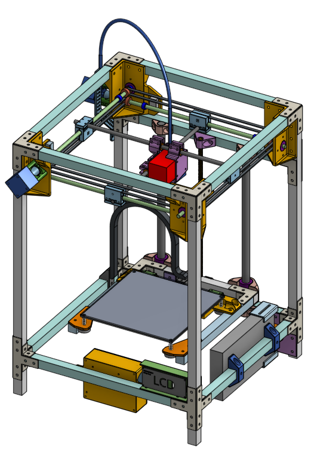

UNDER CONSTRUCTION

This project is an inexpensive fully custom designed 3D printer. The design utilizes common off-the-shelf components and 3D printed parts in its construction. This printer is designed to be something that can become a lesson plan, where the design can be broken down into very simplified concepts so that lessons plans can be developed around small steps that accumulate into the realization of a completely working 3D printer.

You, yes, you. If you've received a direct invitation to view this project from me, it means you are my friend who I would like to help build this 3D printer. Here's the deal only available to you:

 * You will read everything here, read absolutely everything I write, there will be many many many lessons
 * There are homework exercises for you to complete, and I will check your work and give you feedback
 * You will build this 3D printer!
 * You will buy the parts
 * I will double check you are buying the right parts
 * I will 3D print the parts you need 3D printed
 * I will give you spare parts whenever I can
 * I will meet up with you if you need help, I can bring tools
 * When you are done, I will make absolutely sure what you have built is safe
 * You will take pictures so I can post it to this website

What's in it for me? You are my test subject. I don't actually need this printer right now, but I do want to see that my design works! The 3D printing marketplace is constantly evolving and I want to keep up with some new developments. This new design uses the more common 1.75mm filament and all FIVE of 3D printers that I use needs 2.85mm filament, meaning even if I build it, I can't use it myself. But I have that need to prove to myself that I can design good 3D printer that doesn't use expensive parts and techniques.

You are my friend, so I bet you already know it'll be good.

General Design Overview
=======================

It's basically a copy of [my Hephaestus 3D printer](https://eleccelerator.com/hephaestus-my-own-3d-printer/). But this time, key differences:

 * uses 1.75mm filament, instead of 2.85mm
 * single Z leadscrew, instead of two
 * uses a stock Hemera extruder, instead of a flexible-shaft driven Titan Aero
 * uses limit switches, instead of sensorless homing
 * fully metric, instead of a mix of metric and imperial
 * uses 2020 for the frame, instead of 1010
 * no water-jet cut parts
 * all motion components now available from Amazon, instead of industrial supplies

In general, this still means:

 * Ultimaker-like mechanics
 * No bed sensor required
 * About 200mm x 200mm build size
 * Heated bed
 * 32-bit microcontroller (8-bit is still an option)

CAD
===

The whole 3D printer was 3D modeled first, almost every single part, using Onshape. This means:

 * I can share the design with you, and you can modify it under your own Onshape account
 * I can give you CAD homework, and I can check if you did it right, AND I can even check if you cheated, because I can check the file history
 * You can design your own custom parts and share it with me, so I can give you feedback
 * You don't even need a computer. Onshape runs in the cloud and accessible through any web browser or their smartphone app

The link to the Onshape model: [https://cad.onshape.com/documents/359ba....150f](https://cad.onshape.com/documents/359baba3de4f085c967fb5a9/w/62a7ef2a4414462a5d8bf3e1/e/208ce2426916e4fde5ad150f)

About the lessons
=================

There will be parts of the lesson where I take you through steps in CAD to create something, a drawing or a part. But keep in mind, I am not taking through the steps to make an exact copy of the model I just showed you. Instead, each time, I will be simplifiying something that was originally really complicated, to something very easy, and focus on important concepts, instead of exact replication.

Different lessons might intertwine, one lesson might refer to information taught much later, there might be some jumping back and forth, and some knowledge might not even follow any order.

Table of Contents
=================

 * [Lesson 0](ordered_lessons/lesson0.md): How this 3D printer works
 * [Lesson 1](ordered_lessons/lesson1.md): Planning the frame
 * [Lesson 2](ordered_lessons/lesson2.md): Gantry Design
 * [Lesson 3](ordered_lessons/lesson3.md): Construction Tolerance
 * [Lesson 4](ordered_lessons/lesson4.md): Designing 3D Printed Parts
 * [Lesson 4](ordered_lessons/lesson5.md): 3D Printer Motion
 * Lesson 5: Continued Design Walkthrough
 * Lesson 6: Detailed Parts Examination
 * [Lesson 7](ordered_lessons/lesson7.md): 3D Printer Electronics
 * Lesson 8: Mechanical Assembly
 * Lesson 9: Electrical Assembly
 * Lesson 10: Firmware Setup
 * Lesson 11: Software Setup

UNDER CONSTRUCTION