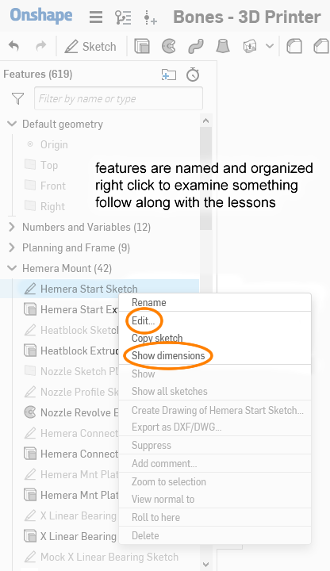

This project is an inexpensive fully custom designed 3D printer. The design utilizes common off-the-shelf components and 3D printed parts in its construction. This printer is designed to be something that can become a lesson plan, where the design can be broken down into very simplified concepts so that lessons plans can be developed around small steps that accumulate into the realization of a completely working 3D printer.

You, yes, you. If you've received a direct invitation to view this project from me, it means you are my friend IRL who I would like to help build this 3D printer. This *could* mean in-person help, free spare parts, borrowing tools, etc, definitely an in-person **safety check**. What's in it for me? **You are my test subject. I don't actually need this printer right now, but I do want to see that my design works!** The 3D printing marketplace is constantly evolving and I want to keep up with some new developments. This new design uses the more common 1.75mm plastic filament and all FIVE of 3D printers that I use needs 2.85mm filament, meaning even if I build it, I can't use any of my existing stockpile of 2.85mm plastic filament. But I have that need to prove to myself that I can design good 3D printer that doesn't use expensive parts and techniques.

You know me, so I bet you already know it'll be good. Reply back to my invitation to start.

This website is still **under construction**

General Design Overview
=======================

It's basically a copy of [my Hephaestus 3D printer](https://eleccelerator.com/hephaestus-my-own-3d-printer/). But this time, key differences:

 * uses 1.75mm plastic filament, instead of 2.85mm
 * single Z leadscrew, instead of two
 * uses a stock Hemera extruder, instead of a flexible-shaft driven Titan Aero
 * uses limit switches, instead of sensorless homing
 * fully metric, instead of a mix of metric and imperial
 * uses 2020 for the frame, instead of 1010
 * no water-jet cut parts
 * all motion components now available from Amazon, instead of industrial suppliers
 * 12V power, instead of 24V

In general, this still means:

 * Ultimaker-like mechanics
 * no bed sensor required
 * about 200mm x 200mm build size
 * heated bed
 * 32-bit microcontroller (8-bit is still an option)

CAD
===

The whole 3D printer was 3D modeled first, almost every single part, using Onshape. This means:

 * I can share the design with you, and you can modify it under your own Onshape account
 * I can give you CAD homework, and I can check if you did it right, AND I can even check if you cheated, because I can check the file history
 * You can design your own custom parts and share it with me, so I can give you feedback
 * You don't even need a computer. Onshape runs in the cloud and accessible through any web browser or their smartphone app

The link to the Onshape model: [https://cad.onshape.com/documents/359ba....150f](https://cad.onshape.com/documents/359baba3de4f085c967fb5a9/w/62a7ef2a4414462a5d8bf3e1/e/208ce2426916e4fde5ad150f)

For additional CAD lessons unrelated to this 3D printer, check out my [robotics class, click here](http://eleccelerator.com/ssfpl_robotics_class_2018/), also using Onshape

About the Lessons
=================

There will be parts of the lesson where I take you through steps in CAD to create something, a drawing or a part. But keep in mind, I am not taking through the steps to make an exact copy of the model I just showed you. Instead, each time, I will be simplifiying something that was originally really complicated, to something very easy, and focus on important concepts, instead of exact replication.

Different lessons might intertwine, one lesson might refer to information taught much later, there might be some jumping back and forth, and some knowledge might not even follow any order.

The assembly and setup steps are much harder for me to write because... well... I can only guess at the order-of-operations without testing, and I can't provide photographs. So please somebody build this printer and send me photos!

Table of Contents
=================

 * [Lesson 0](ordered_lessons/lesson0.md): How this 3D printer works
 * [Lesson 1](ordered_lessons/lesson1.md): Planning the frame
 * [Lesson 2](ordered_lessons/lesson2.md): Gantry Design
 * [Lesson 3](ordered_lessons/lesson3.md): Construction Tolerance
 * [Lesson 4](ordered_lessons/lesson4.md): Designing 3D Printed Parts
 * [Lesson 5](ordered_lessons/lesson5.md): 3D Printer Motion
 * [Lesson 6](ordered_lessons/lesson6.md): Continued Design Walkthrough
 * [Lesson 7](ordered_lessons/lesson7.md): Part CAD Design Walkthrough (more homework)
 * [Lesson 8](ordered_lessons/lesson8.md): 3D Printer Electronics
 * [Lesson 9](ordered_lessons/lesson9.md): Assembly Preparation
 * [Lesson 11a](ordered_lessons/lesson11a.md): Electrical Assembly Part 1
 * [Lesson 10a](ordered_lessons/lesson10a.md): Mechanical Assembly Part 1
 * [Lesson 10b](ordered_lessons/lesson10b.md): Mechanical Assembly Part 2
 * [Lesson 11b](ordered_lessons/lesson11b.md): Electrical Assembly Part 2
 * Lesson 12: Firmware Setup
 * Lesson 13: Software Setup
 * [Optional 3D Printed Parts](other_pages/optional3dprintedparts.md)
 * [Flaws, Mistakes, Improvements](other_pages/flawsmistakesimprovements.md)

If you have enjoyed this project...
===================================

Please consider making a contribution to help cure Alzheimer's disease.

and maybe contribute your computer's idle processing power to help finding a cure

