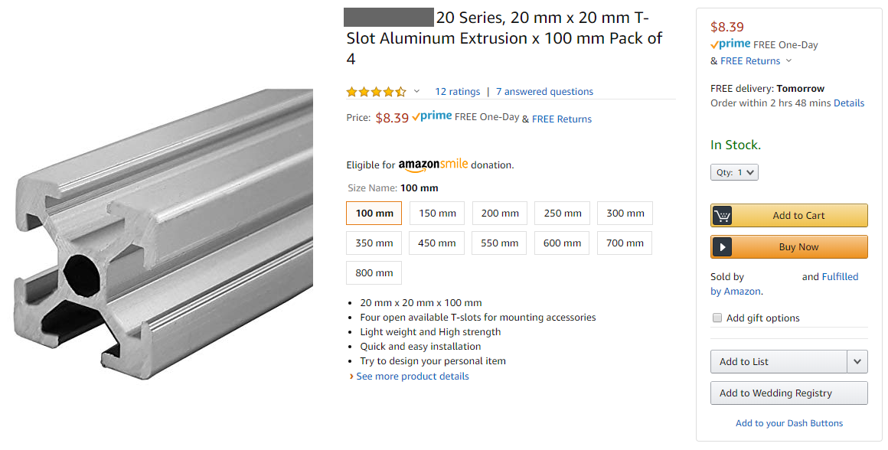

# Lesson 1: Planning the frame

We are designing a 3D printer in CAD. Right now, forget about the electronics and focus on the physical construction. We should be asking ourselves some questions:

 * Just how big are we going to make it?
 * What material are we building it out of?
 * etc etc

Remember: one of the goals of this printer is being easy to build, which also means using cheap and easy to find parts.

## Bed

What determines how big a 3D printer becomes? Probably the possible print volume, right? That means we really need to know how big the print bed is. We want a heated bed that is safe, cheap, and easy to purchase. We also want a matching glass plate that fits on top of it.

Go ahead and look around on the internet for one. I will save you some time though, I've found two options:

 * Option 1: one that's from the Anet 8 printer
   * 220mm x 220mm x 3mm size
   * built out of an aluminum PCB
   * mounting holes positioned in a 214mm x 214mm pattern
   * glass bed available with corners cut
   * 12V only
 * Option 2: RepRap MK2B
   * 214mm x 214mm x 3mm
   * FR-4 PCB material
   * mounting holes positioned in a 209mm x 209mm pattern
   * glass bed size is 213mm x 200mm
   * 12V or 24V

For now, we will pretend we are using the 220x220mm option because it is bigger.

If we want to change our minds later, it's easier to shrink a design than to make it bigger.

## Frame

80/20 inc is the company that popularized the T-slotted aluminum extrusion. These are square beams with a T shaped slot on all sides of the beam. You can put objects onto the beams, even other beams, by inserting special nuts (T-nuts) into the T-slot and fastening screws into those nuts. This is a very fast way to build a light-weight frame for any kind of machine.

For this project we will use 2020 sized beams. 2020 is the product family for beams that have a profile that's 20mm x 20mm. This is the most popular choice and we can easily purchase these beams and the T-nuts from any online store. To avoid needing to cut these beams, we also want to know what lengths are available. I'll save you some time:

100mm, 150mm, 200mm, 250mm, 300mm, 350mm, 400mm, 450mm, 550mm, 600mm, 700mm, 800mm

And they are even sold in packs of 4! This is perfect!

T-nuts for 2020 beams come in a few sizes, for M3, M4, and M5 screws. We want to use M5 as much as possible, bigger simply means stronger.

## Layout

We now know what bed size to use and what the size of the beams are. We can now start using CAD to sketch out the "floor plan" of the printer, meaning a sketch of just the top-down view. This will plan out where the bed is and the overall size of the frame.

In Onshape, make a new document (new part studio). Start a sketch on the "top plane".

The bed is square. The beams are sold in packs of 4. This means the printer will be square, to make our lives easier.

So we draw a few squares, using the "center rectangle" drawing tool, and then giving it some dimensions.

How did I know 400mm is the right choice? I didn't when I started... let's actually jump forward a few steps and see what my final design's floor plan looks like:

The important thing we have to do is try to make sure that if we are using a 220x220mm bed, that we can actually print on all of the bed, not just a small part of it. There will be a extruder that moves on top of the bed, and the nozzle is somewhere at the bottom of that extruder. When the nozzle reaches the edge of the bed, the extruder body must not touch anything, which is why it's important to know where the rods are and where the Z stepper motor is. This is also why in the final design, the bed is not exactly in the center of the frame.

It's totally OK to put in the wrong numbers, make the frame a little too wide or too narrow, and realize it later. With good CAD software, you are always able to go back and make changes to decisions you've made a long time ago, without breaking everything else you've already done. Just think of it as changing a constant in programming code, or editing a layer in photo editors. When you are using an engineering 3D CAD tool, when you want to change something from 200mm long to 150mm long, it is wrong to think "let's cut away 50mm", instead, you should be thinking "let's go back and change the number 200 to 150".

You don't have to plan it absolutely perfectly. For example, while I did put down where I wanted the rods by a single line, I didn't really account for the diameter of those rods. Sometimes you don't want your sketch to look too messy. If I did draw out absolutely everything, it would look like this:

And nobody would understand what each line actually is.

Why did we use "center rectangle"? We centered it on the origin point of the 3D "world". The frame, being roughly square, will have a lot of symmetry. The 3D "world" provides three default planes that start from the origin point. There's a tool in all good 3D CAD software that does some sort of "mirroring", and that tool needs some sort of flat surface, like a plane, to act as the mirror. This means, if we center our square on the origin point, then we are able to use the default planes when we need to use the mirror tool.

Don't worry about making the sketch you are making look exactly like mine! Remember, I'm not going to make you replicate the 3D model exactly, I'm trying to teach you concepts and techniques. Right now, finish the sketch by clicking the green checkmark and we'll learn more.

## Height

Ask ourselves: how tall is the printer? How do we even answer this?

Well, how high could we make it? The longest beam we can buy is 800mm, but then we need to move the bed up and down, how far can we move the bed? How do you even move the bed?

There are several ways to move the print bed up and down but the best idea here is to use a leadscrew driven by a stepper motor (I'll explain in an appendix lesson, click here). This means the range of motion of the bed is roughly determined by the length of the leadscrew.

We also need at least two more rods in the Z axis to make sure the bed doesn't wobble or vibrate. My Hephaestus 3D printer used three rods and two leadscrews, which made it super stable. My Ultimaker uses two rods and one leadscrew, and it's also super stable. We are making a printer like the Ultimaker, but just in case, we'll use some really thick rods for extra strength. (I'll go into detail about this topic in an appendix lesson, click here)

You can buy a leadscrew and attach it to a stepper motor, or better yet, you can even buy a stepper motor with a leadscrew already integrated as the shaft. The latter is the better option but it narrows down the available length choices. I'll save you some time, I looked at available components online and I think these are the best parts to use:

 * stepper motor with integrated leadscrew, 8mm pitch, 1.8 deg/rev, 380mm long
 * 16mm diameter rod, 400mm long

You might be asking "why can't I just buy longer and cut it down to size?". The answer is that: rods and leadscrews are meant to have something constantly rubbing against them, back and forth, repeatedly, so they are made of hardened steel, which is difficult to cut. (not impossible, but difficult enough for me to design in a way that avoids cutting them, you definitely need power tools)

In Onshape, start another new sketch, again, on the "top plane". You should be now editing "Sketch 2" while "Sketch 1" is still visible (if it isn't, unhide "Sketch 1").

Draw the starting squares for the four vertical aluminum beams, positioning them using the lines from "Sketch 1" as a reference.

That doesn't look very good... we want perfect squares in precise positions, without re-drawing "Sketch 1" all over again. This is where you will learn to use "constraints". [Click Here](https://www.onshape.com/cad-blog/tech-tips-constraining-your-sketch) for an official Onshape video on constraints. We will be making some constraints between things in both "Sketch 1" and "Sketch 2".

### Homework

See the below screenshot

Using constraints, draw the four squares "Sketch 2" correctly using "Sketch 1". Send me a link to your Onshape document for me to check.

## Extruding

We know we are using roughly 400mm rods for the vertical Z axis. In the end, I chose to use 600mm long beams for the vertical posts of the whole frame. This means the whole 3D printer will be 600mm tall.

There's a 200mm difference, that's not being wasted. On the top of the printer, you need to leave some space for the extruder, and the mechanisms that move the extruder. On the bottom of your printer, it's a nice place to hide all the electronics.

On your Onshape model's "Sketch 2", you should now have four perfect 20mm wide squares perfectly positioned at the corners of your printer's frame. Use the "extrude" tool on "Sketch 1", new solid, with "blind" mode, height equal to 600mm, and the direction should be up. (pay attention, Onshape tries to guess these settings for you sometimes)

You should end up with:

## Vertical Planning

Let's look at my design, this view shows only the components that affect the vertical placements:

You might ask "how did you know where to put the extruder?". This involves drawing a few sketches near the top of the printer. I know the stepper motor will be the biggest thing and it goes near the top. Knowing where the stepper motor is, and also roughly laying out the the whole upper gantry, the CAD tool shows me where the rods should be. Knowing where the rod that goes above the extruder is means I could 3D model the extruder and figure out where the nozzle tip will be. The nozzle tip is obviously the maximum height of the bed, so finally, I know where my Z rods and leadscrew should reach.

(this will be covered in detail in [another lesson](/ordered_lessons/lesson2)!)

It's not the most optimal way because I haven't technically checked how "thick" the bed is, but the penalty is only losing a few millimeters in print height, which isn't as important as losing print width or length.

In the end, I created three horizontal beams at the back of the printer, using a sketch placed on the side of a rear vertical beam. This sketch has some dimensions and a constraint that aligns the top of where I want the Z rods to where the extruder nozzle tip is.

I used the "circular pattern" tool to create these new horizontal beams for all four sides of the printer. To do this, a vertical sketch is used to define a vertical axis for the circular pattern.

### Homework

In Onshape, make the rear horizontal beams of your frame.

When you use the extrude tool, do not use "blind" mode, instead, try to use "up to face". If you started the sketch on the left vertical beam, then you extrude up to the face of the right vertical beam.

Make sure you are using the new-solid mode! Not the new-add mode! When you use any of the tools, if you want to make a new part, make sure you select the "new" tab, otherwise the part might "stick" to an old part and the two parts become one solid.

## Using Symmetry

We have the rear horizontal beams, how do we easily put more beams on the sides and the front of the printer frame? We are using a square shape, centered about the origin point of the 3D world, which means we can take advantage of symmetry.

### Circular Pattern

For a square design, the best way to generate all the horizontal beams for all 4 sides of the frame is to use the circular pattern tool. This tool requires you to have an axis defined as the center of the circular pattern. So first we need to make a sketch, starting from the "front plane" that simply contains a perfectly vertical line that is constrained to the origin point of the world.

Then use the circular pattern tool, select the horizontal beams at the rear, and select the new vertical line as the axis of rotation. Make sure you are making 4 copies for the full 360 degrees. This will generate horizontal beams for all 4 sides of the frame.

## Finally

Congratulations, you've made a 3D plan of your 3D printer's frame!

Onto the next lesson!
