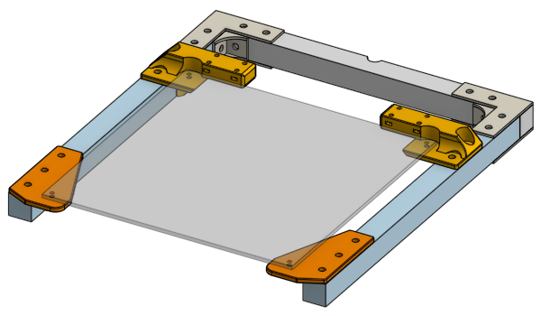
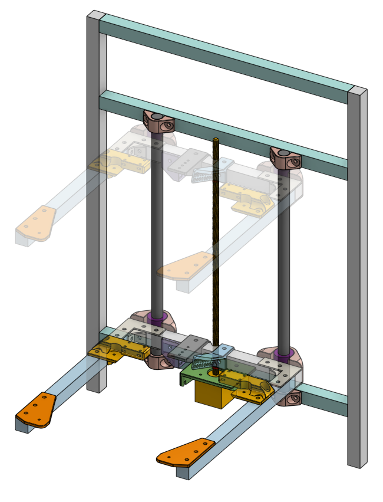

# Mechanical Assembly

## Reminders before you begin

 * Use a square measurement tool frequently
 * Usage of washers can be:
    * not allowed
    * optional
    * critical
 * Don't tighten something down completely until it's the right time to
    * If there are multiple screws, don't tighten down one before moving to the next one, instead, turn one three rotations, then move on to the next screw
 * Check the 3D model for dimensions and measurements

## Small Bits

Install the lead-nut onto the 3D printed part that holds the lead-nut. This uses M3 screws. If you are not using the countersink screws, then use the 14mm long button head screws.

Install a single 8mm bore shaft collar onto the Z axis stepper motor's leadscrew, right at the bottom. This will act as a dust shield for the ball bearing inside the stepper motor.

Install the Z axis stepper motor onto the 3D printed part that it mounts to, using M3 screws that are 8mm long. It'll be nice if the limit switch is already wired up, then you can fasten it as well.

If the levers on your limit switches are too long, cut them to just a few millimeters over the button.

## Do Some Wiring

Some of the parts should have wires attached to them before we start assembling them. Check the [electronics assembly page (click here)](lesson11). It's really hard to solder something when it is already installed into the printer.

## Frame

Start with the four beams on top of the frame. Arrange them in a rough square on a flat table.

Take the four 3D printed gantry bearing mounts and prepare them by inserting the M5 x 8mm flanged screws and **loosely** screwing on the T-slot nuts.

**Slide** the four beams into the gantry bearing mounts. Once you've formed a square, tighten the screws around the plastic, but not too tight.

Slide in the four leg beams of aluminum into the vertical corners of the gantry bearing mounts. Tighten the screws around the plastic, but not too tight.

Prepare the metal L shaped brackets with the M5 x 8mm flanged screws screws and the T-slot nuts. Attach them to the square frame, make sure everything is perfectly square and then tighten the screws very tight.

The horizontal beams are attached next, this is much simpler to do. Again, use the brackets and screws. Check the height using a measurement tool, and use the 400mm long 16mm diameter linear rod as a measurement reference as well. **Tighten slightly first, make adjustments to make everything square and at the right heights, then tighten down completely when you are confident.**

The rough frame should be done at this point.

## Bed

Mounting the Z axis linear rods to the frame is the logical next step, but those need to be placed with extreme precision so that the bed can move up and down **smoothly**. This is actually impossible to do with just rulers. The good news is that we don't actually need an exact distance between the two Z axis rods, we just need them to be **perfectly parallel**. We need a **smart order-of-operations** that can achieve this, and that means we need to assemble the bed first, because the bed will have the Z axis linear ball bearings on it. So follow the instructions closely, in order.

Because the assembling something dangling in the air is difficult, we'll assemble the **entire** bed, not just attach the linear bearings.

### Forklift

Start by cutting the three aluminum beams that make up the "forklift". This can be done by hand and do not need to be precise.

The rear beam of the forklift needs a knotch to be cut out, use the appropriate grinding tool to do this. Do not so deep that you weaken the beam.

There are four 3D printed parts that make up the bed's corners, prepare them by inserting the M5 x 8mm flanged screws and T-slot nuts, then slide them onto the forklift.

Take the heated bed and secure it to the plastic corner pieces with 14mm long M3 screws, **do not use the springs**, you want the heated bed to touch the plastic parts. By using this bed plate as a reference, we made sure the forklift ends up with the exact right size. Now you can use the L shaped brackets and corner brackets to fasten together the forklift. Tighten everything down.

Attach (using the M5 screws and T-slot nuts as before) the other pieces that goes on the forklift:

 * linear bearing and bearing clamps (loosely)
 * lead-nut mounting (tighten, position centered at the notch you cut)
 * actuator for the Z axis limit switch (loosely)
 * drag chain anchor (tighten, position not critical)
 * cable guide for the bed heater wires (tighten, position not critical)

### Z Axis

Attach the Z axis stepper motor and leadscrew to the frame, in the middle, of course, use a ruler. Doesn't have to be super precise. Tighten it down because this is our main reference.

Now you can slide the forklift down the leadscrew (this will spin the leadscrew when you do this). Then slide both Z axis linear rods through the bearings, and secure them **loosely** to the frame with the 3D printed clamps.

Move the forklift all the way to the bottom (again, this will spin the leadscrew). Tighten the linear bearing clamps **slightly**, while trying to keep the two Z axis linear rods as vertical and parallel as possible, then tighten the **bottom** two rod clamps **slightly**.

Move the forklift all the way to the **top**. Tighten the linear bearing clamps **slightly**, then tighten the **top** two rod clamps **slightly**.

Move the forklift all the way to the **bottom**. Tighten the linear bearing clamps **slightly**, then tighten the **bottom** two rod clamps **slightly**.

Go up and down repeatedly, and tighten slightly repeatedly, until the motion is smooth and the screws are completely tight. The bed shouldn't wobble. If it does seem like it could wobble, then move one of the Z axis linear rods a very slight amount (loosening the screws very slightly too) to give it more pre-load, then tighten it down. **Keep making adjustments** until you are completely happy with the smoothness and stability of the bed movement.

The leadscrew should not bend too much. It is **allowed to bend slightly**, just not too much. What we said about **elastic deformation** applies here.

Tighten down all the parts on the fork lift now. Make sure the limit switch actuator is positioned correctly so that it can activate the limit switch beneath it.

## Gantry

### Side Linear Rods

Start installing the side linear rods, the 8mm diameter, 440mm long ones.

This involves skewering on the components in order. On the ends of the rod where the motor will be connected via a shaft coupling, leave **12mm of extension** from the face of the rotary ball bearing.

On the other side, it doesn't matter. Tighten the set-screws but **not too tight**.

Do not forget about the oil-free bushing in the middle.

Repeat for all four rods.

### Sliding Block and Timing Belt

Get the piece of the sliding block that has the belt groves, place it over the oil-free bushing.

Cut the timing belt, loop it over the pulleys on **both ends**...

... and insert the two ends into the sliding block, as shown in the diagram. **Do the U shaped end last**. You need to make sure the belt is **tight**, as tight as you can manage. 

Insert a square nut and a 20mm long M3 screw into the hole, drive the screw into the nut until the end of the screw touches the belt. This is the **belt tensioning screw**. Leave it here for now, we will tighten it further **later**.

Close up the sliding block completely using the other 3D printed piece, the square nuts, and the 20mm long M3 screws. If the screws seem too long, then add a washer.

Tighten the **belt tensioning screw**, until the belt sounds like a guitar string when you pluck it. Then install the belt tensioning spring on the belt. The position of the sliding block should be in the middle of the frame, and the position of the belt tensioning spring should also be in the middle of the frame. This way, the sliding block can move all the way to the left and the belt tensioning spring will move all the way to the right.

Repeat for all four sliding blocks.

Once you are done, follow the diagram below and tighten the set-screws on parts that is indicated.

### Gantry Cross Linear Rods

There are two more 8mm diameter linear rods that are the cross linear rods. Install two LM8UU bearings on each rod. Then install the rods into the sliding blocks, clamping down on them with the final 3D printed plastic piece. This uses the 14mm long M3 screws and square nuts.

If the screws are too long, then use some washers. If the screws are too short, then use 16mm screws.

For the ends of the rods that are meant to hit the limit switch, make sure there's a small gap so it can hit the switch but not the plastic wall the switch is mounted on.

### X and Y Axis Stepper Motors

Install the shaft couplings where the stepper motors will go, butt it up against the rotary ball bearing. Do **not tighten** the set-screws, leave them very loose.

Using the 3D printed spacer for the stepper motor, and the 50mm long M3 screws, install the stepper motor, leaving the screws loose. Pay attention to motor shaft, which is a D shape, the flat part of the D must line up with the set-screw on the shaft coupler. If you are sure you've done this correctly, tighten down all the set screws.

Repeat for both X axis and Y axis.

## Stop Here For Now

I don't want to make this page super long. Take a break. Continue to the next part of the assembly instructions.
