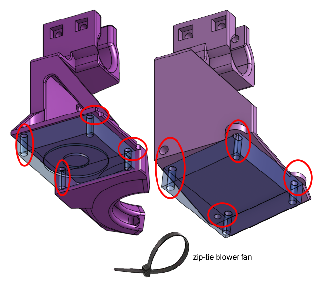

# Mechanical Assembly (Continued)

## Extruder

Follow E3D's instructions on how to assemble the Hemera extruder and hot-end:

 * [01. Hemera Core Assembly Guide](https://e3d-online.dozuki.com/Guide/01+-+E3D+Hemera+Core+Assembly/122?lang=en)
 * [02. Hemera Direct Assembly Guide](https://e3d-online.dozuki.com/Guide/02+-++E3D+Hemera+Direct+Assembly/127?lang=en)

Attach the blower fan onto the 3D printed part that mounts to the Hemera extruder using small zip-ties.

Attach the 3D printed mounts to the Hemera extruder, using the 6mm long M3 screws.

If the screws are too long, then use some washers under them.

This is now the print head. Install this whole print head onto the gantry's cross linear rods. Slide the linear rods through the clamps first, then slide the linear ball bearings into the clamps.

Finally, tighten down the clamps using square nuts, 20mm long M3 screws, and here you **must use washers**.

When you are done this, then you can move the print head around by hand. All the rods will start spinning and the motors will start spinning. Check that, although you can move the print head, it doesn't wiggle around as if the bearings are loose.

## X and Y Axis Endstops

We actually have two different types of endstops: limit switch and shaft collar.

Move the bed up to the nozzle by hand. Move the nozzle to the left front of the glass bed where coordinate (X=0, Y=0) should be.

Now you can use the shaft collar on the side linear rods to set that point as the limit by butting up the collar against the sliding block. Tighten that set-screw.

Also do the same for the far right corner of the print bed. But this time, allow the nozzle to go past the edge of the glass by a few millimeters. This is because we want the shaft collars to act as a safety limit but the firmware will enforce the geometric limit.

As a reminder, do not touch the shaft collars indicated in the next diagram, leave them tightened in place.

Mount the limit switches in the correct position such that the switch will not be destroyed when the sliding block reaches the shaft collar. Use the 20mm long M3 screws to fasten it to the 3D printed gantry bearing mount. The screws should enter through the limit switch, and on the other side, use a washer (**required**) and nylon locking nut to fasten.

## Print Bed

If the heated bed does not have countersunk holes, now is the time to use a drill and a countersink drill bit to make the holes countersunk. Make sure the M3 countersink head screws will sit in the hole with the head flush with the surface. (my research indicates that the heated bed on the shopping list does have the holes already countersunk)

Now is the time to do the wiring for the heated bed, which is covered in [another page (click here)]().

Using the countersink M3 screws, a nylon locking nut, the bed springs, and the knob, fasten the bed heater plate to the bed forklift. Tighten the knobs until the springs are fully compressed first, then release each spring about 2mm.

Secure the wires to the 3D printed wire guide on the back of the forklift using zip-ties. This will allow us to work with the wires without worrying about breaking the solder joints.

## Drag Chain

The drag chain can be disassembled and re-assembled to become different lengths. We chose a drag chain with an internal dimension of 10mm x 10mm, for this chain, each link is about 14mm long.

At the end of every link, there's a small tab that stops it from bending the wrong way. Flipping the links allow the bend to go in another direction.

The end links are wedge shaped with holes for screws, these can be flipped if we need to.

Know all this now, have a look at the drag chain in our printer.

Closer up, pay attention to the shape of the end pieces, and pay attention to where the bends change direction.

Your job is to take the drag chain you've purchased and arrange it in this shape. I did some calculations and for this chain, you need 31 ordinary links in total, plus the 2 end links.

