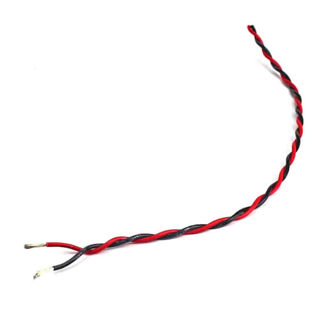
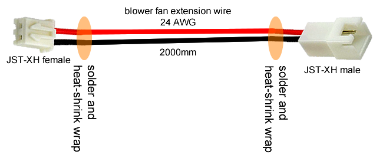

# Electronics Preparation

This page will have the stuff you need to do before you do mechanical assembly!

I will write this page assuming you already have the skills to solder, to crimp, and to use heat-shrink tubing. I will cover these skills in separate pages if you do not have these skills.

## Strategy

For the high current and high voltage connections on the power supply, we will be using barrier screw terminals. They mate with fork connectors (aka spade connectors). They also technically accept bare wires but it's a lot more dangerous without using connectors.

For the high current connections on the control circuit board, there are some screw terminal blocks. Terminal blocks like these work best with proper wire ferrules, but also accept bare wires. We will avoid using bare wires.

For the low current connections, the control circuit board uses many JST-XH connectors. These have a 2.54mm pin pitch and are polarized.

Now here's some bad news. Spade/Fork connectors need a crimper, or even two crimpers. Wire ferrules need a special type of crimper. JST-XH also has its own type of crimper. One crimper is about $20, which doesn't sound bad for a tool that will keep you safe and your projects reliable for many years, but spending $60 on just crimpers for a 3D printer might be a bit daunting.

I know the promise is that the 3D printer is cheap to build. But I will be writing my instructions assuming you have access to the crimpers for the fork connectors and the wire ferrules. You are free to half-ass some of the wiring, but don't expect me to be happy about it if you ask me to inspect it in person.

The wires we'll be using are either 14 AWG or 24 AWG. To avoid using a crimper for the JST-XH connectors, we will buy a large pack of JST-XH pigtails.

## Shopping

 * soldering iron
    * 40W or more
    * with real temperature control
    * with a flared shape (the TS100 fails at this)
    * ideally compatible with Hakko tips or Weller tips
 * 63/37 solder with rosin core, 0.8mm diameter
 * flux, no-clean type preferred
 * desoldering braid (aka solder wick)
 * heat gun, hot air blower, or a cigarette lighter
 * wire stripper for 24 AWG
 * wire stripper for 14 AWG
 * crimper for insulated terminals (or get a crimper with a set of dies)
 * crimper for wire ferrules
 * variety pack of heat-shrink tubing in different sizes, all black, marine grade preferred but not required
 * variety pack of wire ferrules
 * pack of insulated fork connectors that fit 14 AWG wires and fits #8 studs
 * JST-XH pigtails, both male and female
 * cables for stepper motors, with connectors that work with the SKR Mini E3

Below is a massive image that shows all the things in the above list:

There might be more things, we'll cover them later.

## Polarity

Keep in mind that the limit switches, thermistors, and heating elements, **do not have polarity**. Switches are just dumb copper pieces touching each other, current can flow through them in any direction. Thermistors and heating elements are **just resistors**, so they also allow current to flow through both ways, so polarity for thermistors and heating elements also does not matter.

For the cooling fans, especially the type we are using called BLDC (brushless DC), the polarity definitely matters, and reversing the polarity with a 12V power input will definitely cause damage to them. So make sure red goes to red (red = positive, positive goes to positive), and black goes to black.

Why are the fork connectors and wire ferrules both blue? Blue is the colour code for 14 AWG wire. The colours for these items most frequently indicate size, but double check that the wire is a good fit. Ferrules for 24 AWG are sometimes green, sometimes yellow, so check the fit yourself. The crimper for a blue fork connector will have a blue dot where the connector goes.

## Twisting Wires

Whenever you have two wires, one positive and one negative (one red and one black), it's a good idea to twist them together.

Why? Not only does it prevent wire tangles, it also lowers electromagnetic radiation and rejects noise (and crosstalk) better. It's a rather advanced topic but here's a [Wikipedia article about it](https://en.wikipedia.org/wiki/Twisted_pair).

## Limit Switches

There are three limit switches in our design, one for each axis of motion: X, Y, and Z.

These switches will have a very weak signal going through them so we will be using the 24 AWG wire.

You'll notice that the switches can be connected to 4.3mm wide quick disconnects, which you can use your crimpers for. But they don't make these connectors for wires as small as 24 AWG.

It's not dangerous to directly solder some wires directly to the terminals. Use heat-shrink tubing on the solder connection.

The wires go to the **C**ommon pin and the **N**ormally **O**pen (**NO**) pin of the switch. Although technically the switch itself does not care about polarity, please use the black wire for the **C** pin.

You need to do this 3 times for all of your limit switches.

We will be making extension cables for these switches later.

## Cooling Fans

The cooling fans come with wires and maybe a connector, but for the sake of making my job writing instructions easier... we'll prepare all the fans like so:

The choices for the connectors are made to make life easier later. The wire can be pretty thin (use 24 AWG) because the fans are not power hungry. We will be making extension cables for these fans later.

## Nozzle Heater Cartridge

The nozzle heater cartridge should have a 1 meter long wire that's glass insulated already. Extend this another 1 meter with pieces of 14 AWG wire, using soldering and heat-shrink tubing. On the ends, terminate with crimped on wire ferrules.

## Thermistor Cartridge

The thermistor cartridge for the heat-block is sold with a 1 meter dedicated wire. This wire will have a Molex Microfit connector, which we don't want to buy a crimper for so make sure you buy the combo with this wire. Extend this wire with 24 AWG wire, then splice it with a JST-XH female connector. Use soldering and heat-shrink tubing to do this.

## Heated Bed

This part you should do **after** the printer has been mostly assembled! This step you should be doing **after** you prepare the drag chain, but **before** you install the drag chain to the frame.

After you are done soldering, coat the entire area with "J-B Weld 31314 High Temperature RTV Silicone Gasket Maker and Sealant". This will protect the solder joints from debris causing short circuits. Wait for it to cure completely before continuing.

Be very careful not to break the solder joints while installing the heated bed to the 3D printer. After installing the bed with the springs and knobs, zip-tie the wires to the 3D printed bed cable anchor. This will keep the solder joints from breaking.

## Stepper Motors

The stepper motor we've purchased for the Z axis leadscrew should have a 1 meter long cable already, it should be enough.

The X and Y axis stepper motors may need the wires extended. It may have a connector or it may have wires sticking out. Either way, you need to extend these with the stepper motor wires that you've purchased. Just make sure the colours of the wires match up, use soldering and heat-shrink tubing to make the splices.

Make sure it ends with a JST-XH connector, so we can plug it into the control circuit later. The order of the colours might be wrong, but that's ok, we can swap the order later.

## Extension Cables

The big major cable is the 12V wire that runs from the power supply to the control circuit board. This uses 14 AWG wire, 800mm long, and is terminated with spade connectors on one end, and wire ferrules on the other end.

Extending wires from the limit switches to the control circuit board is easy, just a long pieces of 24 AWG wire with JST-XH female connectors on each end. We need three of them, each one is a different length.

Extending wires from the extruder cooling fan and the nozzle blower fan requires two differently made extension wires, they are both really long. Use 24 AWG wire. Follow the diagrams below.

Both will have JST-XH female on the end where it connects to the control circuit. The one meant for the extruder cooling fan will have a JST-XH **female** on the last end, but the one meant for the nozzle blower fan will have a JST-XH **male** on the last end. This way, when route the wire up to the extruder, you won't be confused as to which one is which.

You need to make a splitter as well, it will allow us to connect the extruder cooling fan and the circuit box cooling fan directly into 12V. This is a safety feature, as it prevents a firmware or MOSFET failure from killing the fans. Follow the diagram below.

**NOTE**: It is much easier to see how much wire length you actually need if you build the whole printer first. My own estimates here are very generous, obtained through the measurements done with the 3D model.

## AC Power Input

The AC power input module should have already come with wires that are terminated properly with crimped on spade connectors.

## Next Lesson

 * [Lesson 10a](ordered_lessons/lesson10a.md): Mechanical Assembly Part 1
 * [Lesson 10b](ordered_lessons/lesson10b.md): Mechanical Assembly Part 2
 * [Lesson 11b](ordered_lessons/lesson11b.md): Electronics Bring-Up
