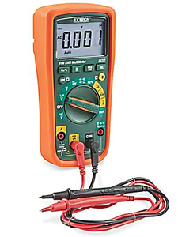

# Electronics Assembly Part 2

At this point, everything should be ready to be connected together. We have made extension cables where we need to.

It'll be great if you had a multimeter right now to do some tests. If everything goes right, then you won't need it. If something goes wrong, we can use it to identify bad connections or bad parts. An infrared thermometer would be helpfun, or even a thermal imaging camera.

We will do this step by step and test after each step. This will prevent any power issues from blowing up any sensitive components. Keep a fire extinguisher near by. Do not leave the area if the power is on or if something is hot. Do not touch any wires or connectors if the AC power cord is plugged in. Never use your feelings to check temperature.

## Skill: Continuity Checking Wires

You can easily check if a wire is broken with the multimeter's continuity check function. Also, you can also verify the wiring of a heating element before plugging it in, by measuring its resistance value at the end of the wires. Review [lesson 9](lesson9) to see what resistances you should be getting.

## Skill: Swapping Wires in a JST-XH Connector

When you have a JST-XH connector that has wires in the wrong order, there's a way to re-arrange that order. You need a pointy tool to pop out the crimp inside the connector housing. Once the crimp is removed, simply re-insert it into the housing at the correct position.

This works on all of our JST-XH female connectors, which includes the stepper motor connectors.

## 1: Power Supply

Connect the AC power input to the 12VDC power supply. That means connecting the "**L**ive" (aka **H**ot), "**N**eutral", and "**G**round" wires.

You also need to connect the negative output of the power supply to the ground somehow. This could be a simple 14 AWG wire. Recall what we [discussed before about grounding](lesson8).

Once the connections are made, keep the area clear, plugin AC power and turn it on. There should be a small LED that lights up on the power supply.

If you can, measure the DC output, it should be about 12V.

Keep it running for 10 minutes. No smoke should come out, nothing should be warmer than 45 degrees C. For all the other tests, also make sure nothing smokes and nothing gets too warm.

Turn the power off and unplug the AC power cord.

## 2: Power Supply to Control Circuit

The control circuit (SKR Mini E3) should be mounted inside its 3D printed box, secured with M3 standoffs and short M3 screws. The lid should be removed. We do not need the cooling fan yet.

The LCD screen should also be mounted inside its own 3D printed box, secured with M3 standoffs and short M3 screws. Connect the LCD screen to the control circuit with the cable that came with it.

Connect the power supply to the control circuit using the 14 AWG wires we prepared before.

Turn the power on, LEDs will start coming on and the LCD will start to show stuff (or at least light up as well). This is good. There's a chance that nothing on the LCD actually does anything when you press it though, don't worry, we'll configure the firmware later.

Plug in a USB cable between the control circuit and your computer. Install all the drivers you need (check manufacturer's website). Download and install [Pronterface](https://www.pronterface.com/), run it and see if you can connect to your control circuit.

Turn the power off and unplug the AC power cord. Unplug the USB cable.

NOTE: The default firmware for the SKR Mini E3 should have been written for a Creality Ender 3 printer. We are using very similar components so things should work out-of-the-box. But we do need to reconfigure things later.

## 3: Sensors and Switches

Input devices, like sensors, are low power, so we test them first. Plus, we depend on the temperature sensors to keep us safe when we test higher powered devices like the heaters.

Connect all the sensors and switches to the control circuit. You've already made all the extension wires for them.

Connect the USB cable, and power on the AC power. Connect to the control circuit from your computer using Pronterface.

You should see that the temperature sensors report values, both the nozzle temperature and bed temperature. Now, use your hot air gun, heat those sensors up and watch your computer screen. Does the values start to increase? If so, then good, test passed. Do this for both the nozzle and the bed. Also when you turn off the hot air, see if the values start to decrease.

The values might be reading room temperature but if they are not, then that could just mean we need to tweak the firmware.

Inside the Pronterface console, type in the following command, then hit send (ENTER key)

 * M119

This is the [gcode command for "Endstop States"](https://marlinfw.org/docs/gcode/M119.html), and it will report when the limit switches are activated. Start pressing those switches, and while the switches are closed, issue the command again. See if the console shows the proper response.

If you are seeing weird behaviour, then disconnect the wires and use tweezers to short circuit the respective connector on the circuit board. Shorting the limit switch connector will make the firmware think the switch is pressed. Shorting the temperature sensor pins should make the firmware think the temperature is very high.

When you are done, turn everything off and unplug everything.

## 4: Fans

Connect the fans, again, we've already made the extension wires and splitter wires we need. But we need to watch out for which fan is connected to which connector. Follow the diagram.

Next we need to check the polarity of the blower fan. The circuit board with have plus (+) and minus (-) symbols, plus means positive and minus means negative. Red wire should go to positive, and black wire should go to negative. If the JST-XH wires do not match the connector polarity, then we need to swap the red and black wires inside the JST-XH connector housing.

Power everything up and connect via Pronterface. As soon as power is applied, the extruder cooling fan and the circuit box cooling fan should both start spinning. This is good. If they don't turn on, the wiring has a problem or the fans are broken.

Issue the following command:

 * M106 S255

Did the blower fan turn on? If so, then we will turn it on at half speed, issue the following command:

 * M106 S128

Did the blower fan slow down? Now turn it off with the following command:

 * M107

Did the blower fan turn off?

If you are troubleshooting a problem with a multimeter, check that the fan output pins on the circuit board are outputting about 12V when you tell the fan to turn on, and outputting 0V when you tell the fan to turn off.

When you are done, turn everything off and unplug everything.

## 5: Stepper Motors

With everything powered off, AC power unplugged, use your hands to move the print head to the middle of the bed, and move the bed vertically to the middle height of the printer. In this position, it is safe to spin the stepper motors slightly just to check if they work.

With the positions set, now plug in the stepper motors into the control circuit. Double check the colours of the wires. **Do not ever connect or disconnect stepper motors while the machine is powered on!**

Power everything up and connect via Pronterface. Use the movement interface to move the print head and the bed, do so with only 10mm increments and a slow speed.

 * Z minus means the bed moves up, Z plus means the bed moves down
 * X minus means the print head moves left, X plus means the print head moves right
 * Y minus means the print head moves towards you, Y plus means the print head moves away from you

Do all the motors respond? They don't have to move in the right direction, they just have to move to prove our wiring is correct. We can flip the direction later when we configure the firmware. But remember which ones need to be flipped.

If a motor is not moving, or only twitching, making a noise, then we need to check the wiring. Power off the printer and unplug the power cord. Unplug the offending stepper motor cable from the control circuit. Check the resistance between red and blue wires, then check the resistance between the black and green wires. The resistance should be close to the coil resistance specified in the stepper motor's datasheet. If the resistance is too high or infinity, then the wire has a bad connection somewhere. If the resistance is too low, like, zero, then there may be a short circuit somewhere.

If both of these checks pass, then you may simply need to swap some wires around. Rearrange the crimps inside the JST-XH connector to swap the red wire with the blue wire.

Reapply the power and try again. Assuming your connections are good. When you are done, turn everything off and unplug everything.

## 6: Nozzle Heater

Before this step, you must properly re-compile the firmware and flash the firmware to the control circuit. See the [page about the firmware (click here)](). We need the temperature sensor to keep everything safe while we test the nozzle heater, so the temperature sensor must be properly configured before we start.

## 6: Bed Heater

Before this step, you must properly re-compile the firmware and flash the firmware to the control circuit. See the [page about the firmware (click here)](). We need the temperature sensor to keep everything safe while we test the bed heater, so the temperature sensor must be properly configured before we start.

## 7: Electrical Stress Test

First, remove the box cooling fan from the circuit box. Don't disconnect it, just remove it.

Get your test gear ready, and have a fire extinguisher near by.

Then, power everything up and connect to the printer via Pronterface.

Command the bed to heat up to 80 degrees C, and command the nozzle to heat up to 250 degrees C.

Leave the printer running like this for an hour or two. Check the temperatures of all the connectors and wires, nothing should reach dangerous temperatures during this time. You can check once every 15 minutes, read a book, but sit beside the printer.

If something on the circuit board gets warmer than 60 degrees C, then install the cooling fan back into the box and continue the test.

Turn off the power and unplug the power cable when you are done.

## Finishing Up

Close up the circuit board box with the lid. Mount everything to the frame if you haven't already. Use zip-ties to secure all wires to the frame somehow, take advantage of the T-slots.

Congratulations! You've just built a 3D printer!

The next steps are to:

 * configure the firmware
 * tune the temperature controlling PID loop
 * setup and configure the slicer software
 * print stuff

