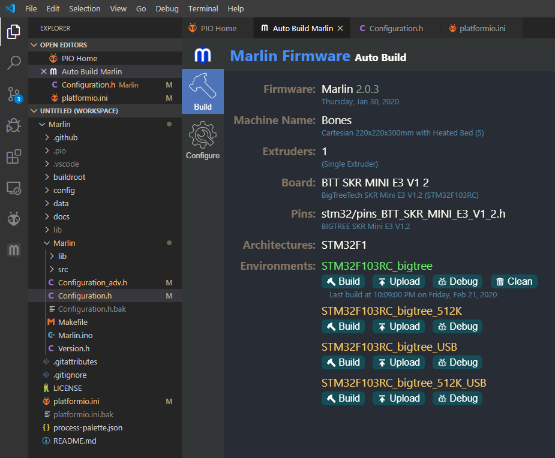
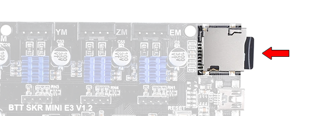
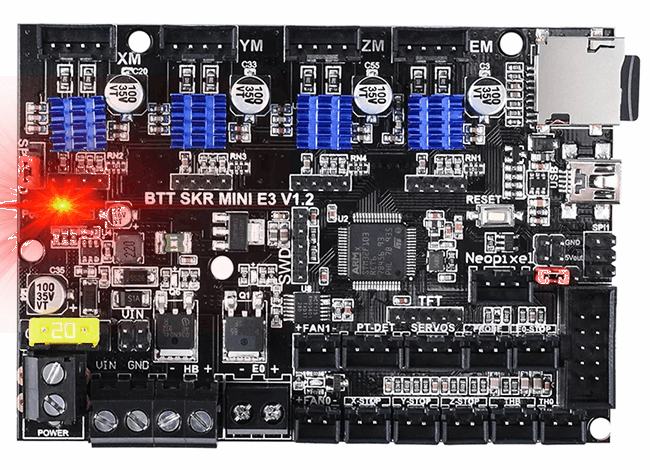

# Firmware

The firmware we'll be using is [Marlin](https://marlinfw.org/) version 2.x.x. This piece of open source code evolved from the early days of 3D printing when people only had access to Arduinos as the microcontroller platform. It is packed with features and have evolved further to support the newer more powerful 32-bit microcontrollers.

## Getting Ready

We need to...

 * download Marlin source code [(click here])(https://marlinfw.org/meta/download/), or use [their GitHub repo](https://github.com/MarlinFirmware/Marlin/) (make sure you are using the right branch, 2.x.x)
 * install PlatformIO [(click here)](https://marlinfw.org/docs/basics/install_platformio.html)

## Modifying Configuration

We need to set the configuration for Marlin, basically we tell it:

 * how big the printer is
 * which way should each motor spin
 * how fast should each motor spin
 * what type of temperature sensor are we using
 * what type of endstops are we using (limit switches)
 * and some other things

In the source code you've downloaded, there should be a "**Configuration.h**" file and "**Configuration_adv.h**" (advanced) file under the directory "MarlinFirmware/Marlin". Open these files. They are large files, with comments explaining what each option is.

A comment is simply text that the computer doesn't care about, but the human can still read. We use it to make notes inside source code to communicate to other humans.

    // this is a single line comment
&nbsp;

    /* a small block comment looks like this */
&nbsp;

    /* a large block comment
    could take up multiple lines
    like this */
&nbsp;

There are options that can be enabled (aka defined) or disabled, and if an option is defined, it might also have a value.

    #define OPTION_X    // this option is enabled (aka defined)
&nbsp;

    //#define OPTION_K    // this option is disabled, because it became a comment
&nbsp;

    #define OPTION_K 3    // this means OPTION_K has the value of 3
&nbsp;

Often we use comments to act as an ON/OFF switch for options, so that we don't forget that the option is available.

There's a lot of these in the file, literally hundreds. To make this page short, go download our version of the **Configuration.h** file and the **Configuration_adv.h** file, inside, look for the word "Bones" to see where I've made a change to the configuration. Copy my files to overwrite the ones you've downloaded from Marlin's website before building.

## Reversing Motor Directions

Remember when we did the tests for the stepper motors, I asked you to remember which motors were spinning backwards? We need to reverse those motor directions using the Configuration.h file. Look for these options:

	// @section machine

	// Invert the stepper direction. Change (or reverse the motor connector) if an axis goes the wrong way.
	#define INVERT_X_DIR false
	#define INVERT_Y_DIR false
	#define INVERT_Z_DIR false

	// @section extruder

	#define INVERT_E0_DIR false

Changing these options between "true" and "false" will change the direction of that motor. Change these for the motors that need to have their direction reversed.

## Stepper Motor Speed

Recall what we learned from the lesson on [3D printer motion](lesson5). Those calculations can be put into Configuration.h under the setting called **DEFAULT_AXIS_STEPS_PER_UNIT**.

The values can be adjusted without editing the Configuration.h file. Either there's an option inside the LCD screen's menu system, or use the [M92 command](https://marlinfw.org/docs/gcode/M92.html) through Pronterface (or any serial port console).

There are other settings such as acceleration that can also be edited through various G-code commands. So we will not worry about them inside Configuration.h for now.

## Stepper Motor Current

The stepper motor current can be adjusted. By default, they are set to 800mA RMS. This is an OK default starting point. We will need to increase this value if the printer is not printing correctly, as in:

 * not enough plastic being extruded, due to the extruder motor being too weak and missing steps
 * layers appearing to shift, due to gantry steppers being too weak and missing steps

Do not end up setting the value too high, beyond your stepper motor's ratings. Also, the higher this current is, the hotter the circuit board will get.

The value can be adjusted without editing the Configuration_adv.h file. Either there's an option inside the LCD screen's menu system, or use the [M906 command](https://marlinfw.org/docs/gcode/M906.html) through Pronterface (or any serial port console).

## Temperature Sensor Configuration

Both the E3D branded thermistor cartridge and the Anet branded bed heater uses the Semitec 104GT-2 model thermistor. This is reflected in the settings named **TEMP_SENSOR_0** and **TEMP_SENSOR_BED**. It is critical for this setting to be correct in order for us to perform any heater testing safely.

## Building

There's a file "**platformio.ini**", modify it slightly, copy [my version of it (click here)](). This will tell the compiler that we are using the SKR Mini E3.

VSCode and PlatformIO should have an [extension to autobuild Marlin](https://marlinfw.org/docs/basics/auto_build_marlin.html), use that to do the build.

You'll end up with a **firmware.bin** file, inside a folder named ".pio\build\STM32F103RC_bigtree".

## Firmware Update

Copy the **firmware.bin** file to a **blank** microSD card. Put it in your SKR Mini E3's microSD card slot.

Then turn on the power. The red LED will start blinking, when it stops, the firmware update is complete.

(If you have a TFT24 as the LCD screen, putting the card into the TFT24 won't update the SKR Mini's firmware!)

If anything needs to be re-configured, you need to figure out if a setting is inside the Configuration.h file, or the LCD screen, or if it can be modified through Pronterface (or any serial port terminal). You only need to do a firmware update for things that can only be changed through the Configuration.h file.

## Measuring the Print Height

The configuration has a rough estimate for the printer's printable height. The setting's name inside Configuration.h is "**Z_MAX_POS**". If this value is too low, then the bed will never reach the nozzle. If this value is too high, then the bed will crash into the nozzle. If the value is close enough, we can use the bed springs to make small adjustments, but ideally we want those springs to be almost completely compressed.

This height is not very predictable, even if we have 3D modeled our entire printer in CAD, because the printer is built by hand, we have measurement errors to account for, plus the springs give a lot of variability. That's why we'll measure it after we built the printer. No, we are not measuring it with a ruler or tape measure, we will measure it with the printer's own electronics.

Remove the glass plate from the heated bed for now, we don't want to shatter it. Turn all the bed leveling knob to set the bed leveling springs at about 50% of their maximum extent. Move the print head, by hand, to about the middle of the print bed.

Turn on the printer and connect to it via Pronterface. Click the **Home Z** button. The bed should start moving down until it hits the limit switch.

Using the Z axis movement buttons, move the bed up. You can choose how far it moves per click. Move it up gradually, use 10mm increments when the bed surface is more than 10mm away from the nozzle, otherwise, move in 1mm increments. Keep a count of how much you've moved it so far, until the heated bed surface is about 3mm away from the nozzle. You can check by sliding the glass under the nozzle, if it fits, move it up more 1mm at a time until it doesn't fit. The count you are keeping is the height measurement.

We do not want decimal places in this measurement! Whole millimeters only. adjustments smaller than a millimeter should be taken care of by adjusting the springs.

When you have finalized this height measurement, then write it to the **Z_MAX_POS** setting inside the Configuration.h file, rebuild the firmware, and update the firmware with the microSD card again. To verify these changes, restart the printer with the new firmware, then home the Z axis, then use following command:

 * G90
 * G0 Z0

This will cause the bed to move from the bottom all the way up, stopping at the perfect distance away from the nozzle.

## Proceed with Testing and Usage

Once you've updated your SKR Mini E3 with the re-configured firmware, it is safe to continue testing the high powered features, and to start using your 3D printer.

## Temperature Control PID Tuning

The firmware uses a PID control loop to control the temperature of the bed and nozzle. This control loop checks the temperature through the thermistors and calculates an appropriate power output using the PID values. Those PID values (aka PID constants) can be tuned for a more stable temperature.

I have already written the steps for PID tuning in the [previous lesson, under the heater sections, click here](lesson11b).

The constants are stored in non-volatile memory, and they can be edited through the [M301](https://marlinfw.org/docs/gcode/M301.html) and [M304](https://marlinfw.org/docs/gcode/M304.html) commands over Pronterface (or any serial port terminal).

NOTE: PID for the bed may be disabled in the firmware. The bed has a large thermal mass that's slow to heat up, so it does not need a PID control loop. PID control loops are more important in places where the temperature could overheat very fast (aka overshoot), such as the nozzle.

## Other Firmware Options

If you are using a [Duet WiFi](https://www.duet3d.com/Duet2Maestro) control circuit board, like [my Hephaestus 3D printer](https://eleccelerator.com/hephaestus-my-own-3d-printer/), then you will be running the [RepRapFirmware](https://duet3d.dozuki.com/c/RepRapFirmware). This firmware is awesome because you don't need to recompile the whole firmware to make changes to any setting, you simply edit a file through the web interface over WiFi (or write the settings to a file on the SD card).
