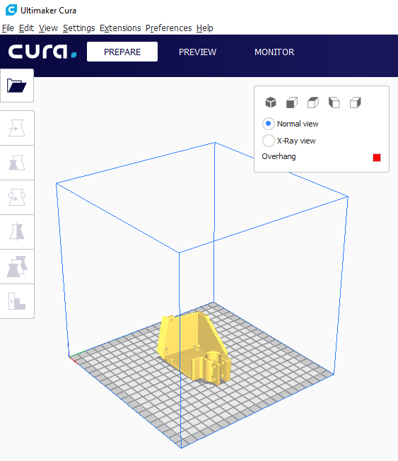
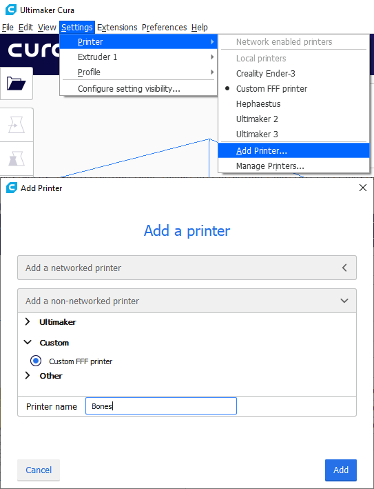
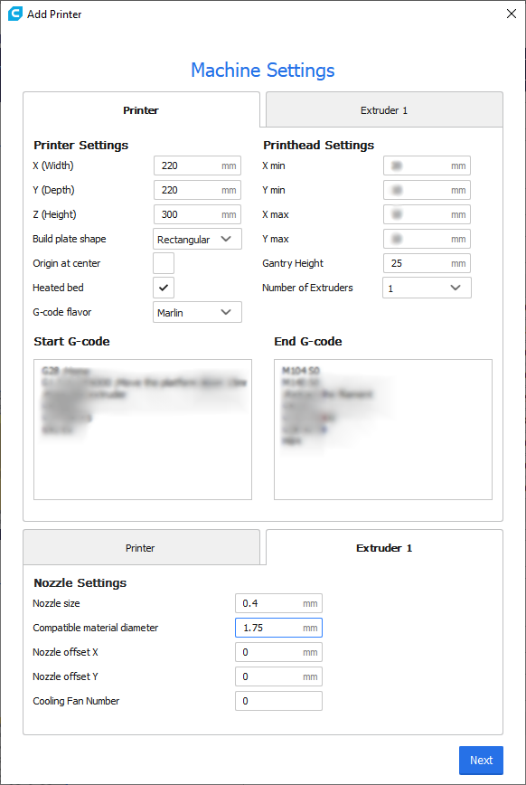

# Software

We will need a slicer software, which is software that slices up a 3D model into very thin layers, and then a path is planned to cover each layer. This path is the instructions given to the 3D printer, and the print head will move in these paths to perform the 3D print.

There's a few slicers out there but I will be recommending Cura just because I'm more familiar with it. Cura is open source, written by Ultimaker, and supports a broad range of different 3D printers, including the ability to define settings for home-built 3D printers. All the good slicers should have a way for you to use it for a custom built machine.

Download and install [Cura (click here)](https://ultimaker.com/software/ultimaker-cura)

## Configure the Custom Machine

Add a custom machine to Cura.

We will put in the dimensions of our printer's print volume. Select that it has a heated bed. For now, leave the starting and ending gcode alone. On the "extruder" tab, simply make sure that the nozzle size is correct, it should be 0.4mm if you followed my advice. The filament diameter should be set to 1.75mm since that's the filament size we will be using.

NOTE: Where it says 300mm for Z height, change that if you've already measured a different height. It must match what the firmware is configured for.

Then for the print settings, you should edit "Initial Layer Height" to be 0.28mm because of the step size and the leadscrew pitch of our Z axis stepper motor. Recall from [lesson 5](lesson5) that the leadnut will move 0.04mm per full step of the stepper motor. So all height settings, such as lay height and initial layer height, should be a multiple of 0.04mm. For the actual layer height setting, please use 0.12mm for slower-but-better-quality prints, and please use 0.2mm for faster-but-rougher prints.

If you decide to swap to a 0.8mm diameter nozzle, then please make a new custom machine and set the nozzle size again under the extruder tab. For this new machine, set the initial layer height to 0.32mm, and use layer heights of 0.2mm or 0.4mm, maybe even 0.6mm if you dare.

## Start and End G-code

The G-code for the start of the print and end of the print can be configured through Cura. At the start, typically it will home the printer and then prime the nozzle. At the end, it simply moves the bed to the bottom and turns off the heaters and fans.

With G-code, comments start with a semicolon ;

    ; this is a comment in G-code

I will write out the G-code for the start and stop with more detailed comments explaining what it does

The start G-code should be

	G28             ; home all axis
	G1 Z15.0 F6000  ; move the bed to where the nozzle is 15mm above the bed, as quickly as possible
	; prime the extruder, aka purge
	G92 E0      ; reset E coordinate to 0
	G1 F200 E8  ; extrude 8mm of plastic at a rate of 200mm per minute
	G92 E0      ; reset E coordinate to 0

The end G-code should be

	M104 S0     ; turn off nozzle heater
	M140 S0     ; turn off bed heater
	M107        ; turn off blower fan
	; retract the filament
	G92 E1      ; reset E coordinate to 1mm
	G1 E-1 F300 ; retract filament 2mm at a rate of 300mm per minute
	; go into a nice idle position
	G28 Z       ; move the bed down completely, easier to remove prints
	G0  X100 Y100 F600  ; move the print head to about the middle of the machine, easier to change filament or change nozzle
	M84         ; disables all stepper motors

NOTE: Cura will put some more G-code above your "start G-code" automatically, most importantly, it sets the bed and nozzle temperatures, then puts the machine in absolute extrusion mode.

NOTE: You might want to edit the prime amount and the retract amount in the start G-code and ending G-code

## Slicing

Use Cura to open up a STL file, click "prepare", save the file to a microSD card. Move on to the [next lesson](lesson14), when you will start your first print!

NOTE: It is very unlikely that the time estimate that Cura gives you is correct.

I would start with a simple [calibration cube](https://www.thingiverse.com/thing:1278865), then move on to printing some of the [optional accessories for this printer](../other_pages/optional3dprintedparts). Here are some more popular test prints:

 * [Cali Cat](https://www.thingiverse.com/thing:1545913)
 * [3D Benchy](http://www.3dbenchy.com/)
 * [All in One 3D Printer Test](https://www.thingiverse.com/thing:2656594)

Do not worry about fine tuning parameters for now.

## Next Lesson

Let's [start printing](lesson14)!
