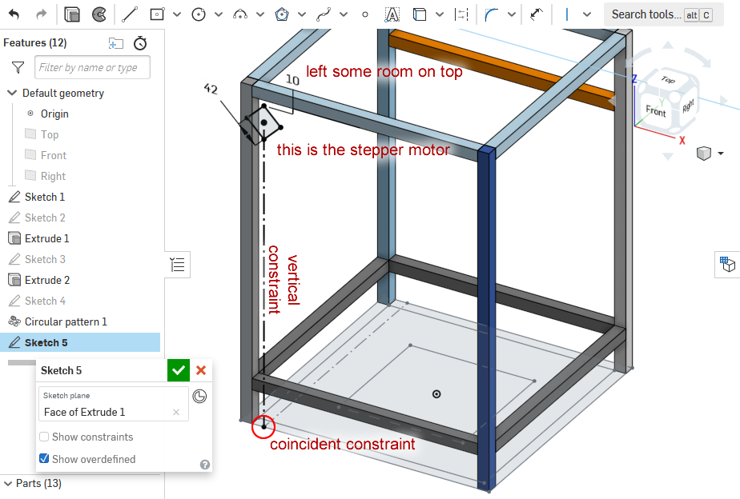
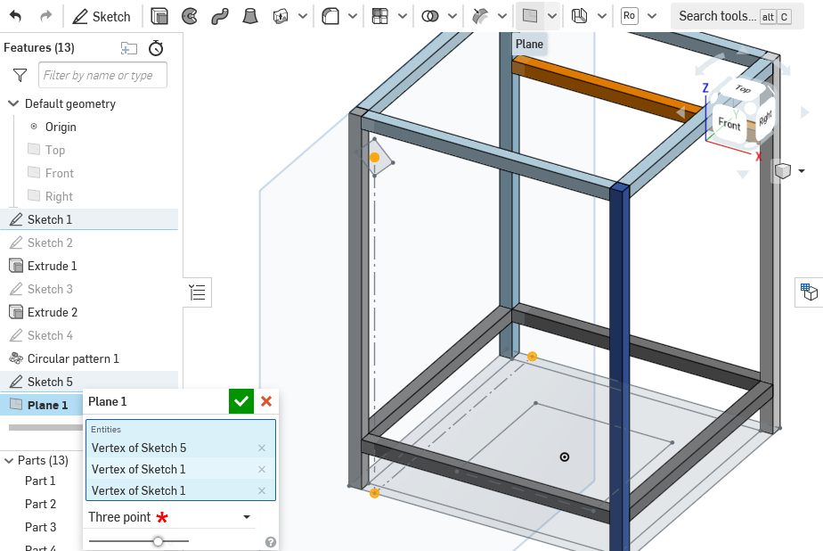
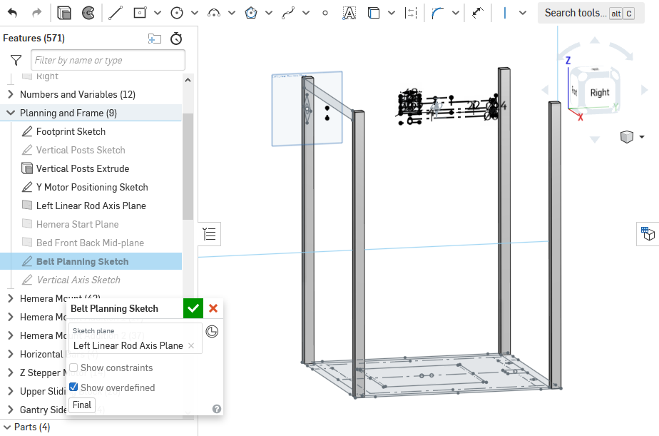
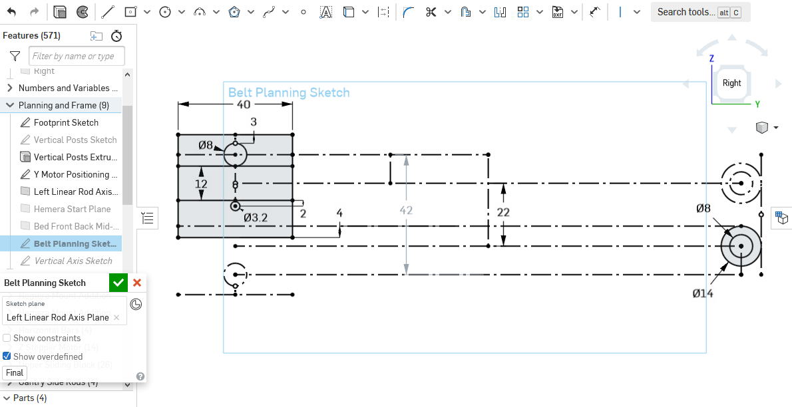
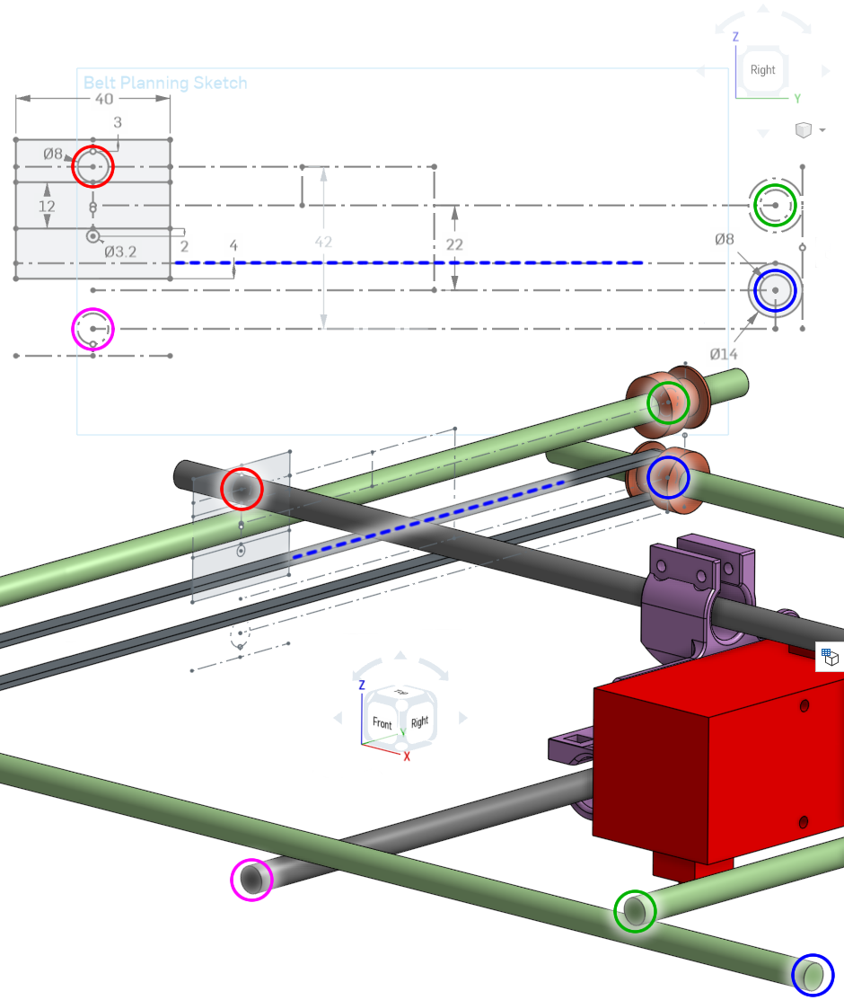
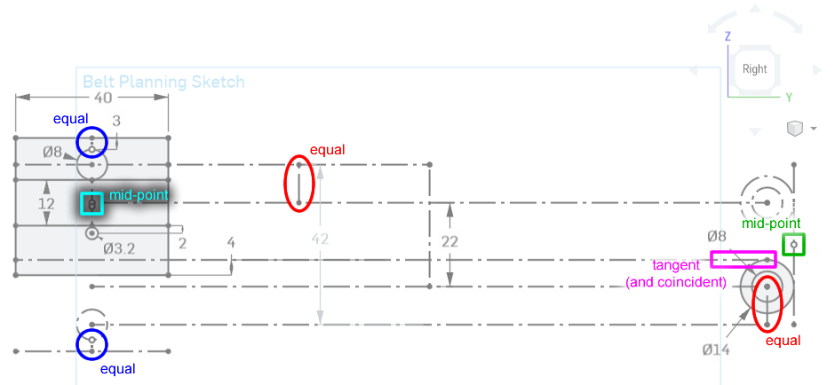
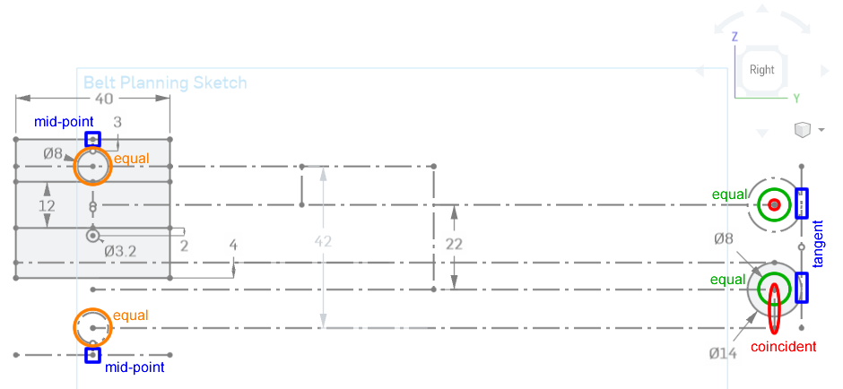
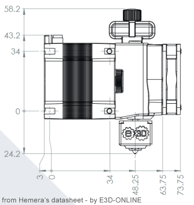
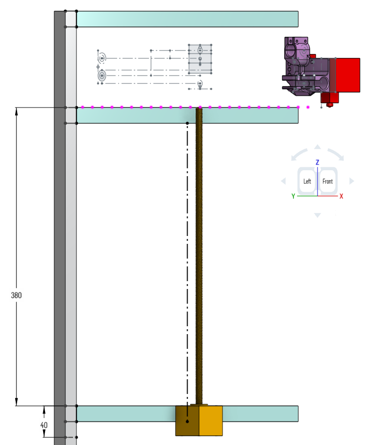

# Gantry Design

Remember in the frame planning, I actually designed the entire gantry just to figure out how high up to put the Z axis rods? This lesson will cover those sketches in detail. After this lesson, you will be an expert in using constraints.

## Starting with the motor

I knew the stepper motor was going to be the highest point. The dimensions of a NEMA 17 stepper motor is 42mm x 42mm, and we give it some room below the upper horizontal beam so we have room to put some screws.

## Defining the Rod Plane

We need a plane to put the belt planning sketch on. We can define any plane with 3 points, so we will use these three points to define a plane to put the sketch on:

After making this plane, you can start sketching on it.

## Belt Planning Sketch

This sketch will tell me where the belts, rods, pulleys, and bearings will go. On my design, the sketch:

It is aligned, using constraints, to the stepper motor, and to the rod lines of the floor plan:

In relation to the rest of the model, here's the relationships between the printer components and the sketch:

## Some Constraints Used

These diagrams show you where some key constraints are being used:

## Extruder Mount and Nozzle Height

Since we've planned out the pulleys and rods, we can design the mount for the extruder. This mount will have linear bearings that slide along the rods, and carry the extruder.

Have a look at the Hemera's side view dimensions:

Here's our sketch in relation to the mount I designed:

Notice how the nozzle is 24.2mm below the bottom screws. Now we know where the top of the bed will reach, which gives us an estimate of where the leadscrew should reach. Knowing where the leadscrew will reach tells us where we need to mount the Z axis stepper motor as well. Now we can design where the horizontal beams should go on the frame.

## Gantry Bearing Mount

Much later, the gantry bearing mounts will be designed and the centers of the bearings are constrained to the belt planning sketch:

## Next Lesson

click here for the next [lesson on "Construction Tolerance"](lesson3)
