# Construction Tolerance

We are building what is supposed to be a highly reliable, precise and accurate piece of equipment, but with cheap 3D printed parts? How do we accomplish that at home?

## Square Frame

Remember how when we planned out the frame, we decided it'd be nice to buy the right sized aluminum beams pre-cut for us, in packs of four?

Hopefully those guys did a good job cutting them. They usually do. But what if they didn't?

The easiest way to construct the frame is to just screw together everything as tightly as possible, right? If you did that, but had beams that are not the right lengths, then you might end up with a skewed frame.

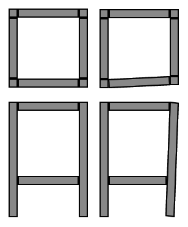

But this is a problem we can solve without too much effort, you just need to use some squares (L shaped rulers) to help you when you build your frame.

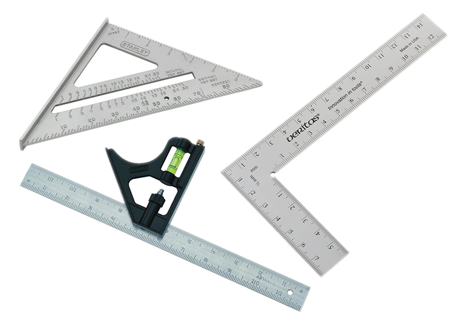
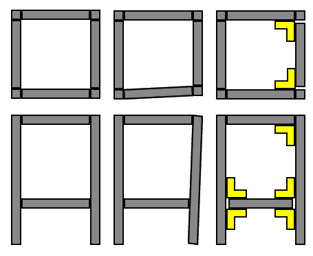

If the four legs of the printer isn't exactly the same length, you can use adjustable feet to adjust the level.

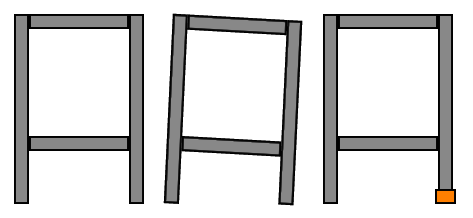

## Rod Spacing

This printer is much cheaper to build than my Hephaestus 3D printer or my Ultimaker 2, one expensive part of Hephaestus is the usage of water-jet cut aluminum sheets to make sure all the rods are mounted in perfect position. Let me explain with an example

The water-jet machine is specified to have a tolerance of +/- 0.1mm. If I design one sheet of aluminum to have two holes exactly 300mm apart, then I might end up with a sheet that has holes could be 299.99mm apart, or 300.1mm apart. That's pretty good.

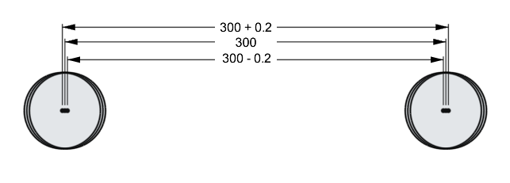

The new design is basically two 3D printed parts, each one with a hole, mounted with a 2020 aluminum beam in between. Pretend my 3D printer can print with a tolerance of +/- 0.1mm, and the aluminum beam was cut on both ends with +/- 0.2mm tolerance. Now the maximum and minimum possible distance between the holes are much more wrong:

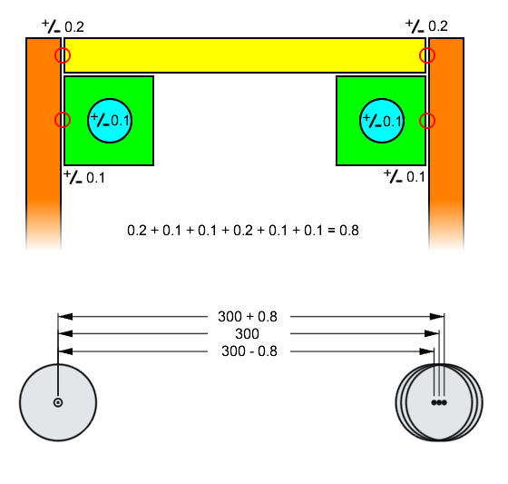

It will be incredibly hard to measure the spacing of two rods across the entire printer, so we are not going to bother, or even care. What's more important is that all the rods running along the X axis are parallel with each other, and the same for the Y axis. Remember that parallel lines will form a plane, and now we have two planes, one formed by the X rods, and another one formed by the Y rods. These two planes must be parallel. Being parallel is more important than the distance between these two planes.

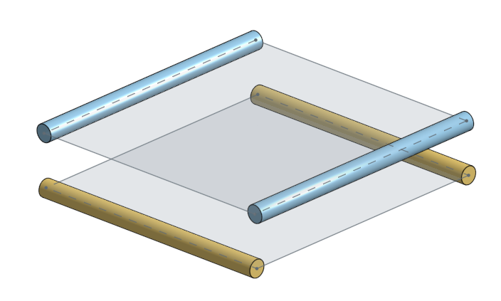

The good news is, the part that holds the ball bearings for these rods are 3D printed, and 3D printing is pretty consistent, at least, consistent enough to build parts for other 3D printers. We just have to make sure we keep the printer settings consistent, and the filament consistent.

## Why it's OK to be a little off

What will happen if everything is not perfectly parallel?

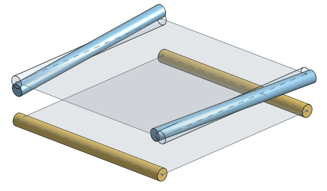
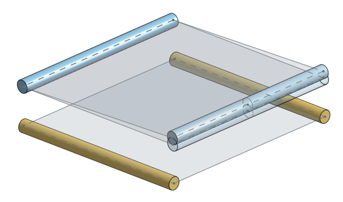

If everything is perfectly stiff and solid, then your printer wouldn't even move, it would get stuck. But, in the real world, everything is soft and squishy. Steel is harder than plastic but the rods we will use will still bend, and the plastic will bend and squish.

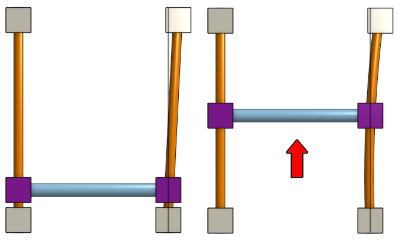

There will be extra radial load on all the linear bearings and bushings as well, so there will be more friction, and thus the stepper motors will use more power.

But in the end, the printer will still work, even if it's not perfectly built!

We are using 8mm diameter hardened steel rods. We have to make sure they are perfectly straight when we buy them! But if they start out being straight and are bent after, that's actually still OK! There's two types of deformation: **plastic** and **elastic**

**Plastic** *deformation* means you've bent the rods enough that they will stay bent permanently. This is bad.

**Elastic** *deformation* means the rods will spring back into being straight if you remove the stress forces.

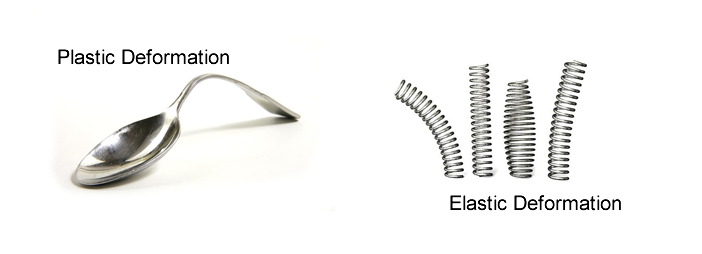

So as long as you didn't do such a horrible job to cause plastic deformation of the steel rods, then your printer will still work!

## Leveling and Skew

The design of the printer bed uses four spring loaded adjustment screws so that even if the movement plane of the extruder isn't level (as in, parallel with the bed), you can adjust the bed level using those screws. This is a pretty standard mechanism used on many 3D printers.

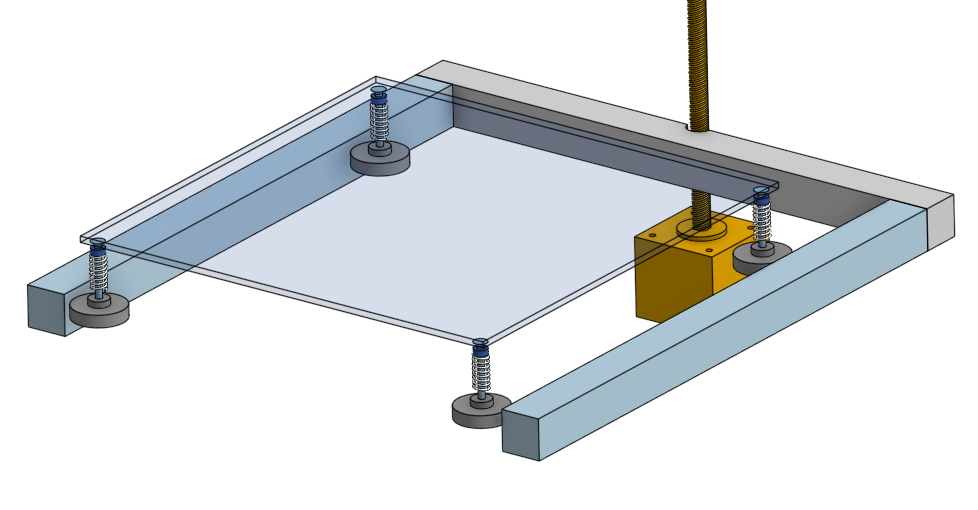

Remember that 3 points make a plane, but with 4 points, that might means bending the bed! Not good!

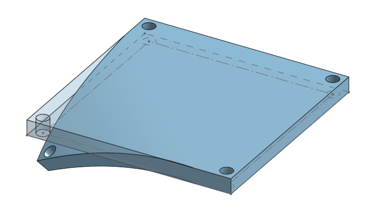

But don't worry too much because we will be putting a piece of glass on the bed. Glass can't bend, so it will stay flat, even if the heater is slightly bent. Plus, you'll see that one of the 4 corners is a bit wrong and fix it by hand when you see it.

(also, maybe read [this article by Cults3D](https://cults3d.com/en/blog/articles/how-to-level-3d-printing-bed))

(my own Hephaestus 3D printer used a 3 point bed leveling system, but that's because I used water-jet cutting to custom cut the aluminum bed, not cheap, most cheap off-the-shelf heated beds have 4 screw holes for leveling, not 3)

If you didn't make your printer square, but your rods are all parallel, then your printer will be skewed like a rhombus. Your printer will still work but if you tried to print a square shape, it will come out looking like a rhombus.

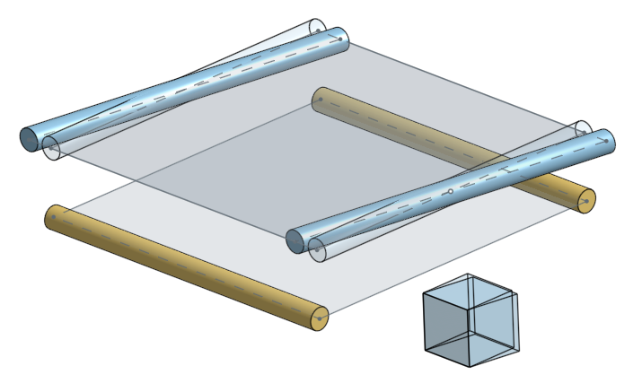

You should be assembling your printer properly! But if the skew is still there, you can actually just tell the printer's firmware code to compensate and correct for the skew.

(more reading: [Marlin source code comment describing skew compensation](https://github.com/MarlinFirmware/Marlin/blob/e4679c1b787887c466fa607b7408f69e420f4b90/Marlin/Configuration.h#L1364) and [Marlin gcode for skew compensation](https://marlinfw.org/docs/gcode/M852.html) , it's a bit of an advanced topic)

## Metal-on-metal

There are some places in this design where we try to butt up metal up against other metal. Have a look at the design of the plastic clamp that holds the Z axis rods:

Notice how the tangent constraint is used in the 3D model to make the steel rod touch the aluminum beam. Notice how there's a gap between the plastic part and the aluminum beam.

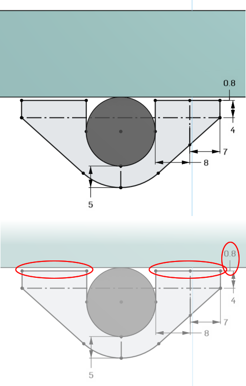

When you screw the plastic clamp down to the aluminum beam, the plastic will squish the steel rod up against the aluminum beam. Plastic is softer than metal so the plastic will bend a little bit when the screws are really tightened down, this keeps the rod extremely secure.

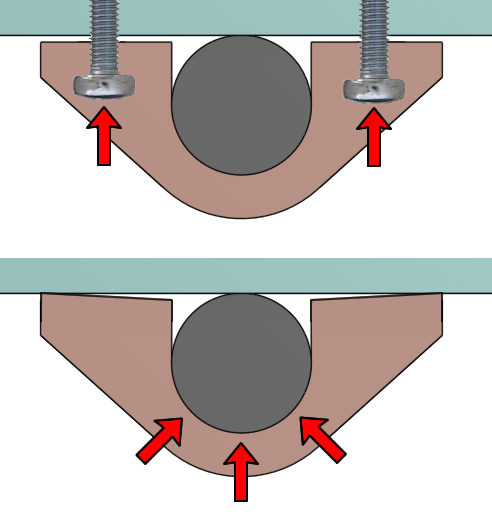

Pretend the Z axis rod is made with +/- 0.05mm diameter tolerance, the aluminum beam has a width tolerance of +/- 0.05mm, and the 3D printed plastic has a dimensional tolerance of +/- 0.1mm, what is the advantage of this design over a piece of plastic surrounding the entire Z axis rod?

The same principle is applied to the sliding block part that holds a graphite bushing and the middle axis steel rods. Have a look:

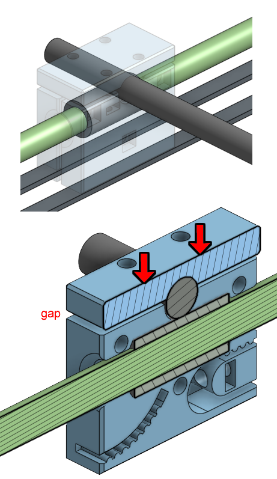
