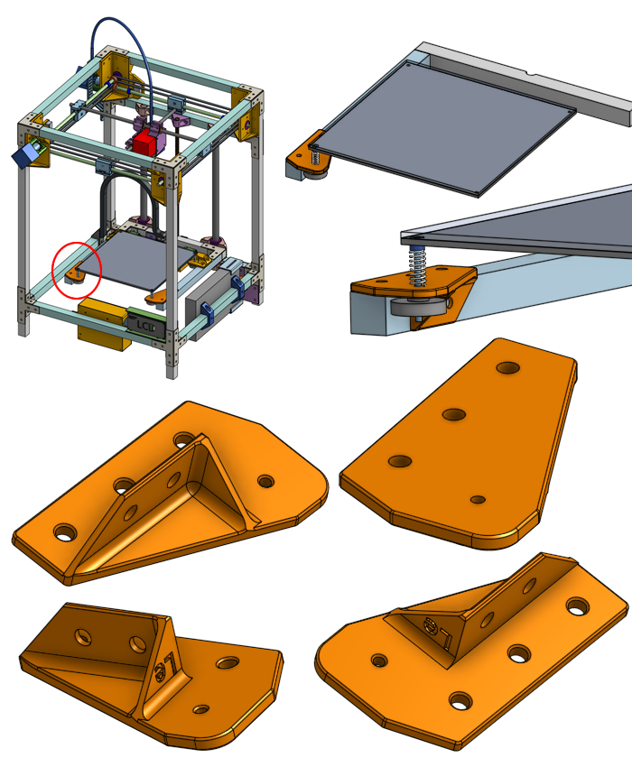
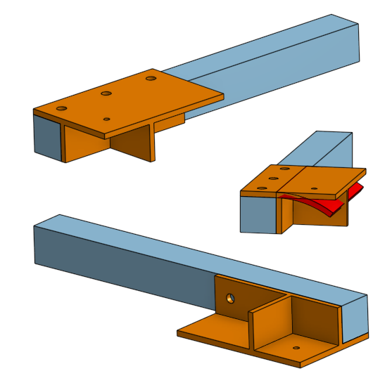
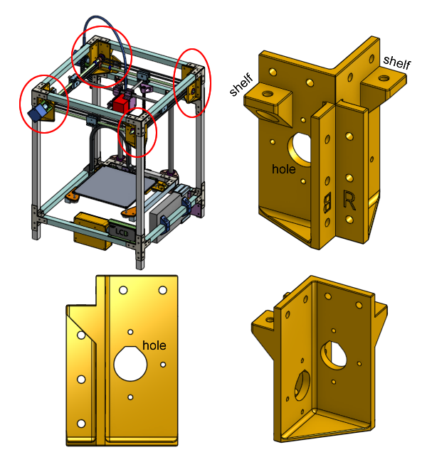

# Designing 3D Printed Parts

3D printing plastic parts is great because it's cheap for us, just one or two spools of plastic is probably enough to print all the parts needed for this 3D printer. We are not limited to the constraints of other manufacturing methods, we have a lot of freedom when we are designing.

But not total freedom. 3D printers cannot just make "any shape". And some shapes are stronger than others.

## Designing for Strength

There's some support parts in our 3D printer design that holds the bed up. We will look at its design.

If every solid in the world was infinitely hard and stiff, then the job of holding up the bed could be accomplished with just a single flat sheet of plastic.

But in the real world, plastic can bend, especially when you apply a load on top of that hole.

What's the simplest way to make the plastic stronger? Make it thicker!

Obviously this will work but it's not efficient. It takes up more room. It uses more plastic.

We can take advantage of the aluminum beam that this plastic part will attach to.

That looks fine but we can still do better.

### Ribs

Features like this are called **ribs**: thin protrusions that extend perpendicular from a wall or plane to provide added stiffness and strength.

The ribs will brace against forces that could bend the main flat chunk of plastic.

There are areas of the rib that do not experience stress, especially the corners on the end of each rib. We can save some plastic if we remove them.

### Fillets

As a basic rule of thumb, corners are where cracks tend to happen, because stress tends to concentrate around corners. To avoid things cracking, we can make corners rounder. We frequently do this by adding fillets to the design.

(additional reading: [Engineering Stack Exchange: Why do stress concentrations really occur?](https://engineering.stackexchange.com/questions/26514/why-do-stress-concentrations-really-occur))

Fillets are also required in other manufacturing methods, for example, if you are using a spinning mill to cut a corner, that corner radius must be round since it's physically impossible for a round spinning cutting mill to cut perfectly sharp corners.

## Print Orientation

The proper print orientation can determine how strong your 3D printed part is and how easy is the part to print. Basically we are asking which side of the object should be sitting down on the print bed.

### Orientation, Stability, and Bed Adhesion

We don't want the part to come off the print bed during the print. We want as much contact surface area to the bed as possible. This usually means keep the flattest side of the print against the bed. This rule can be broken though. If you are printing something tall, it will want to topple over because the nozzle of the printer is applying a slight force to it when it is printing. A larger bottom area will prevent it from toppling over.

Tricks like a brim layer, or a raft, are other ways of increasing the bottom surface area without changing the part's design. They waste more plastic and time so we try to avoid them, and only use them when absolutely neccessary.

### Orientation and Strength

The 3D printer lays down plastic layer by layer, almost like stacking sheets of paper. Each layer is composed of many lines. Since each line is a single continuous solid, it is strong. When a line is printed, it's hot liquid plastic meeting hot liquid plastic, it cools down into one continous chunk of solid. When hot liquid plastic is meeting cold solid plastic, there's a bond but it's weaker. This means when we stack the layers, we get a very large area that's weak that goes right through the entire print. This is why 3D printed parts tend to break at the layer lines.

As an example, we will study the plastic clamp part we designed to hold the Z axis linear rod. What is its best print orientation?

If we try to pick flat surfaces, then we have two choices, see the screenshots: (we will name one "like-a-bridge", and the other one "on-its-side")

If we printed it like-a-bridge (see image below), then the forces being applied by the screws and the rod will peeling the layers away! (we say that the forces are normal, aka perpendicular, to the layers)

If we printed it on-its-side (see image below), then the continous lines of plastic will handle the majority of the forces.

This is good! This is the best printing orientation for this part.

### Overhangs

The 3D printer works by squirting plastic out from a nozzle above the print, this means that if there's nothing for the liquid plastic to land on, the plastic will end up on the bed and not where you want. When 3D printing, it's laying down lines of plastic. One line must be supported by the line below it.

Let's visualize what happens when we print something with angled slopes: (pretend the diagram is showing 0.2mm layer height and 0.4mm nozzle diameter)

Let's study the part that holds the ball bearings for the X and Y gantry rods. It's a tall print but I've designed it to have a wide base so it won't topple as it prints. It features a shelf that an aluminum bar would sit on top of, and it features a weird looking hole where the bearings sit in.

This shelf feature would have been an overhang and fail to print correctly, but that's why the final design of this part has an angled slope underneath the shelf, which allows it to be printed correctly.

This hole is designed to grip a ball bearing. But the hole is vertical, so if we designed the hole as a normal circle, the top of the circle is an overhang, and it would droop at the top if printed this way.

The solution is to find the point in the circle where the slope is a managable 45 degrees overhang, and then continue in a straight line instead of a curve.

The two 45 degree slopes meet at the top at a point, forming a 90 degree corner. We want to avoid sharp corners so we make the top of the hole flat, giving it some room to droop without touching the ball bearing.

We use this technique for the ball bearings, which have an outer diameter of 22mm, and need a tight toleranced fit. The fasteners we are using around the printer are only 5mm in diameter, and their positioning do not need tight tolerances. This is why we only apply this technique on the circles for the ball bearings and not the circles for the 5mm screws.

## Print Artifacts and Optimization

There are many caveats to 3D printing plastic parts, we will explorer some of the noteworthy problems and how to solve them.

### Corner Bulges

Corner bulges will cause flat walls to not be completely flat at the corner. They are caused by how 3D printers slows down the extruder movement when it needs to do a direction change. The hot melted plastic in the nozzle still has some pressure and thus more-than-expected plastic comes out when the extuder is slowing down. Also, the extruder might overshoot the corner due to its own momentum, the belt will stretch and allow the extruder to overshoot past the corner slightly.

We use fillets and chamfers to avoid them. Slicer settings can be adjusted to compensate for the extra filament pressure. Belts can be tightened to avoid extruder overshoots. The extruder's acceleration setting can also be slowed down to manage the momentum.

### Elephant's Foot

When the first layer of a 3D print is made, it is squished right up against the bed plate. If you don't squish it enough, the print might peel away from the bed while it's printing. If you squish it too much, then the first layer will become slightly over-extruded, and become bigger than what you expect.

We can correct for this by adding a chamfer or fillet to the bottom of the printed part.

The slicer settings might actually have a setting to shrink just the first layer in order to avoid elephant's foot. This might work but sometimes even the second layer is affected, so I prefer to use chamfers as the solution to elephant foot.

(additional reading: [All3DP: Stomp It Out! Elephant's Foot - Easy Fixes](https://all3dp.com/2/elephant-s-foot-3d-printing-problem-easy-fixes/))

### Line Gaps

When the printer prints a line, the width of that line might not be so precise, and if it is too thin, the print will have gaps between lines.

This isn't usually a problem that causes a loss of strength of your print. Obviously there is less adhesion where there are gaps, but the gaps are only on the walls of the prints. It's actually really unlikely you'll ever exert a force in a way that causes a print to break due to this gap.

So really this is only an aesthetic problem, because looking from the top of the print, the gap on top will let you see into the gap on the next layer too. So the solution to this is to somehow put a line of plastic, on the top-most layer, that covers the gap on the second top-most layer. We can achieve this by simply using a chamfer on the edges near the top.

A chamfer of about 0.6mm seems to work well for all situations, for most layer heights and most nozzle sizes. You don't have to get that line exactly right in the middle of the gap, you just have to cover it slightly.

The other solution is to adjust the extrusion factor, but I prefer not to do this as different brands and even different spools of filament may have different optimal extrusion factors.
