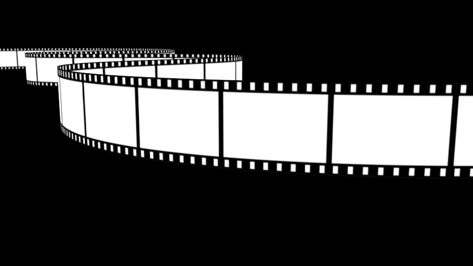
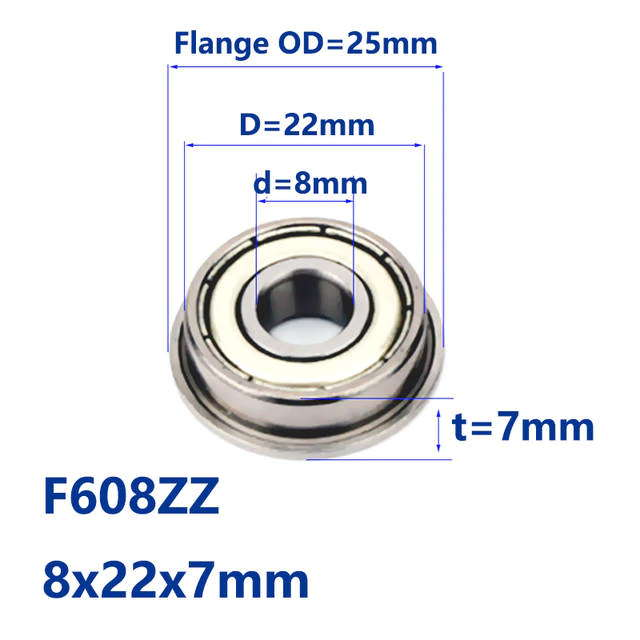
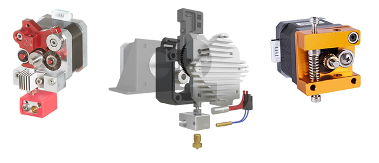

# 3D Printer Motion

Have a look at the 3D printer parts that move.

Some parts are moving linearly, some parts are rotating. We are the motion to be smooth but tight, no vibrations, and for the parts to last a long time.

This is a good time to review [Lesson Zero: How this 3D printer works](../ordered_lessons/lesson0), where there are videos showing the movements that the 3D printer makes. It is also a good idea to have the [3D model of the printer](https://cad.onshape.com/documents/359baba3de4f085c967fb5a9/w/62a7ef2a4414462a5d8bf3e1/e/208ce2426916e4fde5ad150f) open so you can explore it as you are reading.

We'll look at each part closely. The relationships between the **different parts** are intertwined so don't worry if I mention something and don't explain it straight away, I will explain it later.

## The 4 linear rods on the sides

In the 3D model of the printer, these are named "side rods".

These are **linear rods**. These rods are made of hardened and polished steel, with a very precise diameter, with a very smooth surfaces, and made extremely straight. This means when it rotates, it will not wobble, and when something slides along the rod, it will be a smooth motion without wobbling as well.

**Tech Specs:** 440mm long, 8mm diameter, hardened steel linear rod

### Review of how the printer works

<video controls="controls" loop="loop" preload="none" id="vid_0" poster="../images/filmanimation.gif" style="width: 100%;"><source src="../videos/hephaestuscircles.mp4" type="video/mp4"></video>

These rods are rotated by a **stepper motor**, and they are held in place with **rotary ball bearings**.

The rod on the left is connected to the rod on the right by two **timing belts**, with help from **pulley wheels**, so when the rod on the left rotates, the rod on the right also rotates. The same goes for the rods on the front and in the rear of the printer.

In the middle of each of these rods is a **brass bushing**, which is carried by a **sliding block**.

Metal rods purchased from a hardware store like Home Depot are not hardened and are not anywhere near round enough or straight enough to be used as linear rods.

## The 2 linear rods in the middle

In the 3D model of the printer, these are named "cross rods". These are the parts that pushes the extruder print head around. The **sliding blocks** move the cross rods. These rods do not rotate. The extruder's **linear ball bearings** moves along them linearly.

**Tech Specs:** 440mm long, 8mm diameter, hardened steel linear rod, cut down to appropriate lengths

## Rotary Ball Bearings

Rotary ball bearings holds our side rods and allow them to rotate without friction. Ball bearings work by having balls inside that roll instead of rubbing.

[Wikipedia: Ball Bearing](https://en.wikipedia.org/wiki/Ball_bearing)

[Wikipedia: Bearing](https://en.wikipedia.org/wiki/Bearing_(mechanical))

**Tech Specs:** 8mm inner diameter, 22mm outer diameter, 7 mm overall thickness, flanged rotary ball bearing, standard part number: **F608ZZ**

## Linear Ball Bearings

Linear ball bearings slides linearly along our *cross rods*, without rotation, and without friction. They also use balls that roll on the inside instead of rubbing, hence why they are low friction. The balls inside a linear ball bearing rolls inside an internal track, with one side of the track exposed so that the balls can touch the **linear rod**.

**Tech Specs:** 8mm inner diameter, 15mm outer diameter, 24mm length, linear ball bearing, standard part number: **LM8UU**

[Wikipedia: Ball Bearing](https://en.wikipedia.org/wiki/Linear-motion_bearing)

## Brass Bushing

We will be using very special brass bushings to slide along the *side rods*. We cannot use **linear ball bearings** in this situation because linear ball bearings are **bad at rotation**. Brass bushings are good at both linear motion and rotation.

I say these brass bushings are special because they use self-lubricating graphite, which keeps the motion smooth and the durability of the bushing high. These should last many years and do not require you to add lubrication. (they are sometimes called "oil-less bearings")

**Tech Specs:** 8mm inner diameter, 12mm outer diameter, 24mm length, self-lubricating graphite brass bushing

[Wikipedia: Plain Bearing - Lubrication](https://en.wikipedia.org/wiki/Plain_bearing#Lubrication)

### 3 main types of loads on a bearing

## Sliding Block

This is a plastic 3D printed part we designed specifically for this printer, not something purchased. It slides along the *side rods*, using a **brass bushing**, while carrying the *cross rods*, holding the cross rods perpendicular to the side rods. It is pulled by the **timing belt**, and it has internal grooves that has matching teeth to the belt's teeth to hold the belt in place.

Actually, the sliding block is composed of three 3D printed pieces that needs to be screwed together.

## The 2 vertical linear rods and linear ball bearings in the rear

The rear linear rods are the Z axis linear rods. They do not move at all, and are held tightly in place with clamps against the frame. The **linear ball bearings** that slide on these rods are clamped against the bed platform.

These rods are much thicker because we expect them to handle quite a lot of moment load, because the bed platform sticks out and is heavy, so it acts like a lever.

If the rods are too thin and the bed is too heavy, then the rods could bend.

**Tech Specs (rod):** 400mm long, 16mm diameter, hardened steel linear rod

**Tech Specs (bearing):** 16mm inner diameter, 28mm outer diameter, 37mm length, linear ball bearing, standard part number: **LM16UU**

(you can also use LM16LUU, which are longer and will give the bed more stability, but will be more expensive)

## Timing belts and pulleys

Belts and pulleys are used together to transfer motion. Timing belts are a subcategory of belts that have teeth, so they do not slip, thus making our motion more precise. The pulley wheels we are using have teeth that match the teeth on the belt.

Belts are usually made of a soft rubbery material for flexibility and grip. But that means they are prone to stretching. The belts we will be using will have glass fibers inside as well to prevent it from stretching but maintaining its flexibility.

The belt must be tightened after the printer has been assembled. If the belt is loose, the print head will move when it shouldn't, causing ugly looking prints. There's a screw inside the **sliding block** that tightens the belt, and also we can add spring loaded belt tightening clips to the belt.

**Tech Specs (belt):** 6mm width, 2mm teeth pitch, GT2 profile timing belt

**Tech Specs (pulley):** 20 teeth, GT2 profile, 2mm teeth pitch, 7mm belt width, 8mm inner bore diameter

[Wikipedia: Timing Belt](https://en.wikipedia.org/wiki/Toothed_belt)

## Z axis leadscrew and lead-nut

The bed is driven up and down along the Z axis by a leadscrew and lead-nut. The leadscrew and lead-nut has helical (spiral) grooves (threads) so that when the leadscrew spins, the lead-nut moves linearly along the leadscrew.

<video controls="controls" loop="loop" preload="none" id="vid_0" poster="../images/filmanimation.gif" style="width: 100%;"><source src="../videos/zleadscrew.mp4" type="video/mp4"></video>

The difference between a threaded rod (one purchased from a hardware store like Home Depot) and a leadscrew is that the leadscrew is made of a much harder steel with a thread profile that's designed to handle loads along the rod very well. A plain threaded rod is made of softer steel with a much rougher thread, it is designed to be tightened with a nut, whereas a lead-nut will never be really tight against the leadscrew.

**Tech Specs (leadscrew):** 380mm long, TR8x8 profile (8mm diameter), 8mm per rotation, integrated into stepper motor

**Tech Specs (lead-nut):** TR8x8 profile (8mm diameter), 8mm per rotation

[Wikipedia: Leadscrew](https://en.wikipedia.org/wiki/Leadscrew)

## Stepper motor

A stepper motor is a type of electric motor used to make very precise movements. It has a stator with two sets of electromagnetic coils, and a rotor with many many tiny permanent magnetic teeth. When you control the states of the electromagnets in steps, the teeth rotate very slightly in steps. One change in the state of the electromagnet is basically one tooth step.

For the Z axis, the stepper motor will have a leadscrew as its output shaft (ie, the leadscrew is integrated into the stepper motor). For the X and Y axis, the stepper motor will be connected to the *side rods* using a **shaft coupling** (the standard output shaft of these stepper motors is 5mm in diameter).

**Tech Specs:** NEMA 17 stepper motor, 200 steps per revolution, 1.1A max current rating (or higher)

A specially built stepper motor is also included when you purchase the Hemera extruder.

[Wikipedia: Stepper Motor](https://en.wikipedia.org/wiki/Stepper_motor)

### Stepper motor precision

Let's think about our printer's print resolution in the X and Y axis. I've written down the tech-specs of the belts, the pulleys, and the stepper motor. How much movement of the print head is made when the stepper motor makes one step of rotation?

The belt and pulley has a teeth pitch of 2mm, and there are 20 teeth on the pulley. This means every full rotation of the pulley will move the belt 40mm (do 2 times 20). So a full rotation of the stepper motor will move the belt 40mm. The stepper motor has 200 steps per revolution, so divide 40 by 200, and you get 0.2mm. Every step of the stepper motor results in 0.2mm of print head motion.

That's not actually very good. We want 0.1mm per step, or better. So maybe we want to buy stepper motors with 400 steps per revolution! That's a perfectly fine solution. Stepper motors with 400 steps per revolution is less common and usually have less torque (because the magnets inside has to be smaller), but execellent 3D printers like the Ultimaker 2 and such do actually use stepper motors with 400 steps per rev.

There's another way to achieve higher resolution. What if you tell the eletronics to go between steps really REALLY fast? Then you can rotate a 200 steps-per-rev motor as if had 400 steps, right? This would be called microstepping! What you just did is a 1/2 microstep. Older control circuitry may not have this feature but the newer ones usually do, usually up to 1/256 sized microsteps, using fast precise electrical waveforms to keep the magnets in a certain spot in between full steps.

The problem with microsteps is that there's a bit less torque, so it's easier to cause unwanted movement. If the microsteps are too small and too weak then you might end up simply stretching the belt slightly, instead of moving the print head.

Don't worry too much, a 200 steps/rev motor with microstepping works just fine for 3D printers. The default setting for most firmware is to enable 1/16 microsteps by default, this means given 0.2mm per full step, we can easily achieve **0.0125mm** positional resolution in the X and Y axis.

For the Z axis, it's a good idea to use multiple of full steps as your printing layer height. Let's do another math calculation, what is the minimum layer height of a 3D print if you used the leadscrew I've specified for you and a 200 step/rev motor? One revolution of the leadscrew is equal to 8mm of motion. 8 divided by 200 is 0.04, so if you do not use microsteps, then the thinnest layer of plastic you can print is 0.04mm thick. In practice, you will never print that thin, but you do want to use a multiple of 0.04, such as 0.12mm, 0.2mm, 0.4mm, etc.

## Shaft Coupling

How do you connect the 5mm diameter output shaft of a **stepper motor** to the 8mm diameter *side rods*? Simply use a chunk of metal with a 5mm hole on one end and a 8mm hole on the other end. This is basically what a shaft coupling is.

There is a potential problem because the rods are held in place with **rotary ball bearings** and the stepper motors are held in place with screws. You can't rotate one shaft with another shaft if they are not perfectly in alignment. The shaft coupling's holes, the bearing holder, and the motor holder, all have small imperfections. It's difficult to achieve perfect alignment. This is why we will be using a **flexible** shaft coupling (the exact type is *beam coupling*).

The type of flexible shaft coupling we will use sort of looks like a spring. When you spin one end, the other end will spin with it, but both ends are also allowed to move in any direction, and the axis of either end can be slightly out of parallel without problems.

[Wikipedia: Coupling - Beam Coupling](https://en.wikipedia.org/wiki/Coupling#Beam_coupling)

**Tech Specs:** 5mm bore to 8mm bore, 18mm outer diameter, 25mm long, aluminum flexible shaft coupling

## Shaft Collars

Shaft collars are very simple objects that you can secure onto a shaft. We use them on the side rods to do two things:

 * prevent the side rods from shifting by locking up against the rotary ball bearings
 * prevent the sliding block from moving too far, acting as a stopper

The above image shows three types of shaft collars:

 * set-screw, cheapest but can damage the rod
 * clamping, does not damage the rod
 * split, does not damage the rod, and can be installed without removing the rod

We will be using the set-screw type. They are cheap and since we are good at designing and planning, we will put them where we need them before installing the rods.

**Tech Specs:** 8mm inner diameter, 14mm outer diameter, 7mm thick, made of aluminum or steel, with a set-screw for fastening

## Extruder

Any 3D printer extruder will have some sort of wheel with teeth that grips onto the plastic filament, as this wheel spins, the plastic filament moves. To create a good looking 3D printed object, you need to make sure the amount of plastic that exits the nozzle is precise and accurate.

Assuming there's no resistance in the nozzle, and you have perfect grip on the plastic filament, and that the plastic filament is infinitely hard before it's melted, then you can easily mathematically determine how much to spin your stepper motor to print an object of a certain size.

Let's try this (consider this is me helping you with math homework). We are using the Hemera extruder. The [Hemera datasheet](https://e3d-online.dozuki.com/c/Hemera_Datasheets) says it uses a 3.32:1 gear reduction, and the final output gear (the filament driving wheel) has an effective diameter of 8.27mm. The plastic filament we are using is 1.75mm in diameter. Also pretend we are using a standard 0.4mm nozzle to print a 0.4mm wide line of plastic with a layer height of 0.2mm, and we want to print a 100mm long line. How many rotation steps of the stepper motor do we need?

First, calculate the volume of plastic we need to extrude, which is simply <nobr> 0.4 * 0.2 * 100 </nobr> which is equal to 8mm3 (we are totally ignoring the ends of this line, which should be round, this calculation assumes the lines have flat ends)

Then calculate how long of the 1.75mm diameter filament is needed to match that volume. <nobr> (1.75 &divide; 2)2 * &pi; * L = 8 ,</nobr> solve for L, which leads to <nobr> L = 3.326mm</nobr>

Effective output wheel diameter is specified as 8.27mm, so we calculate the circumference of it. <nobr> &pi; * 8.27 = 25.981mm .</nobr> It takes the stepper motor 3.31 rotations to rotate this output wheel exactly once, so if we do <nobr> 25.981 &divide; 3.31 ,</nobr> we get how long of the filament we feed if the stepper motor spins exactly once, which is <nobr> 7.849mm .</nobr>

7.849mm per full rotation of the stepper motor, when we only need 3.326mm, so we don't need a full rotation, we only need... <nobr> 7.849 &divide; 3.326 = 0.423748 ,</nobr> meaning 42% of a full revolution, and knowing there are 200 steps per rev, <nobr> 200 * 0.423748 = 84.7496 steps. </nobr>

Let's verify this against the Hemera's datasheet. 84.7496 steps per 3.326mm, means 25.48 steps per mm. If you read the Hemera's datasheet, it specifies that it's 409 steps per mm under but under 1/16 microstepping configuration. <nobr> 25.48 * 16 = 407.7 </nobr> so we are pretty close! Remember, this calculation is done assuming a lot of things are under perfect ideal conditions.

In practice, there are many things that can go wrong. For example, the effective diameter of the feeding wheel is totally depending on how soft the filament is, and the spring pressure applied to it by the tensioning lever, if you squish the plastic into the wheel more, then its effective diameter is smaller. The plastic filament itself may not be exactly 1.75mm in diameter, cheap filament might be thinner or thicker. Also, depending on the friction in the hot-end system below the extruder, it might be difficult to feed the filament, the motor will still spin, but the teeth on the feeding wheel will slip on the filament instead of pushing it (actually the teeth will chew it up, grinding it).

Later on, you will need to configure your 3D printer's firmware with this information, called "ESTEPS", ie extruder steps per mm. In reality, since E3D made the Hemera, they will provide the best value to put into your firmware. So don't worry too much about it. (if you want the best performance, you should do a full calibration yourself)

## Cheaper Plastic Bearings

In recent years, the demand for cheaper 3D printers have popularized plastic self-lubricating bearings, to be used instead of metal ball linear bearings.

One particular German brand named "igus" became the most popular, with products that can directly replace LM8UU and LM16UU. If you can get genuine (meaning not Chinese crap) igus bearings, you can try them out to save some money.

 * LM8UU Replacement: RJ4JP-01-08
 * LM16UU Replacement: RJ4JP-01-16

[igus product page for RJ4JP-01-XX](https://www.igus.com/product/990)
