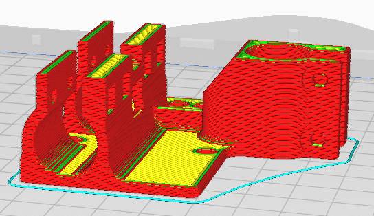
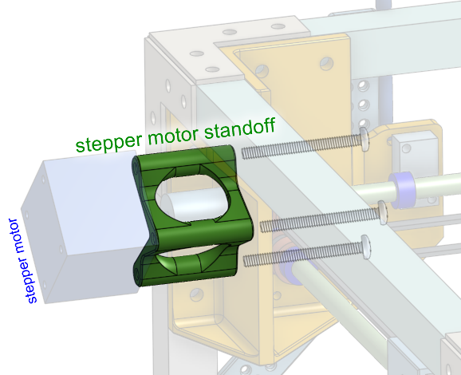
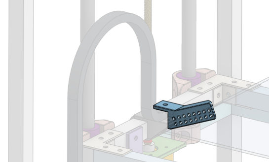
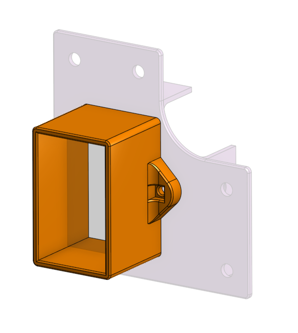
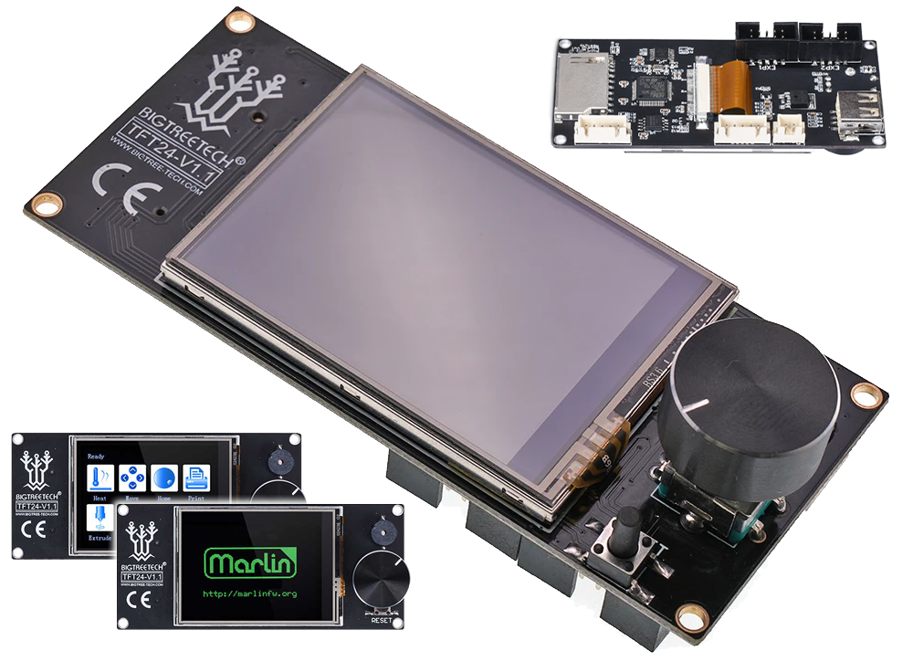

# Continued Design Tour

We've already looked at many parts of the printer during the previous lessons, we will not look at the ones we've missed and talk about what they do.

The link to the Onshape model: [https://cad.onshape.com/documents/359ba....150f](https://cad.onshape.com/documents/359baba3de4f085c967fb5a9/w/62a7ef2a4414462a5d8bf3e1/e/208ce2426916e4fde5ad150f)

## Extruder Mount

This is a 3D printed part that mounts the Hemera extruder to the X and Y cross rods. It is secured to the Hemera extruder via four screws.

The mount has clamps that wrap around linear ball bearings, using screws to provide a very tight clamping force to hold the bearings in place. In [lesson 2](lesson2) we talked about how we planned the position of those linear ball bearings.

In [lesson 4](lesson4), we talked about designing 3D printed parts. Notice what the print orientation is...

... and how overhanging slopes are kept to a limit while maintaining a strong grip on the linear bearings.

The opening of the clamps are 8mm wide so that you can install and uninstall the entire extruder without removing any of the linear rods. Ribs are also used to add rigidity. The line of holes in the rear are for wire management, a place to put zip-ties through.

The other side of the extruder has a similar 3D printed mount, it holds one more linear ball bearing for stability.

This second piece also provides a place to attach a blower fan to the bottom of the extruder, pointed exactly at the nozzle, with an airflow deflector.

Again, careful attention was paid to proper design techniques with regards to print orientation and overhangs.

## Gantry Bearing Mounts

These are 3D printed plastic parts that hold the rotary ball bearings, which in turn, holds the side linear rods. There are some holes to fasten the stepper motors with, and lots of holes to fasten it to the frame with.

We've already talked about these in [lesson 4](lesson4) about how the shelf and holes are designed, and in [lesson 2](lesson2), we talked about how we planned the position of the holes on it.

There are four of these but each one is different. Two of them also have an extension that a limit switch will be mounted to.

Other topics from [lesson 4](lesson4) applied here are the print orientation, how the bottom is given a large surface area, and the usage of chamfers.

## Sliding Blocks

These blocks carry the cross linear rods and have an internal brass bushing so it can slide along the side linear rods. The have internal groves where the belt is attached to so the belt can pull on it. We talked about these sliding blocks interact with the other components in [lesson 5](lesson5).

We also talked about how the screws are fastened to square nuts embedded into the plastic in [lesson 4](lesson4). The position of this part was planned out in [lesson 2](lesson2).

## Limit Switches and Homing

How does the printer know where the print head is? How does the printer know where the bed is?

The "end" of the printing area is at (0, 0) meaning X=0 and Y=0, this is the front left corner of the bed. When the X axis reaches position 0, the cross rod will hit an electrical switch, which signals to the control circuit and the firmware that the X axis has reached X=0.

The switch is called a limit switch, and also called end-stop switches. The same goes for the Y axis and Z axis too, except the Z axis limit switch is on the bottom of the printer, not the top.

At the start of a print, the firmware will move all of the axis towards their limit switches until all of them have been hit, so the printer knows what position it has started in. This is called "**homing**". Once the homing is complete, the firmware can simply track position internally because it is controlling the stepper motors, which moves in very precise steps. As long as the firmware doesn't lose count and the stepper motors are fully functioning, then the firmware is aware of the position of all of the axis.

In this printer's design, all of the limit switches are adjustable, so we can fine tune the home position easily. For the X and Y axis limit switches, the mounting holes are actually slots, so the switches can slide. For the Z axis limit switch, there's a screw above it that can be extended to adjust the activivation point.

These switches are designed so that they are durable and their activation point is repeatable. This is important because we want the home position to be consistent, so that every print starts at the same bed height. Otherwise, one print might be successful, and the next print might not stick to the bed at all.

These switches also have a standardized form factor so we can easily purchase replacements if any breaks.

## X and Y Stepper Motor Standoff

These are 3D printed plastic standoffs that act as a spacer between the X and Y axis stepper motors and the gantry bearing mounts. This space is needed because there needs to be a shaft coupling between the side linear rods and the stepper motor's shaft.

The openings on this part allows for the shaft coupling to be tightened by a hex wrench, since the coupling will use set-screws for fastening.

This part does not need to be strong, since it's simply a spacer, and the screws inside will take any load that would cause problems. The print orientation will ensure that it does handle forces axial to the screws. I did later modify the design to be even stronger, by making one side a solid wall, and giving it a wider base.

## Z Axis Motor Mount

Have a look at how the Z axis stepper motor is mounted to the frame. It is using a 3D printed piece of plastic with a design that secures the stepper motor to the rear horizontal beam of the printer's frame. Pay attention to how ribs and walls are used to give it strength.

On the side is where the Z axis limit switch is mounted. This limit switch will let the printer circuit and firmware know when the bed has reached the bottom of the printer.

Above the limit switch is the limit switch actuator, which is the object that will press against the limit switch. We'll talk about this soon.

## Z Axis Lead-Nut Mount

On the back of the bed assembly is where the lead-nut is mounted, so that the leadscrew can move the bed up and down. This is a 3D printed piece of plastic, with holes that allow the lead-nut to protrude through and be fastened. Due to the positioning of the lead-nut, the screws need to be countersunk into the plastic, which is why there are four holes that have a chamfer.

You will also notice that the bed's rear aluminum beam needs a slight cut so that the leadscrew does not hit it. There's other ways to solve this problem but the easiest is to just make that cut into the aluminum.

## Z Axix Limit Switch Actuator

This is a 3D printed plastic part that is meant to press against the Z axis limit switch. It has a hole for a screw that's positioned exactly above the limit switch's button. It also has a cavity for a square nut for the screw to thread into. To adjust the activation point of the switch, simply rotate the screw to extend or retract it.

## The Bed Assembly

The bed assembly starts off looking like a forklift built with three aluminum beams.

The bed plate itself is simply the bed heater PCB with a sheet of glass on top. The bed plate uses a four point spring loaded leveling system with the holes at its four corners, connected to pieces of 3D printed plastic under them, with springs in between.

The front two pieces of plastic are very simple they are attached to the front of the forklift and just have to support the front of the bed.

The rear two pieces of plastic at the rear of the forklift have a very similar role but also provides four additional holes.

These additional holes is where another piece of plastic, the backstop, can be attached and adjusted in height to match the height of the glass sheet. This backstop prevents the glass from sliding when you use a scraper to remove your prints from the glass bed, and this is why the part uses four screws secured into a very thick piece of plastic, for strength.

The height of the backstop is adjustable because we don't want the print head assembly to hit the backstop when it is performing movements close to the rear of the printer.

If you drastically change the bed's level, you do need to re-adjust the height of the backstops.

## Bed Leveling

We've talked about how and why we level the bed in the previous lessons. Now we look at the hardware required in detail.

If you tighten the knob by twisting it clockwise, the knob will pull the screw, compressing the spring, and lowering that corner of the bed. Vice-versa, loosening the knob by twisting it counterclockwise, the knob will push the screw, the spring will extend, and that corner of the bed will rise.

There's actually another way, using silicone rubber columns. These are tube shaped pieces of silicone that acts as springs. They are shorter than the springs that are commonly found on 3D printers. This is a good thing because a shorter gap between the bed and fork lift means slightly more stability of the bed itself.

You would need to buy the screws and knobs separately if you decide to buy the silicone columns.

## Drag Chain

A drag chain is used to guide the wires going from the bottom of the printer to the bed assembly.

The drag chain can bend in one direction, and limits the bend radius of itself, and thus limiting the bend radius on the wires inside. This reduces wear-and-tear on the wires as they are repeatedly bent and straightened. It also protects the wires from snagging on anything.

A drag chain is appropriate for something that moves slowly and only in on direction, so it is perfect for a 3D printer bed, which only moves up and down, and only once per print.

This drag chain is secured to the frame and the bed assembly by some 3D printed plastic parts that act as anchors for the ends of the drag chain.

## Bed Cable Anchor

In order to keep the printer safe, I would recommend soldering thick wires directly to the heated bed's solder pads. This is means we can have the most electrical current flow capacity, less fire risk, but it also means we need to be careful that the solder joints do not crack under repeated movements (metal fatigue). The drag chain does help keep the wires out of the way of things, and sort of holds them still, but there is still a chance for very minor movements of the wire between the drag chain and the heated bed. I've designed this 3D printed plastic cable anchor that is mounted to the bed assembly right next to the drag chain's exit point.

It allows the heated bed wires to be zip-tied very close to the solder joint, ensuring absolutely that it will not move and risk a cracked solder joint.

Aside note: It's definitely not impossible to have a safe crimped connector to connect the bed heater, but truely safe ones are much larger than the ones that would come supplied with the bed heater. Properly crimping wires do not involve solder and thus allows wires to be flexible without worrying about solder cracking. Using a good safe connector would make it easy to replace the bed heater.

## Upper Corner Cable Guide

For the wires going to the extruder, we need to prop up the wires so that they don't end up dangling into the gantry's rods. There will be a flexible tube that goes into an arc above the printer, bridging the side of the printer and the extruder. The wires that powers the extruder will be guided along this tube so that they don't dangle.

Zip-ties will be used extensively, especially to attach this tube to the extruder and the frame. A 3D printed piece of plastic can be used to position the tube on the printer frame.

On other printers the same idea is used very frequently.

## Power Input

On the back of the printer is where the main power input is. It will be an off-the-shelf IEC320 C14 input module with a power switch and safety fuse, all in one.

A 3D printed piece of plastic will let you screw this input module on, and it will be secured to the frame of the printer.

Another piece of 3D printed plastic behind the first one is there to protect the connectors and wires. Notice that uses square nuts for easy pliers-free assembly.

It'll stop you from poking your fingers in accidentally and getting shocked.

## Power Supply

The power supply module is mounted right next to the power input, on the side of the printer.

This short distance means less wires needed for the more dangerous higher voltage wires. The mounts are simple U shaped clamps, 3D printed, that wraps over the aluminum beam and allows you to use screws to fasten the power supply.

This also ensures that the outer enclosure of the power supply is directly in contact with the aluminum frame, which provides a simple yet important [grounding connection electrically](lesson8#grounding-aka-earthing).

There is a 3D printed cover for the power supply, which you can slide along the power supply and secure in place. There are screws that can be fastened to the sides of the power supply, and they will sit in slots on the 3D printed cover so they can slide. You will slide the cover out of the way during wiring, and when you are finished, slide it into final position to protect the connectors and to prevent you from poking your fingers into dangerous high voltages.

We will cover the topic of electricity and safety later.

The footprint of most power supplies of this type are fairly standard, but the thickness might vary between models. Most of these power supplies use M4 screws in a 150mm by 50mm arrangement pattern.

This design will fit a Mean Well LRS-350-12 model. You may need to redesign these parts very slightly if you use another model. Since it's likely only the thickness will differ, you'd only need to modify the sliding cover's dimensions.

## Control Circuit

The main circuit board is placed into a 3D printed box that's mounted to the bottom front of the printer, which means it's easy to access its microSD card slot. It's also placed close to the LCD screen so that the cable between the main circuit and the LCD screen can be shorter.

There is one big opening on its side to give access to the microSD card slot and the USB port connector. It has openings along its other walls to allow wires to protrude through. It also accomodates a cooling fan to keep the main circuit board cool.

The 3D printed box has a lid and obviously protects the main circuit board. There are cavities for square nuts at the corners of the box, allowing us to fasten the lid to the box with screws. This is a good place for threaded inserts instead but we are saving money this way.

This 3D model of the box is designed to accomodate a BIGTREETECH SKR Mini E3, but it also fits a TH3D EZBoard Lite. If you want to use another circuit board, you will have to redesign the box.

## LCD Screen

You need a LCD screen so you can use the printer without a dedicated computer attached to the printer's USB port. There is a 3D printed box designed to hold a LCD screen, mounted to the bottom side corner of the printer frame.

The specific screen it fits is a BIGTREETECH TFT24, which is a very cheap option yet packs many features. It has both a touch screen mode, and if you don't like that mode, you can also use the legacy mode.

The 3D printed plastic box has a hole in the back for the cables to escape through. The right side wall is lower than the other walls to accomondate the SD card slot. The USB port is on the right side, and will be completely blocked off, sorry.

To fit any other screen, or to use the USB port, this box needs to be redesigned.

## Advanced Fan Duct

Remeber that other part of the extruder mount that had a blower fan?

I also designed a much better version, still 3D printed, that focuses the airflow more, partially surrounding the nozzle. (instead of just using a flap that points down, which wastes a lot of air)

It still uses an inexpensive-yet-effective 40mm centrifugal blower fan. This is very popular and also what I've been using successfully on my own Hephaestus 3D printer.

The design of this part is much more complex so I did it in another file. Have a look at how the profile of the airduct was designed, how I used constraints to point towards a spot just below the nozzle, while keeping enough clearance.

(none of this is science, the 5mm and 30&deg; angle are just guesses, it looks good enough to me)

The bad news with this design is that the height is not adjustable, which would be handy. If for some reason you need to adjust the height, the whole part needs to be re-printed. It also sticks out the back a little bit, but according to the positioning of the print bed, there's enough room in the back and won't hit anything.

Due to the more complex geometry, I had to be extra thoughtful about managing overhang angles for easy 3D printing. Have a look at how I used sloped angles to support the curved duct that would've dangled just above the print bed.

## That's all for now

For now that's all the important bits and pieces!