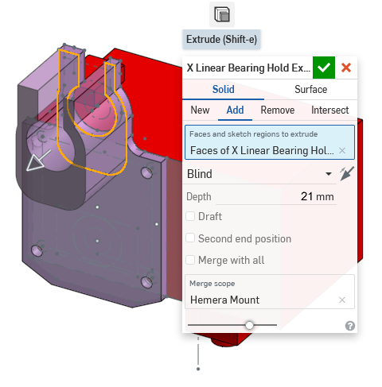
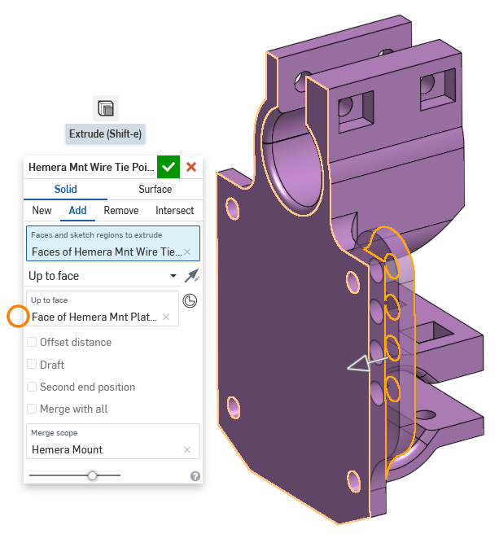

# Part CAD Design Walkthrough

I haven't given you homework in a while... there will be a bunch at the end. To warm you up, I will walk you through the design process of one of the more complex 3D printed parts of this 3D printer design.

Recall in [lesson 2], we talked about how the upper gantry was planned out with the size of the extruder in mind. This was how we figured out where the nozzle was vertically. We will start from there in order to design the 3D printed mount for the Hemera extruder.

Remember that you can always follow along by forking and editing the 3D model yourself. Since it's a cloud based CAD tool, you can just fork it over to your own account, and edit the sketches and features to see what I am showing you. The link to the Onshape model: [https://cad.onshape.com/documents/359b...150f](https://cad.onshape.com/documents/359baba3de4f085c967fb5a9/w/62a7ef2a4414462a5d8bf3e1/e/208ce2426916e4fde5ad150f)

On this webpage, some images may be opened in full view (so you can zoom in) when you click on them. Not all of them, but some.

### How do we start?

First, we examine the Hemera extruder's datasheet where it has some mechanical drawings. The link to the file: [https://e3d-online.dozuki.com/Document/UBaWiCkBAAlCkZBG/Hemera-Datasheet-%28Edition-1%29.pdf](https://e3d-online.dozuki.com/Document/UBaWiCkBAAlCkZBG/Hemera-Datasheet-%28Edition-1%29.pdf)

Inside we see these drawings:

What I did was create a rough representation of the Hemera extruder first. Using a sketch started from a side view. I need the sketch to show the overall body size of the Hemera, where the placements of the screw holes are. The positioning is relative to the positions of the rods so the cross linear rods and linear ball bearings are represented by dotted lines (construction lines).

(note: the sizes of the linear ball bearings had to be reseached before doing this drawing, LM8UU bearings are 15mm outer diameter and 25mm long)

There are some dimensions in there that you can match up with the Hemera extruder's datasheet drawings, or the dimensions of the LM8UU bearings. There are also some dimensions you may not understand, I will explain them:

 * The 5mm circle over the bottom right 3mm circle: this is used along with a few tangent constraints to ensure that even with the 8mm rod installed, I can get a screwdriver into the M3 screw there.
 * 0.05mm on the outer diameter of the linear ball bearing: this can be adjusted later if the 3D printed clamps are too tight around the linear ball bearings.
 * 0.1mm at the center of the top linear ball bearing: this can be adjusted later if the vertical distance between the cross linear rods require adjustments.

Breaking down some of the constraints used in this sketch:

We can extrude out this sketch 44mm to get a blocky representation of the Hemera extruder.

We will now skip a few things, I added a few more bits to this rough representation, like the whole nozzle, and the connector on top...

...but they are not critical to the design of the part we are trying to design.

### Starting the Mount Plate

The next sketch is started on the side of the Hemera extruder. The previous sketch is used as a reference, and some dimensions and constraints are made between these two sketches.

The top of the clamp has a tab that extends up 8mm, this is for the M3 screw and washer to be tightened against. The clamp's thickness at the top has an extra 3mm on the left side because that's where the square nuts will sit. The opening of 8mm at the top is so that the mount can be removed from the cross linear rods without removing those rods from the gantry. The 8mm dimension at the bottom is from the linear ball bearing's outer edge to the bottom of the mount, this is purely to make the mount bigger so that there could be a fillet there, making it stronger.

The thickness of 3.2mm I honestly just guessed from experience, this should work. If it's too thin, the clamp might break. If it's too thick, the clamp won't be flexible enough. Since this part is 3D printed, if I'm not happy, I can always adjust that 3.2mm to something else and re-print it.

There's no good reason why I chose 4mm for the fillet radius, it's large enough, and not too large.

Let's break down the constraints for this sketch:

We extrude this as a new part, 4.2mm thick.

Why did we use 4.2mm as the thickness? This is because I took the official 3D model of the Hemera extruder, and measured what the thickness should be if we were to use a 8mm long M3 screw with a washer.

### X Axis Linear Ball Bearing Clamp

This next sketch starts on top of the new flat piece. It's very boring, it's mostly projected from the previous sketch. It will give this piece a lot of plastic for stiffness. I won't go into much detail for this sketch.

This sketch is extruded out 21mm, because the linear ball bearing is 25mm long and we've already extruded 4.2mm for the plate.

We get interesting again, starting to plan out where the holes for the clamping screws go. A sketch is made on the tab surface. The size of the square nuts is used to determine where the holes should go first.

Here are the constraints used: (seems to be very obvious)

The extrude tool is used to remove (cut) all the way through.

The screw's head needs a flatter place to sit on, so we draw two circles, 8mm in diameter, concentric to the screw holes we just made. These two 8mm circles are used for another extrude-remove, but in the outwards direction.

On the other side of the flange, we draw the shape for the square nuts. This is done mostly with projecting the squares from the previous sketch we've made before on the other side of the clamp. The 0.8mm extensions to the squares are made to compensate for print orientation (see [lesson 4](lesson4) about print orientation and overhangs)

Then using the extrude tool, remove 3mm into the plastic to create the cavity for square nuts.

### Y Axis Linear Ball Bearing Clamp

We need to do everything we did for the X axis clamps, but facing another direction. We need a drawing surface, a plane to start from, that makes sense. We make a plane, starting from the center of the X axis from the very first sketch, but also parallel with the default "front" plane. This can be done using the "plane point" mode under the new plane tool.

Use that new plane as the sketch plane. Draw the clamp shape, using some of the techniques we've used previously, but this time, we can't use the concentric constraint because the circle is on a plane that's perpendicular. (image below is large, click on it to open in full view to zoom)

This time, the opening of the arc terminates with a line that's at a 45&deg; angle. This is to control the overhang slope angle, as covered in [lesson 4](lesson4). A lot of mirroring is used again. I believe you can where the mirror constraints are already. The next image will show you how I can use projection to set the diameter of the circle equal to the circle drawn in the very old first sketch.

Extrude this sketch in both directions by checking the "second end position" checkbox. We want the clamp to be 25mm long, you can use "blind" mode and do 12.5mm in both directions, but another way is to use "up to vertex" mode, and specify the points in the very old first sketch as the vertex. This way, if you change to a 30mm long bearing later in the first sketch, then the length of the clamp changes automatically, otherwise, you'd need to type in 15mm twice.

The holes for the screws and square nuts are done with the same techniques as before, I will skip the details.

### The Last Few Extras

A rib is added for stiffness (see [lesson 4](lesson4)). Just a rectangle, about the middle of the part, using coincidence constraints to set the size and position.

Extrude it out, you can't have it poke out too far so I used "up to vertex" mode so it goes to the end of the fillet.

Use the fillet tool to round out the clamps, this will make the linear ball bearings enter easier.

There's a spot where the plastic isn't contributing as much to the overall strength of the part, so I cut away a triangular portion of it. The size of this triangle isn't critical, it just "looked right" to me.

Add some more fillets to relieve stress concentrations (see [lesson 4](lesson4))

Some holes were added to the back of this part, so that zip-ties can be used to manage the wires going to the extruder. This sketch doesn't need to be complicated at all, it's very... curvy... with lots of tangents. I won't go into too much detail here. There is a linear pattern used here, where it says "4x", meaning I told it to draw 3 more circles, 7mm apart, copying the first one on top.

When extruding, use the "up to face" mode, and select the flat face. This way, if we decide to change the design to be 2mm thick instead of 3mm, we don't have to go edit 2mm twice, just once.

### You are done, sort of

That's enough to mount the Hemera extruder using one linear ball bearing per axis. The final design can hold two more bearings for more stability, but showing you how to do that is not going to teach much, because most of it is using the projection tool to copy the shape of the clamps.

## Homework

#### Design the Rod Holders

Remember the Z axis linear rods, and the 3D printed plastic clamps that secure the rods to the frame?

**Design those clamps**. I am providing a starting point that includes the aluminum extrusion beam and the rod itself. You can use constraints and those starting pieces to make your sketches and extrudes. To start, make a fork of this Onshape model into your own account, and start editing: [click here](https://cad.onshape.com/documents/359baba3de4f085c967fb5a9/w/62a7ef2a4414462a5d8bf3e1/e/8b0404f633dc661a53533d76)

#### Design a Box, for a LCD Screen

The box I put into the 3D model is designed for a BIGTREETECH TFT24. What if you wanted to use the bigger TFT35? It even has WiFi! **Design a box for the TFT35**. (any of the V3.0 variants)

There's no starting point, because you can put it anywhere on the 3D printer. Think about where the wires go, where the SD card goes, and where the USB port goes. You will need to see the TFT35's github repository to find the drawings:

 * [TFT35-V3](https://github.com/bigtreetech/BIGTREETECH-TFT35-V3.0/tree/master/Hardware)
 * [TFT35-E3-V3](https://github.com/bigtreetech/BTT-TFT35-E3-V3.0/tree/master/Hardware)

WARNING: I've never actually used the TFT35 myself, but I heard the WiFi feature on it is really slow (I think it uses the UART on the ESP8266, which is a snail for handling large files). If you want good WiFi performance, get a [Duet 2 WiFi](https://www.duet3d.com/DuetWifi) as the control board, design a box for that. (beware that the Duet is $170, worth every penny)

## Next Lesson

The next lesson is on [3D Printer Electronics](lesson8)
