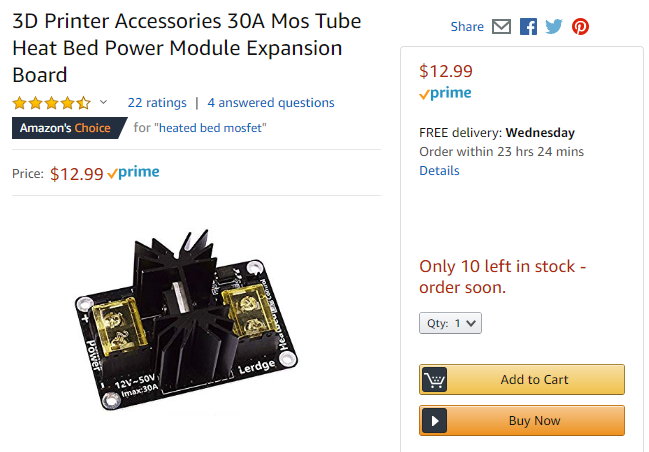

# 3D Printer Electronics

This lesson will be a little bit of general overview, and a lot of math! I will focus less on what things do (which the other lessons cover), and focus more on how to check for safety and pick components.

I am an electrical engineer, who can design every circuit board being used in a 3D printer. But if I wrote down absolutely everything I know, you'll get bored and miss the safety information. So I will keep it short and stick with important stuff.

## The building blocks

The major electrical components are:

 * Power Supply Unit (ie. PSU)
 * Control Circuit
 * Bed Heater (and temperature sensor)
 * Nozzle Heater (and temperature sensor)
 * Limit Switches
 * Hot-end Heatsink Fan
 * Part Cooling Fan
 * Maybe a LCD screen

## Power Input and PSU

The power that arrives at your home is 120VAC (in North America), AC meaning alternating current. This is quite high and quite dangerous for a computerized device like a 3D printer. We will use a power supply unit (PSU) to convert the 120VAC down to 12VDC so that our sensitive components can work properly, and not die when we make a mistake.

When shopping for a PSU, you'll need to look for:

 * rated for a 120VAC input
 * provides a 12VDC output
 * can output enough power (watts) to power the printer

For the power input, we plan on using an all-in-one package that includes an input socket, a power switch, and a fuse.

(the above product is nice because it looks like the connectors are included and crimped on properly, if you choose this, we can double check its safety with a stress test)

### Total Power Used

We'll very roughly add up the power consumption in our 3D printer:

 * 120W for the heated bed
 * 30W for the nozzle heater
 * 3 stepper motors, 5W each

The supporting electronics, such as the microcontroller, won't draw much, it should be drawing current in only milliamperes.

We have 175W total, and if we give it some safety margin, we can look for a 200W or better power supply. You can find one higher if you plan on doing upgrades.

If we are using 178W at 12V, then we can calculate the current consumption at this power consumption:

<nobr> Voltage * Current = Power ,</nobr> so <nobr> Power &divide; Voltage = Current </nobr>

<nobr> 175W &divide; 12V = 14.6A </nobr> (we might round this to 15A later)

(175W is the worst case scenario, typically your bed heater is only fully powered up during pre-heat, and doesn't use much power to maintain heat)

### AC Input and Conversion

When converting between different voltages, remember the [Law of Conservation of Energy](https://en.wikipedia.org/wiki/Conservation_of_energy). ~~If you don't conserve power, the cops will come and arrest you.~~ Power in must always equal power out. There's no free ~~lunch~~ power in the universe.

We know our printer is using about 15A from the 12VDC output. Then using the same calculation, we can calculate how much current is going into the 120VAC input:

<nobr> 175W &divide; 120V = 1.46A </nobr> (we might round this to 1.5A later)

The conversion isn't perfect though. Remember that everything in the universe is a resistor, even copper. The components inside the PSU has some resistance that will waste some power as heat while it is doing the conversion. The efficiency is advertised as "up to 89% efficient". If we are using 175W from the 12VDC output, then how much power are we actually taking?

<nobr> 175W &divide; 0.89 = 196.6W </nobr>

We are using 196.6W from your wall outlet. Let's do that current consumption calculation using this more realistic power consumption value:

<nobr> 196.6W &divide; 120V = 1.64A </nobr>

### What's the important takeaway?

Safety First! But don't worry, a typical desktop computer uses about 500W, a microwave uses much more than 1000W. Your house should be protected by many circuit breakers, typically 10A or 15A, and our 3D printer will not trip those circuit breakers.

On the AC power input side, you only need to handle 1.64A of current, this means you need to use wires that have an insulation rated for more than 120VAC, and copper thickness that can handle 1.64A of current. If you think about it, a iPad charging cable can handle 2A easily but doesn't have thick insulation. This isn't very scary.

You'll want to use a fuse on the AC power input side, rated anywhere between 1.8A and 5A would be fine.

On the DC power output side, you'll want wires that can handle 15A of current for the main bus wire, and insulated to handle 12VDC. You will need a 20A fuse, typically installed on the control circuit board.

## What do fuses (and circuit breakers) do?

Accidents happen, and we all make mistakes. Pretend you were using a drill on a piece of metal, but you lost your grip and that piece of metal flies across the room and hits your 3D printer's power cable, causing a short circuit! This would cause current to flow much greater than just 15A, I would actually expect some sparks. Without a fuse, then some electrical components, wires, and connectors, will start getting very hot, potentially melting, or even starting a fire.

Fuses will protect from this situation. They are made with a piece of metal conductor inside, that is designed with the exact size to melt when a specific current passes through it. Thus, if a dangerous amount of current is pushed through the fuse, it will melt, and the current will stop flowing, keeping things safe.

[Wikipedia: Fuse](https://en.wikipedia.org/wiki/Fuse_(electrical))

[Wikipedia: Circuit Breaker](https://en.wikipedia.org/wiki/Circuit_breaker)

When a fuse blows, you must first diagnose the problem that caused it to blow. Only replace a fuse when you are certain that it won't blow again.

## Grounding (aka Earthing)

Have you ever wondered what this round hole in a power outlet actually does? That's the ground pin. Its job is to protect you from electrical shock.

Imagine that piece of metal hit the 120VAC wire, and also touched the aluminum frame of the 3D printer, while you were holding it. If the frame was not grounded, then there's a chance that you be electrically shocked with 120VAC. If the frame was grounded, then all that high voltage would go into the ground, and not hurt you, moments later, the fuse should blow, and everything would be totally safe.

Grounding also prevents build-up of static electricity, because the static charges would go directly into the ground.

You also want to ground the negative terminal of the DC output. This is because the conversion from AC to DC can still have a small bit of AC leaking into the DC side. It's most often not dangerous but you can still feel a small shock if you touched something with even a few millivolts of AC.

Ground is usually indicated by one of the following symbols:

[Wikipedia: Grounding](https://en.wikipedia.org/wiki/Ground_(electricity))

Since the 3D printer uses an aluminum frame, grounding everything is simpler, because we can use the frame as the ground conductor. There may be parts that are not connected to ground and should be, we'll check for that once the printer is built.

## Heated Bed and Nozzle Heater

Remember that any conductor is also a resistor, and any resistor will dissipate heat as current flows through it. Most heating elements are simply a really REALLY long piece of conductor, and it's coiled up somehow to fit inside where it is needed.

The two popular ways of making a heated bed. One is to make an aluminum plate and then stick on a heating pad. The other way is to build a circuit board that has a very long snaking copper trace that acts as the heating element. It's easier to just buy the latter pre-made for us, and we've already picked out an appropriate sized one already (220mm x 220mm, 120W).

Have a look at the circuit board design for one of these heated beds, you can see it's just simply copper in a snaking pattern.

To heat the nozzle, the heater is usually in a cylindrical format, simply a coil inside a metal canister.

The most important characteristic of a heating element to us right now is its resistance. Our choosen heated bed is designed for a 12V input and should provide 120W of heat output. A very simple calculation can help us find the current consumption

<nobr> Voltage * Current = Power ,</nobr> so <nobr> Power &divide; Voltage = Current </nobr>

<nobr> 120W &divide; 12V = 10A </nobr>

We now know the current, then we can find the resistance of the bed heater. For this calculation, we use Ohm's Law:

<nobr> Resistance x Current = Voltage ,</nobr> so <nobr> Voltage &divide; Current = Resistance </nobr>

<nobr> 12V &divide; 10A = 1.2&Omega; </nobr>

**Homework:** what is the resistance of a 12V nozzle heater that can output 40W?

Warning: My own printer used a whopping 65W 24V heater cartridge for my nozzle heater, but my printer also used a copper heat-block. The printer you will be building will have a standard aluminum heat-block that comes with the Hemera extruder. The aluminum heat-block has less thermal capacity and it can become damaged under 65W of heating power, so stick with 30W nozzle heaters.

## Voltage choices, and why it matters

Most inexpensive 3D printers use a 12V DC power source. This is mostly due to Arduinos having an input voltage rating lower than 24V. As a result, it is much easier for us to find printer bed heaters that are rated for 12V.

What happens when you use a 24V power supply but a 1.2&Omega; heating element? Use Ohm's Law again:

<nobr> 24V &divide; 1.2&Omega; = 20A </nobr>

20A is quite a big jump from 10A. Of course this would also feed double the power into the heating element:

<nobr> 24V x 20A = 480W </nobr>

Whoa! Maybe you thought that you can get away with just upgrading the wires and fuses to be a bit beefier for just an extra $5, but now we are into spending an extra $20 on a more beefy power supply.

This particular 3D printer I've designed is meant to use a very specific power supply, the MEAN WELL LRS-350-12, which can output a maximum of 350W. I am very happy about this particular product, it is reliable, intelligent (it's quiet, it's very good at knowing when to kick the cooling fan on), and compact.

24V is useful though, if you were to use a heater that's rated for 24V and still outputs 120W, then it means you'll only need 5A of current, this means you could potentially save some money on cheaper wires. But this is NOT why people build 24V printers.

People do need 24V or even higher voltage when they want to use more powerful heating elements, and drive more powerful motors. You need more heating and bigger motors for larger printers.

**Homework:** you have a 24V nozzle heater that outputs 60W, what power will it output if you only provided it with 12V?

(the answer to this question shows that you can actually use 24V components on a 12V printer)

## Stepper motor electrical ratings

When you purchase a stepper motor, you'll see that it has a current rating and a voltage rating. For example, commonly, a current rating of 1.68A and voltage rating of 2.8V

Whoa, 12V is much more than 2.8V, do we need a 2.8V power supply? No...

Stepper motors are driven by dedicated stepper motor driver chips. These chips will have a feature called "current limiting".

Remember that the stepper motors are really just coils on the inside, and any conductor, even if it's copper, still has a resistance. That coil has a resistance and it obeys Ohm's Law

<nobr> 2.8V &divide; 1.68A = 1.67&Omega; </nobr>

(reading the datasheet, the coil resistance is measured at 1.65&Omega; so we are pretty close)

Pretend we've told the steppper motor driver to limit the current at 1.5A, then, since the coil has a resistance of 1.65&Omega;, we use Ohm's Law

<nobr> 1.5A x 1.65&Omega; = 2.475V </nobr>

Which would be fine. It's not about how much voltage is going into the stepper motor driver chip, it's all about how much current that chip is outputting.

Remember how I guessed that each stepper motor uses 5W? I simply multiplied 1.7A by 2.9V which gave me 4.9W

## Temperature Sensors

The most common type of temperature sensors for 3D printers are NTC thermistors, RTD, and thermocouples.

A thermistor is a resistor that changes resistance according to temperature. They are easy for a microcontroller to read, using analog to digital conversion, and another resistor to provide a voltage divider. If you use poor tolerance resistor and a poor performing analog converter, then the accuracy will be poor. The most common thermistor used on 3D printers is the 100K&Omega; NTC thermistor, and that is the usual default setting in most 3D printer firmware.

RTD means resistance temperature detector. It's similar to a thermistor in theory but is made of metal (thermistors are ceramic). They require dedicated amplifiers to work, making them expensive to use. They are very accurate and responsive. The most popular RTD used for 3D printing is the PT100, which is used by the Ultimakers and also sold as an upgrade for E3D branded hot-ends.

A thermocouple is much more accurate and responsive, but it requires an amplifier to work, adding to the overall costs. They also handle much higher temperatures.

Annoyingly... you cannot cut a thermocouple's wires! You must use one continuous piece of wire that the thermocouple was manufactured with. No cutting, no soldering, no connectors allowed, it will stop working. They are very difficult to use correctly. It's quite an engineering challenge to plan out your wiring when you want to use thermocouple. Stay away from them.

We will be using thermistors for both the bed heater and the nozzle heater. The bed heater usually has a thermistor built-in already. The Hemera extruder kit will include both the nozzle heater and the nozzle thermistor as well.

[Omega: Temperature Probes](https://www.omega.co.uk/temperature/z/thermocouple-rtd.html)

[DYZE Design: Comparison between temperature sensors used in 3D printers](https://dyzedesign.com/2016/06/temperature-sensors-used-3d-printers-part-1/)

[Wikipedia: Thermistor](https://en.wikipedia.org/wiki/Thermistor)

[Wikipedia: Resistance Temperature Detectors](https://en.wikipedia.org/wiki/Resistance_thermometer)

[Wikipedia: Thermocouple](https://en.wikipedia.org/wiki/Thermocouple)

## Cooling Fans

There are three cooling fans in our design:

 * one mounted to the Hemera extruder's heatsink
 * one that blows air under the nozzle
 * one that cools the control circuit board

None of these fans are safety critical.

The heatsink fan is there so that the filament doesn't jam in the hot-end, it helps the heat-break maintain a sharp temperature transition, meaning we want it to be hot on one side, and cold on the other side, and not warm in between. Unwanted large warm areas inside a hot-end is where filament jams happen.

The fan that blows air under the nozzle is there to cool the plastic after it has exited the hot nozzle. It will make the print look nicer for some types of plastic. (not all types, the firmware will turn it off according to the type of plastic)

The circuit board may need some cooling, as the stepper motor drivers, and heater MOSFETs, will get very hot. This fan does not need to be very powerful at all.

## Choosing Wire Sizes

A thicker wire can handle more current passing through it, this is true. The National Electrical Code actually has a table that says that a 14 gauge wire is thick enough for passing 15A of current.

But that is a very simplified way of thinking. In reality, remember that all conductors have a resistance, and all resistors dissipate power as heat, if the heat causes temperatures to rise beyond the melting point of something...

We know our worst case current consumption is 15A, and our printer's physical size suggests that the longest wire we might need is only about 1 meter long.

Assuming that you are using a solid copper wire, we can calculate the resistance of the wire using copper's resistivity, its cross-sectional surface area, and its length. Wires are specified by AWG, American Wire Gauge, which is not a number that we can easily calculate using, we need a chart. To save time:

 * 14 AWG wire has resistance of 8.282 &Omega; per km, or 8.282 m&Omega; per meter
 * 24 AWG wire has resistance of 84.1976 &Omega; per km, or 84.1976 m&Omega; per meter

Power = Resistance x Current2

 * for 14 AWG, <nobr>0.008282&Omega; * 15A2 = 1.86345W</nobr>
 * for 24 AWG, <nobr>0.0841976&Omega; * 15A2 = 18.94446W</nobr>

(above calculation assumes 1 meter, but we should be calculating for 2 meters, because we need both a positive and negative for a power cable, and so the wasted heat is about 38W for the 24 AWG)

Whoa, wasting 4 watts is acceptable, wasting almost 38 watts is not and could actually melt something. Without any calculations, I can tell you that the Ultimaker 2's nozzle uses 25W and it can obviously easily melt plastic.

To actually calculate temperature, that's actually much more difficult. You'd need to take into account the thermal capacity and thermal conductivity of the materials involved, and also account for the heat dissipation into the surroundings, which varies based on air density and air flow.

#### Main Power and Bed Heater Wires

In the end, my recommendation is we stick with using 14 AWG wire for the main power wire and for the bed heater, we know this is fine because the National Electrical Code says it's fine (that code is meant for much longer wiring, like household wiring).

#### Nozzle Heater Wires

The nozzle heater will come with a 1 meter long wire already, and it's insulated with a special jacket that's very VERY heat resistant, I believe it's a glass fiber braided sleeve. The conductor inside is... well... nobody knows officially but the best guess is 22 AWG. The wire is already properly terminated for you so do not cut this wire unless you have to.

If you do need to extend this wire, extend it from the end farthest away from the actual heating element. Use the 14 AWG wire as the extension, it's safer this way and it keeps the print head lighter.

#### Stepper Motor Wires

A stepper motor will have 4 wires and each wire must be plugged into the right pin on your stepper motor driver's output. If you don't colour-code your wires, this becomes a nightmare. Luckily, it's pretty cheap to buy colour-coded wire bundles specifically for stepper motors.

They are usually 22 or 24 AWG, with a plain PVC insulating jacket, and bundled as a ribbon. You can find them with connectors already crimped on for you.

#### Other Wires

The other signals are things like the cooling fans, limit switches, and temperature sensors. The current flowing through these wires will be so low that it literally doesn't matter. At most, a cooling fan is going to use 200mA of current. I'm pretty sure the thinnest insulated wire you can buy is 30 AWG and even that is not dangerous, just inefficient, and you are more worried about the wire simply snapping rather than any fire hazard. I would recommend you use 24 AWG wire for everything else in the system. It's easy to work with and more than thick enough.

22 AWG wire is actually difficult to crimp sometimes, especially with smaller crimps.

## Control Circuitry

The control circuit can be broken down into more detail:

 * Microcontroller
 * Interfaces (eg. USB port, LCD screen, Networking)
 * Storage Device (eg. SD card)
 * Temperature Sensor Inputs
 * Fan Control Outputs
 * Bed Heater Outputs
 * Nozzle Heater Outputs
 * Stepper Motor Drivers

We are building a 3D printer that's very similar to other 3D printers on the market, this makes it easy for us to find a suitable 3D printer control circuit to purchase. They all generally have the same features.

The microcontroller is the brain that will execute the firmware code. It is connected to all the sensor inputs and is able to give control signals to all the outputs. It can control the stepper motors by giving instructions to the stepper motor drivers. It controls the heaters with the help from the temperature sensors. It can read files from the SD card to perform print jobs.

When shopping for a control circuit, we are checking the following specifications:

 * What type of microcontroller is it using, 8-bit or 32-bit?
 * How many stepper motors can it drive, and what stepper motor driver chips are used? What are their ratings?
 * What's the maximum power it can provide to the heaters?
 * Does it have the inputs and outputs we need? Does it support our sensors and our cooling fans?
 * How does the user interact with it? LCD screen? SD card? USB port?

The best canidate, in my opinion, is the BIGTREETECH SKR Mini E3. It's small and cheap, at around $30, it's literally 1/3 of the price of its competitors.

Here's a few things I want to point out:

 * 32 bit microcontroller, running Marlin 2.0
 * Trinamic TMC2209 stepper motor drivers (these have very nice features)
 * It's small, it has exactly what we need and nothing that we don't need (but this means we can't do certain upgrades)
 * It's compatible with really cheap LCD screens for user interaction
 * It uses a microSD card for storage
 * Comes with a 20A fuse pre-installed

The only downside is that I can't be sure how reliable it is. The stepper motor drivers are perfectly adaquate. The connectors should not melt if we stick with a 120W bed heater and 30W nozzle heater. The only thing left to worry about are the MOSFETs that control the heaters. Fortunately, if they fail, it's not really a fire hazard if we keep flammable materials away.

A down side of a small circuit board is that there's less surface area for heat dissipation. Components that generate heat are grouped closer together. Copper traces that handle large currents have less space. All of these means that it's a good idea to put a cooling fan around this circuit board.

When the printer is built, a full load stress test should be performed and all temperatures should be monitored. We should be able to detect a bad MOSFET or bad connector this way.

### Thermal Runaway Protection

Thermal runaway protection is a safety feature that's optional for most 3D printer firmwares and should be activated. What it does is prevent fires by checking if the heating elements are actually heating what they are supposed to. Think about it this way:

Your printer is moving its print head around very rapidly, and the screw holding the nozzle heater comes loose and the nozzle heater falls out and lands on something flammable. The firmware is controlling power to the nozzle heater, and turns it on, it expects to see an increase in temperature when it checks the nozzle temperature sensor. After a while, the nozzle heater is getting hot but the temperature sensor is not reporting an increase in temperature. Now the firmware knows something is wrong, and stops providing power to the heater, so that a fire does not start.

This is just one situation that this feature is useful for. Other ones it can handle:

 * failed temperature sensor
 * broken sensor wire or loose connector
 * broken heater wire or loose connector
 * detached heater from bed
 * detached heater from nozzle
 * MOSFET failed open

What it does not help with:

 * MOSFET failed closed
 * firmware crashing
 * short circuits

Don't worry too much about MOSFETs failing closed, it means that the heaters cannot be turned off. This is bad but if they are secured in place, nothing should catch fire. The printer will still stop and report an error.

And remember, short circuits that cause dangerously high currents are protected by the fuses.

## External MOSFET

One popular accessory for 3D printers is an external MOSFET. They got popular because the MOSFETs on cheap 3D printers got a reputation for exploding. They are also a way to use a heated bed that's designed for way more power than your control circuit can handle.

Basically, the external MOSFET board is a circuit board with a much bigger MOSFET than usual, and with a heat sink for heat dissipation. The MOSFET is usually controlled by an optoisolator, and the optoisolator is driven by the orignal MOSFET on the control circuit. This way, no extra connectors are needed, no firmware changes are needed.

Note: Some people actually buy these as an *insurance policy* when they purchase a cheap printer. For example, people frequently tell other people that if you want to order a Anet 3D printer, you should just buy one of these MOSFETs because Anet essentially build ticking time bombs.

**Advanced Homework:** Design and build your own external MOSFET circuit board, and then design a 3D printed box to protect it. If you do it right, this is a way to absolutely guarantee that your MOSFET will never fail, because you can buy a MOSFET rated for 200A if you wanted to.

(lesson dedicated to this homework: [click here](../other_pages/externalmosfet))
