# Assembly Preparation

## Shopping List

This page will attempt to list everything you need to buy. You can try shopping around for the best deal but for certain parts, I will insist on a particular model from a particular store. In the end, feel free to ask me to check an item on your list.

The main source will be Amazon Prime and McMaster-Carr. If you wish to shop on Aliexpress, eBay, Banggood, etc, that's up to you. I will avoid posting Amazon links unless there's one particular listing that I need to point out.

Be smart, group your purchases to save on shipping, but also, take the project slowly if you need to! It's a great idea to build-a-little then test-a-little.

### 2020 Profile Aluminum Extrusion Beam

Buy these from Amazon, they don't need to be super high quality, just straight and cut to the right length. See [lesson 1](lesson1) for the sizes you need, because we picked the sizes according to what is available on Amazon.

### Fasteners

There are about 400 screws being used in this design! That's not even counting the nuts and washers.

I've figured out that it's not cheaper to buy them from Amazon, plus, there are some that cannot be found easily on Amazon. So the source for all the screws shall be from McMaster-Carr.

I have optimized a shopping list for every screw, nut, and washer you need from McMaster-Carr:

| Qty | Sku                                             | Name                               |
|-----|-------------------------------------------------|------------------------------------|
| 120 | [90909A721](https://www.mcmaster.com/90909A721) | M5 x 8mm flanged button head screw |
| 100 | [93475A240](https://www.mcmaster.com/93475A240) | M5 washer                          |
| 40  | [92832A229](https://www.mcmaster.com/92832A229) | M3 x 20mm button head screw        |
| 30  | [92095A168](https://www.mcmaster.com/92095A168) | M3 x 14mm button head screw        |
| 30  | [92832A215](https://www.mcmaster.com/92832A215) | M3 x  6mm button head screw        |
| 20  | [90991A113](https://www.mcmaster.com/90991A113) | M3 x  8mm button head screw        |
| 12  | [91290A137](https://www.mcmaster.com/91290A137) | M3 x 50mm button head screw        |
| 100 | [90576A102](https://www.mcmaster.com/90576A102) | M3 nylon locking nut               |
| 100 | [97259A101](https://www.mcmaster.com/97259A101) | M3 square nut 5.5mm wide           |
| 100 | [93475A210](https://www.mcmaster.com/93475A210) | M3 washer                          |
| 8   | [95947A008](https://www.mcmaster.com/95947A008) | M3 x 12mm standoff                 |
| 8   | [90304A215](https://www.mcmaster.com/90304A215) | M4 x 8mm screw                     |
| 8   | [93475A230](https://www.mcmaster.com/93475A230) | M4 washer                          |

(some of the quantities are 100 because the pack size is 100 and I don't actually know how many you need, I only counted screws, not nuts and not washers)

The above list is optimized to an extreme extent, including the usage of [cost-saving alternate versions of 3D printed parts](../other_pages/optional3dprintedparts). If you want your life to be easier, also purchase the following: (warning - I don't guarantee that these will get utilized)

| Sku                                             | Name                             | Why?                           |
|-------------------------------------------------|----------------------------------|--------------------------------|
| [92832A225](https://www.mcmaster.com/92832A225) | M3 x 16mm button head screw      | just in case 14mm is too short |
| [90991A115](https://www.mcmaster.com/90991A115) | M3 x 12mm button head screw      | just in case 14mm is too long  |
| [92703A151](https://www.mcmaster.com/92703A151) | M3 x 12mm countersink head screw | original lead-nut mount design |
| [95947A012](https://www.mcmaster.com/95947A012) | M3 x 16mm standoff               | higher circuit board mounting  |

McMaster-Carr doesn't tell you what the shipping costs are, but in the end, it should still be cheaper than Amazon. (warning - if McMaster-Carr ships from two different warehouses, you pay extra shipping)

### T-slot Nuts

McMaster-Carr does NOT stock T-slot-nuts for M5 screws, or at least... they do but they cost like $2 each and we'd need about another 160 of them. So this one we have to buy from Amazon.

They cost about $10 for a pack of 100. (specs: 2020 series T-slot nut for M5 screws)

### Frame Brackets

 * 10x T shaped frame brackets
 * 18x L shaped frame brackets
 * 26x corner frame brackets

Buy extras, I may have miscounted. Check the 3D model again to verify.

If the frame brackets do not come with screws already, then you will need to purchase an additional 180x ["M5 x 8mm flanged button head screw" (SKU 90909A721) from McMaster-Carr](https://www.mcmaster.com/90909A721).

These should also have come with T-slot-nuts

### Bed Leveling Springs

Amazon sells bed leveling springs in packs of 4 which includes the knob as well. I have not tried these, and I question just how good those springs are.

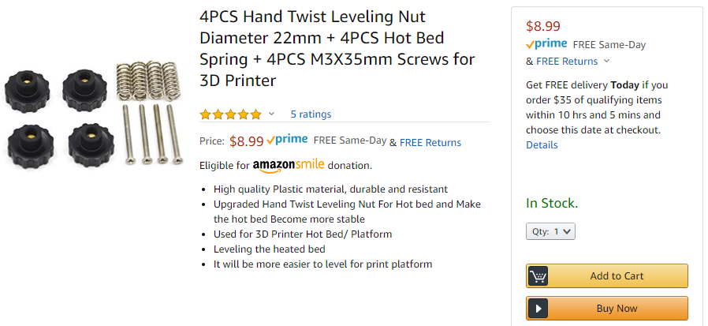

I do have some suggestions that are from McMaster-Carr that are much stronger. Stronger is good, it'll make the bed more stable. My suggestion is this set of parts:

 * [spring SKU 94125K204](https://www.mcmaster.com/94125K204), which comes in a pack of 5, and works great with our design
 * [screw SKU 92125A150](https://www.mcmaster.com/92125A150), M3 screw with countersink head, very long
 * [nut SKU 94300A120](https://www.mcmaster.com/94300A120), M3 wing nut, use as the knob

### Z Axis Leadscrew and Lead-Nut

This one must be a 380mm long leadscrew integrated into a NEMA stepper motor.

 * [Pololu product number 2690:](https://www.pololu.com/product/2690) "Stepper Motor with 38cm Lead Screw: Bipolar, 200 Steps/Rev, 42×38mm, 2.8V, 1.7 A/Phase"

Seemingly equivalent products from overseas costs about half the price. Make sure the leadscrew is TR8x8, and 380mm long. Make sure the physical and electrical specifications are similar. 

Make sure you get at least two lead-nuts! One should come with the motor, get a spare!

### Motion Components

#### X and Y Axis Stepper Motors

Buy 2 of them. NEMA 17 sized stepper motor with 5mm D shaped output shaft. 200 steps per rotation, phase current rating of about 1.5 amps or more, bipolar.

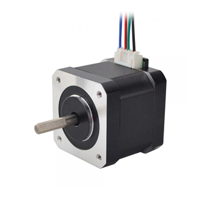

This [17HS15-1504S-X1 from OMC](https://www.omc-stepperonline.com/nema-17-bipolar-45ncm-6374ozin-15a-42x42x39mm-4-wires-w--1m-pin-connector.html) is absolutely perfectly suitable for a 3D printer like ours, and comes with a 1m cable. Should be about $9 each. Another option is [17HS15-1684S from OMC](https://www.omc-stepperonline.com/nema-17-stepper-motor/nema-17-bipolar-1-8deg-36ncm-51oz-in-1-68a-2-8v-42x42x39mm-4-wires.html), which doesn't have a connector but still have a cable.

#### 8mm diameter linear rods

Buy 6 of them. 8mm diameter, 440mm long, hardened steel, chrome plated.

For comparison, getting the best quality possible from MiSUMi, they'll cost about $20 each. On Amazon, something that might work costs $8 each, in a pack of 2.

If you want to buy from MiSUMi, you can get each rod custom cut-to-length.

#### 16mm diameter linear rods

Buy 2 of them. 16mm diameter, 400mm long, hardened steel, chrome plated.

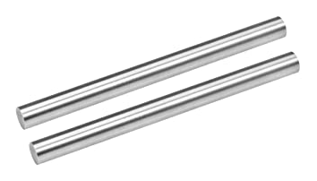

So far I've not found a good deal for these. They are $15.50 each on MiSUMi ([part number PSFJ16-400](https://us.misumi-ec.com/vona2/detail/110302634310/?HissuCode=PSFJ16-400)).

If you want to buy from MiSUMi, you can get each rod custom cut-to-length.

#### LM8UU linear ball bearings

Buy 4 of them. 8mm inner diameter, 15mm outer diameter, 25mm long.

The standard LM8UU on MiSUMi costs $6.50 each ([part number LMU8](https://us.misumi-ec.com/vona2/detail/110300026540/?HissuCode=LMU8)). Amazon has them for about $2 each if you get a pack of 4.

#### LM16UU linear ball bearings

Buy 4 of them. 16mm inner diameter, 28mm outer diameter, 37mm long.

The standard LM8UU on MiSUMi costs $8.13 each ([part number LMU16](https://us.misumi-ec.com/vona2/detail/110300026540/?HissuCode=LMU16)). Amazon has them for about $3 each if you get a pack of 4.

We may need to upgrade to LM16LUU if the bed vibrates. This is highly unlikely though.

#### brass bushing

These must be "oil free" or "oil-less" or "self-lubricating graphite" brass bushings!

Buy 4 of them. 8mm inner diameter, 12mm outer diameter, 24mm or 25mm long. You can try putting two together that are 12mm to act as one piece.

MiSUMI has these for about $13.50 each ([part number MPBZ8-25](https://us.misumi-ec.com/vona2/detail/110300032230/?HissuCode=MPBZ8-25)). This might be a better deal than Amazon or eBay.

#### F608ZZ rotary ball bearing

Buy 8 of them. 8mm inner diameter, 22mm outer diameter, with flange, 6mm or 7mm overall thickness.

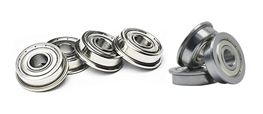

The standard F608ZZ on MiSUMi costs $12.28 each ([part number F608ZZ](https://us.misumi-ec.com/vona2/detail/221000058301/?PNSearch=F608ZZ&HissuCode=F608ZZ)). Amazon has them for about $2 each or lower, in large packs.

Another 4 more is needed for the spool holder but the spool holder do not need high quality ones.

#### Timing Belt

2GT profile 6mm wide timing belt, with some sort of fiber cord inside for reinforcement.

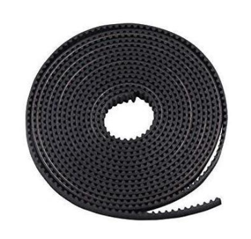

You need 4 chunks, each chunk should be about 780mm long, so you can also buy a roll that's longer than 3120mm long.

MiSUMi has these for about $7.85 per chunk ([part number GBN7602GT-60](https://us.misumi-ec.com/vona2/detail/110302652060/?HissuCode=GBN7602GT-60)). [Filastruder has the Gates branded 2GT belt](https://www.filastruder.com/products/gates-2gt-belts), it'll cost $31 for all the belt we need. Amazon lists 5 meters worth for $7.

#### Timing Belt Pulley

Buy 8 of them. 20 teeth, 8mm bore, 2GT profile, 6mm wide or slightly wider.

MiSUMi and Filastruder actually doesn't have a product that matches what we need, and no acceptable substitutes. The Ultimaker reseller [fbrc8 has some](https://fbrc8.com/products/pulley-8mm-assembly) that are $8.40 each. Otherwise, they are on Amazon for about $2.50 each, in packs of 5.

#### Timing Belt Tension Spring

Buy 4 of them. Torsion springs designed specifically to tighten up 6mm wide belts. These cost pennies!

#### Shaft Collar

Buy at least 10 of them, 20 is better. 8mm bore, about 7mm wide, about 14mm outer diameter, using set-screws for locking. Try getting ones that have two set-screws instead of just one if possible.

There's no reason to get high quality versions of these. They are dirt cheap. I'm not even going to research them.

#### Shaft Coupling

Buy at least 2 of them. 8mm bore to 5mm bore, 25mm long, 18mm outer diameter, flexible aluminum.

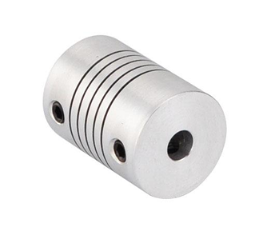

There's no reason for these to be super high quality. About $3 or less is a fine price. [example from OMC](https://www.omc-stepperonline.com/shaft-coupling/5mm-8mm-flexible-coupling-18x25mm-cnc-stepper-motor-shaft-coupler-st-fc04.html)

### Extruder

We've talked about the [E3D Hemera extruder](https://e3d-online.com/e3d-hemera) many times.

This is what we must use. Get the full package with 12V electronics. It comes packaged with a lot of stuff so make sure you are not buying anything duplicated. [Filastruder link](https://www.filastruder.com/collections/e3d-hemera/products/e3d-hemera)

### Hot-End Components

#### Heat Block

The heat-block should be an [aluminum heat-block](https://e3d-online.com/v6-heater-block-for-sensor-cartridges) from E3D-Online. [Filastruder link](https://www.filastruder.com/collections/e3d-spare-parts-and-accessories/products/e3d-standard-v6-heater-block-cartridge-style)

#### Heater Cartridge

The heater cartridge must be a 12V 30W [heater cartidge](https://e3d-online.com/standard-heater-cartridge) from E3D-Online. Knock-offs may have problems fitting properly into the heat-block, which is a potential hazard and lowers efficiency. [Filastruder link](https://www.filastruder.com/collections/e3d-spare-parts-and-accessories/products/e3d-heater-cartridge)

#### Thermistor Cartridge

The temperature sensor should be a [thermistor cartridge](https://e3d-online.com/thermistor-cartridge) designed specifically for the heat-block. [Filastruder link](https://www.filastruder.com/collections/e3d-spare-parts-and-accessories/products/e3d-thermistor-cartridge)

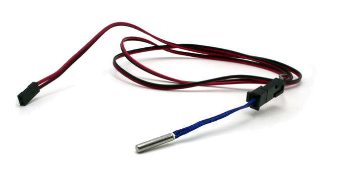

Buy this with the optional 1m long wire! We need that connector!

#### Nozzle

Your first nozzle should be an ordinary 0.4mm diameter brass nozzle for 1.75mm plastic filament. It must use the same M6 threads that the E3D heat-block uses. [Filastruder link](https://www.filastruder.com/collections/e3d-spare-parts-and-accessories/products/e3d-spare-nozzle-v6)

Your second nozzle should be a 0.8mm nozzle for the sake of print speed, ordinary brass is OK but a premium upgrade is [something like this](https://thegr5store.com/store/index.php/1-75mm-filament-products/0-8mm-matchless-race-nozzle-for-1-75mm-filament.html), I can attest to how good "Matchless" nozzles are.

Hardened steel nozzles are required for carbon fiber filaments and glow-in-the-dark filaments!

For the heat-block, it's a good idea to get a sock for it. It stops plastic from accidentally sticking to the heat-block. [Filastruder link](https://www.filastruder.com/products/silicone-socks-3-pack)

### Cooling Fan

The extruder should've already included a [12V cooling fan](https://e3d-online.com/e3d-hemera-fan), which is required to prevent the hot-end from jamming. You should get another one to cool the control circuit board. Should be 40mm x 40mm square shape and 10mm thick.

Get a Noctua NF-A4x10 if you are willing to spend $15 on just a cooling fan. It's super quiet. Otherwise, shop around, they are cheap. For simply cooling the circuit board, they pose no danger if they fail.

[$3 on Filastruder](https://www.filastruder.com/products/generic-40mm-ball-and-sleeve-bearing-axial-fans) ; [option on Digi-Key (Sunon MF40101VX-1000U-A99)](https://www.digikey.com/product-detail/en/sunon-fans/MF40101VX-1000U-A99/259-1798-ND/6198736) ; [example on Amazon](https://smile.amazon.com/WINSINN-Brushless-40x40x10mm-Extruder-Makerbot/dp/B0757LXKST/ref=sr_1_3)

### Blower Fan

You will need a small centrifugal blower fan, 40mm x 40mm square shape, 10mm thich, running on 12V.

These usually cost about $6 on Amazon, usually in packs of 2 or 4. These pose no danger if they fail.

[example on Amazon](https://smile.amazon.com/MakerHawk-Brushless-Cooling-Hydraulic-XH2-54-2P/dp/B07JKVNMY3/ref=sr_1_4) ; [option on Digi-Key (Delta BFB0412HHA-A117)](https://www.digikey.com/product-detail/en/delta-electronics/BFB0412HHA-A117/603-1840-ND/5022816)

### Heated Bed

As recommended in [lesson 1](lesson1), we will use a 220mm x 220mm bed rated for 12V that outputs about 120W, made of aluminum.

[example on Amazon](https://smile.amazon.com/Aluminum-Hotbed-Cable-Printer-220x220mm/dp/B07JLQW3XW/ref=sr_1_25)

It may come with wires, but those wires are crap in terms of safety. We will use our own wires.

### Bed Glass

This must be a borosilicate glass bed, 220mm x 220mm in size.

If we properly use a countersink drill bit on the heated bed, we could avoid required the glass to have the corners cut. Here are some that don't have corners cut:

[example on Amazon](https://smile.amazon.com/Wisamic-Borosilicate-Heated-220x220x3mm-Printers/dp/B076V38M7R/ref=sr_1_10) ; [example on Amazon (textured)](https://smile.amazon.com/KINGROON-Platform-Tempered-Borosilicate-Printers/dp/B07F8QVKJQ/ref=sr_1_6) ; 

(the McMaster-Carr screw shopping list uses countersink screws, so the countersink drilling is a requirement)

With corners cut:

[example on Amazon](https://smile.amazon.com/220x220x3mm-Borosilicate-Polished-Duplicator-Printers/dp/B07FRV28XQ/ref=sr_1_30)

WARNING: Borosilicate glass is required to handle high temperatures!

You will need some small binder clips if the glass plate does not come with any. These will clip the glass to the bed.

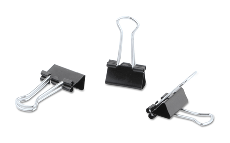

### Wires

 * 14 AWG stranded copper wire
   * silicone insulated
   * one chunk black and one chunk red, about 10 feet each, red and black might come together on one spool
 * 24 AWG stranded copper wire
   * silicone insulated
   * one chunk black and one chunk red, about 25 or 50 feet each, red and black might come together on one spool

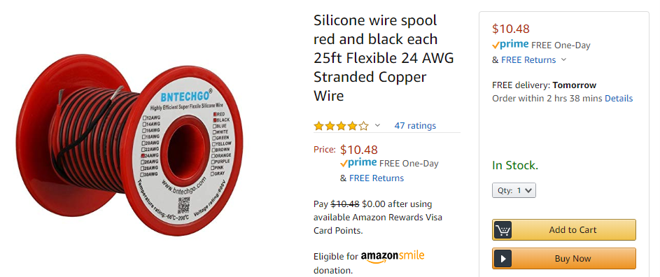

Additional connectors and such will be mentioned later on during the lesson on electrical assembly, because you'll need to deal with situations as they arise.

### Control Circuit Board

 * [BIGTREETECH SKR Mini E3](https://www.biqu.equipment/products/bigtreetech-skr-mini-e3-control-board-32-bit-integrated-tmc2209-uart-for-ender-4) official page
 * [AmazonSmile Link](https://smile.amazon.com/BIGTREETECH-Control-TMC2209-Printer-Creality/dp/B07XYW21J3?sa-no-redirect=1)

You can try getting the combo with the TFT24 LCD screen. [AmazonSmile link to combo](https://smile.amazon.com/BIGTREETECH-DIRECT-Control-Dispaly-Motherboard/dp/B07ZP5FPFK/ref=sr_1_3?)

### LCD Screen

 * Recommended: [BIGTREETECH TFT24](https://www.biqu.equipment/collections/lcd/products/bigtreetech-tft24-v1-1-display-two-working-modes)
    * if buying from Amazon, see above part about the SKR Mini E3 combo
    * if you are not getting a combo, then make sure you get the cable meant for the Ender 3
 * Dirt cheap option: 12864 LCD Graphic Smart Display, [AmazonSmile link](https://smile.amazon.com/KINGPRINT-Graphic-Display-Controller-Adapter/dp/B076WQQX5K/ref=sr_1_16?) or [BIGTREETECH link](https://www.biqu.equipment/collections/lcd/products/ramps1-4-lcd-12864-lcd-control-panel-for-3d-printer-smart-controller-mega-2560)

### Power Supply Unit

As discussed in the [electrical lesson](lesson8), we are shopping for a reputable 200W 12V power supply. From a trusted source like Digi-Key, we get [this list](https://www.digikey.com/short/zq3n88). From there, we see that the lowest priced suitable items are both from Mean Well:

 * LRS-200-12
   * [Digi-Key link](https://www.digikey.com/product-detail/en/mean-well-usa-inc/LRS-200-12/1866-3330-ND/7705022)
   * [Mean Well page](https://www.meanwell.com/webapp/product/search.aspx?prod=LRS-200)
   * [AmazonSmile search](https://smile.amazon.com/s?k=meanwell+lrs-200-12&rh=p_85%3A2470955011)
 * LRS-350-12
   * [Digi-Key link](https://www.digikey.com/product-detail/en/mean-well-usa-inc/LRS-350-12/1866-3344-ND/7705030)
   * [Mean Well page](https://www.meanwell.com/webapp/product/search.aspx?prod=LRS-350)
   * [AmazonSmile search](https://smile.amazon.com/s?k=meanwell+lrs-350-12&rh=p_85%3A2470955011)

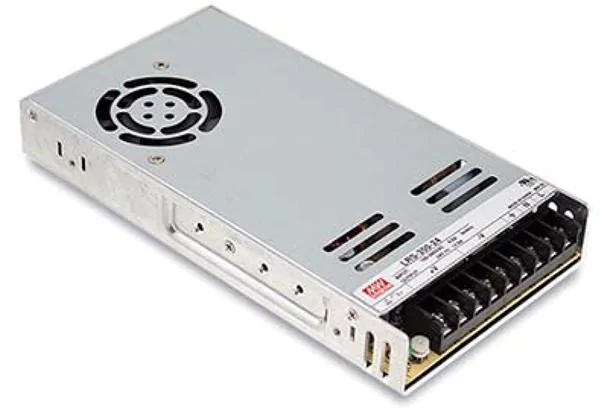

Important: The LRS-200-12 is has a much more open enclosure for airflow and does not use a cooling fan. This is could be dangerous as debris may fall into the enclosure. The LRS-350-12 is definitely the preferred choice because it's better protected and uses a cooling fan. If the fan fails, it should still be safe because we are only using 175W in the worst case, and it has its own internal protections that will trigger.

There are other options that are about $20 on Amazon Prime, or [from OMC](https://www.omc-stepperonline.com/power-supply?mfp=16o-ship-from[58,59],47-output-voltage-v[12],49-power-w[201,250,350,400]). If you wish to save $20 you can try them out. It is likely that they will fail earlier and generate more electromagnetic interference. They are also thicker than the LRS family from Mean Well.

### AC Input Socket

As discussed in the [electrical lesson](lesson8), we will use a product that combines the AC input socket, power switch, and a safety fuse. These are super common on Amazon. Find one with the wires already attached if possible.

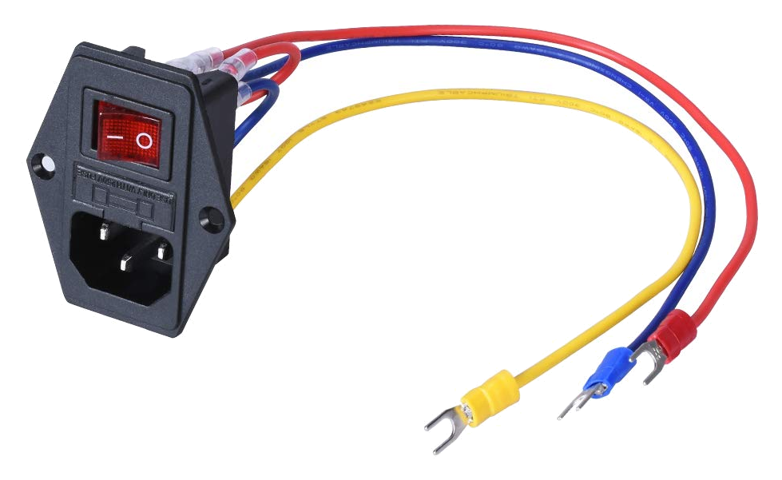

[example on Amazon](https://smile.amazon.com/BIQU-Rocker-Switch-Socket-Module/dp/B07KS2TQ45/ref=sr_1_1) , and here's a beefcake one on [Digi-Key (Delta 06AB2D)](https://www.digikey.com/product-detail/en/delta-electronics/06AB2D/1144-1009-ND/3830632)

### Limit Switches

We need 3 limit switches. Their form-factor are somewhat standarized, and we are only passing a very weak signal through them so they do not need a high rating. But with the same form-factor, the actuator style might still differ.

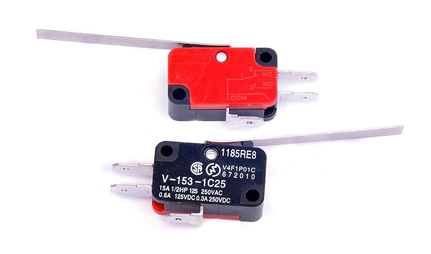

 * from Amazon Prime, this one is the best deal: [link to AmazonSmile](https://smile.amazon.com/Cylewet-V-153-1C25-Straight-Arduino-CYT1068/dp/B071NSRHK3/ref=sr_1_5)
 * from Digi-Key, the best deal: [Omron D3V-11G2M-3C24-K](https://www.digikey.com/product-detail/en/omron-electronics-inc-emc-div/D3V-11G2M-3C24-K/Z10805-ND/1789198)

Switches that are smaller will not fit with our M3 screws.

### Teflon Tube

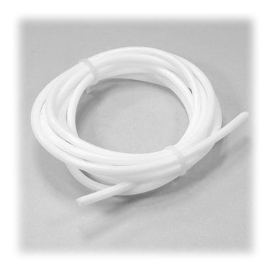

You do need a teflon tube. Firstly, to support the wires going to the extruder. Secondly (and optionally), it helps guide the plastic filament to the extruder from the spool holder. It's not a requirement but could prevent tangles.

This teflon tube is not a bowden tube, but it may be sold as one. It does not need to be a tight fit, in fact, a loose fit is better. You do not need any tube fittings.

I'd much prefer you to buy something with a 3mm inner diameter if possible. [This Amazon listing is great](https://smile.amazon.com/WINGONEER%C2%AE-Teflon-Bowden-Filament-Printer/dp/B077XDYR74/ref=sr_1_7).

### Drag Chain

A relatively small drag chain is used to guide the wires to the heated bed as it moves up and down. The internal size can be as small as 10mm x 10mm.

This is not a required part, there's an alternate cost saving method that uses another piece of teflon tube instead. Please see the [page on alternative parts](../other_pages/optional3dprintedparts#tube-guide-anchor).

### Other Electrical Components

We will cover connectors, soldering, and such, much later. Since at this point, we are a bit unsure what wires come attached to what product, so we will deal with connecting them after mechanical assembly. You do need plenty of zip-ties later but you may get those from any retails store.

# 3D Printed Parts

If you are a friend that can meet me locally, I'd gladly provide you with the 3D printed parts for this 3D printer. Come meet me at the public library I volunteer at, I can show you how to print one part in person with the library's Ultimaker 3D printer.

Otherwise, go through the design and the [walkthroughs (link to lesson 6)](lesson6), use the Onshape export function to generate the STL files you need for printing them yourself.

Remember what we discussed about [best print orientation (link to lesson 4)](lesson4). Most of the time it's obvious, and if it isn't obvious, I would've pointed it out in a previous lesson.

Almost all of the parts can be printed with PLA plastic, except for the parts that are touching a stepper motor, which can get very hot. Use PETG for any parts that need to get warm, and nylon for things that will get very hot.

Please use PETG for the following:

 * mounting part for the Hemera extruder
 * standoff spacers for the X and Y axis stepper motors
 * mounting part Z axis stepper motor

Make sure all the holes on the 3D printed parts fit the screws that will go into them. Use a drill bit to drill them out if the holes do not fit the screws.

If a hole or clamp is meant to fit in a bearing, and it doesn't fit, then that part should be re-designed and re-printed with a very slightly bigger diameter. Do not use a drill to widen these parts.

# Ball Bearing Preparation

When you purchase ball bearings, both the rotary and linear kind, you should lubricate it. The bearings might already seem oily, but that oil is an anti-rust oil used for storage and transportation, not for lubrication. Purchase some dedicated bearing oil, such as machine oil, and apply it to all the bearings. Do this right before installing the bearings.

# Tools

Required:

 * set of hex wrenches for metric fasteners
 * set of torx wrenches
 * pliers for gripping nuts during tightening
 * flush cutters
 * drill and drill bits
 * ~~countersink drill bit~~
 * screwdriver set, including torx bits
 * hobby knife (Xacto knife)
 * set of metal files (not computer files...)
 * something to cut aluminum beams, at least a metal hacksaw, a miter saw of some kind is better
 * something to grind into aluminum beams, such as an angle grinder or rotary tool (Dremel tool)

There may have been things I've missed. We'll deal with missing stuff as the assembly is being done.

WARNING: Usage of imperial hex wrenches on metric screws will cause damage to the screw head by stripping the hexagonal recess! Get the correct metric hex wrenches!

# Aside

#### E3D-Online

E3D-Online is a company in the UK who has many American [resellers](https://e3d-online.com/resellers) that you can trust, I typically use [Filastruder](https://www.filastruder.com/), who also resells parts from Duet (also British) and Gates.

#### Stainless Steel

None of this machine is meant to work outdoors or in a wet environment. You can choose steel or stainless steel according to price. Black oxide is also fine.

#### Torx

Use torx screws whenever possible. They will save you so many headaches because they are impossible to strip. Their wrenches and drivers do not have metric or imperial versions, it's always just a "T number", so it's impossible to strip the screw head by using the wrong tool.

Hex is the next preferred type, at least it's better than philips, because a wrench can apply more torque to the screw.

#### Lock Nuts, Lock Washers

Using square nuts and flat washers is fine in this 3D printer. The vibrations expected isn't strong enough to shake the screws loose. Use a thread-locker if you wish.

The Ultimaker brand of 3D printers use mostly square nuts for their frame assembly and nylon locking nuts for everything else. They rarely even use washers. Their printers will last several years of continued abuse.

My own Hephaestus 3D printer used locking nuts and locking washers everywhere because the printer itself was a present to myself. Plus, some of the screws were literally impossible to tighten once they have been installed. This new design is different from Hephaestus, every screw can be tightened without much trouble.

#### Spare Fuses

We've coverd fuses in the [electrical lesson](lesson8). If you blow a fuse, you need to first fix what caused the problem, then replace the fuse.

For the AC power input, the fuse is a glass fuse, 20mm x 5mm size, rated for 120VAC (or 220VAC), trip point at 1.8A to 5A, must be fast blow. [example on Digi-Key (Littelfuse 0235004.MXP)](https://www.digikey.com/product-detail/en/littelfuse-inc/0235004.MXP/1294-0235004.MXP-CHP/9857094)

For the DC fuse holder on the SKR Mini E3 circuit board, it's a 20A mini ATC fuse. [example on Digi-Key (Littelfuse 0297020.WXNV)](https://www.digikey.com/product-detail/en/littelfuse-inc/0297020.WXNV/F993-ND/146599)

You can find these for sale at local hardware stores and car part stores.
