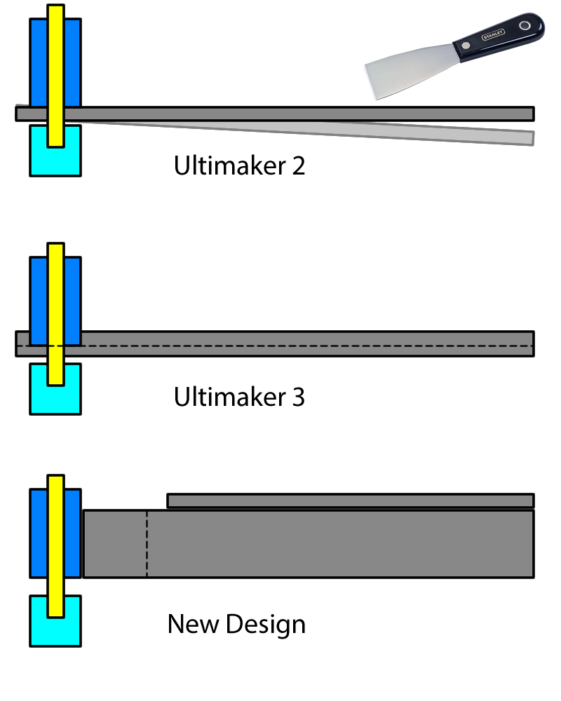
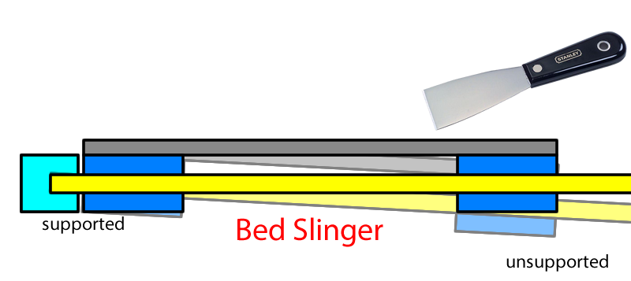
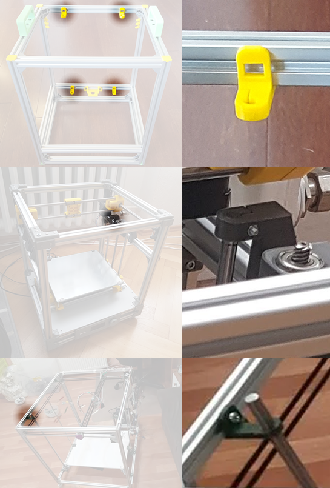

# Comparison to Other Printers

## Versus My Own: Hephaestus

Versus [my Hephaestus 3D printer](https://eleccelerator.com/hephaestus-my-own-3d-printer/), this new design is a attempt to achieve the same performance and reliability but at a lower price. Plus, using more commonly available 1.75mm filament.

 * uses 1.75mm plastic filament, instead of 2.85mm
 * single Z leadscrew, instead of two
 * four point bed leveling, instead of three points
 * uses a stock Hemera extruder, instead of a flexible-shaft driven Titan Aero
 * uses limit switches, instead of sensorless homing
 * fully metric, instead of a mix of metric and imperial
 * uses 2020 for the frame, instead of 1010
 * no water-jet cut parts
 * all motion components now available from Amazon, instead of industrial suppliers
 * 12V power, instead of 24V

## Versus Ultimaker 2

THe mechanics of both Hephaestus and Bones is nearly identical to the Ultimaker 2 and 3. The center crossing rods are thicker on my designs, 8mm, to handle a heavier direct extruder, whereas the Ultimaker uses 6mm for it's very lightweight Bowden extruder.

But I do not like the performance of a Bowden extruder when it comes to speed and reliability. Try to print TPU filament on an Ultimaker 2 at full speed, I dare you... Spoiler alert, it can't.

The Ultimaker 2 also used a very thin aluminum platform for its bed, it tends to bend and allows for a lot of vibrations. The Ultimaker 3 fixed this problem by adding a lip around this aluminum bed to give it much more rigidity. Bones uses 20mm thick aluminum beams under the bed, you try bending it, I dare you.

The Ultimaker printers also uses two more short belts. While it's true that more belts means more belt-stretch, these belts are short, and honestly they haven't become loose on my Ultimaker yet.

## Versus Bed-Slingers

Bed slingers designs are by far the most inferior designs out there, but also they are popular because they are incredibly cheap.

As the name implies, the bed of a bed-slinger 3D printer moves around, usually along the Y axis. The bed is a very heavy component and it gets heavier as the 3D print progresses. Moving a large mass will cause the belts to stretch, this results in vibrations when the printer changes directions. This vibration manifests as a wave-like artifact that ruins the surfaces of the 3D print.

It's hard to remove a 3D print from a bed-slinger's bed surface because there's nothing holding the bed still. If you tried to use a scraper, you'll be applying a force right into the middle of the rods that support the bed, which is the place most likely to bend.

Bed-slinger designs sometimes get around this by using removable flexible plates, but that just means the flexible plate won't be flat, which causes bad adhesion of the 3D print to the bed surface. Because of the tendency of the bed rods/rails to bed, and the flexible plates not being flat, some bed-slinger designs use a bed level sensor.

Bed level sensors are not a magic bullet. A cheap printer like the Ender 3 can have a bed level sensor retrofitted but the microcontroller won't have enough memory for it unless you sacrifice some other functionality. On the expensive end, the Prusa i3 MK3 has some execellent implementation of automatic calibration but it still needs the user to calibrate the digital baby-steps of the bed height. These sensors are an additional liability sometimes, another thing to break, another thing to calibrate. The magnets that the Prusa uses for its bed cannot be overheated or else they become ineffective, so its bed temperature is limited.

Bones, Hephaestus, and Ultimaker, are all designed with a ridgid bed that only moves along the Z axis. This can handle some rough handling during print-removal as the removal is done at the bottom of the rods where there's the most support. The bed level will never go out-of-level on its own, nearly guaranteed to be flat by design as long as the surface being used is glass. This means it doesn't need sensors for bed leveling, ever. It doesn't even need baby-stepping because of the knobs. Since the bed doesn't move during printing, the knobs can be adjusted while it is printing, so you can do your initial calibration much faster. This is impossible on a bed slinger because the bed is obviously moving, so you can't turn the knobs.

## Versus CoreXY

The good thing about CoreXY vs Ultimaker-like design is that it doesn't need bearings that need to handle both rotation and linear movement. CoreXY can be built with linear guide rails, which are very simple to implement in comparison to spinning rods. That's about its only advantage.

The **2** belts on a CoreXY system are **super long**, with only **4** attachment points to the print head. This means as the print head moves around, there's **more belt stretching**.

In comparison, the Ultimaker-like system that our original design used, has **8** belt attachment points, and also **4** relatively **short** belts. This is almost like **doubling the belt's width**. The belt stretch of a Ultimaker-like system will be much less than a CoreXY system, because the belts are shorter and virtually wider.

This disadvantage of CoreXY is why I do not prefer it, as it would either cause **worse print quality**, or force the print **speed to be reduced**.

This is why CoreXY 3D printers typically use a lightweight Bowden style extruder, to avoid carrying around an extruder motor, which would cause more belt stretch. Bowden extruders are far less capable of high speed printing, much easier to jam, and doesn't handle flexible filaments well.

Also, while this is not a flaw of CoreXY designs, but there are many CoreXY 3D printer kits that have design flaws that cause Z wobbling due to poorly supported Z axis rods. (we discuss this in [lesson 3](../ordered_lessons/lesson3#z-axis-wobble))

#### Back to Main Page

[Click Here](../) to go to our main page
