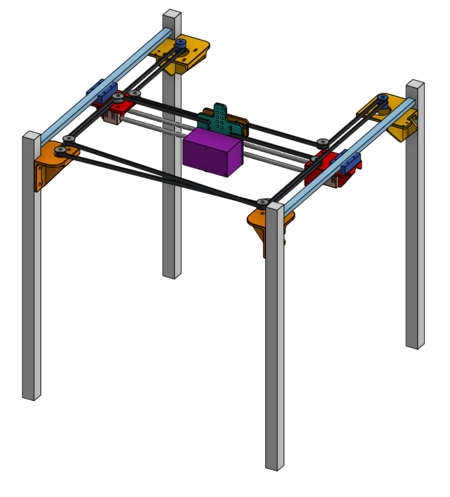
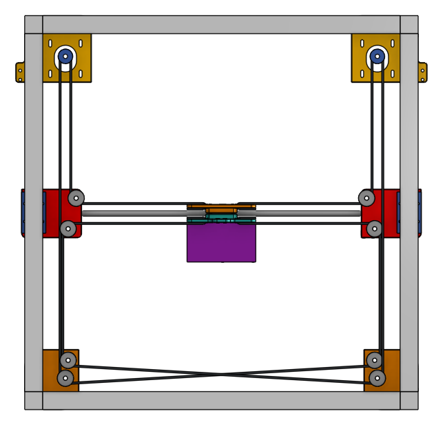
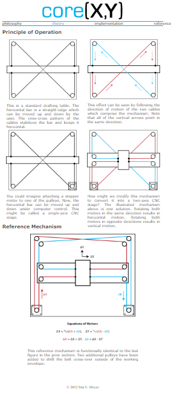
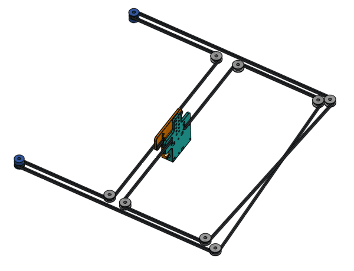
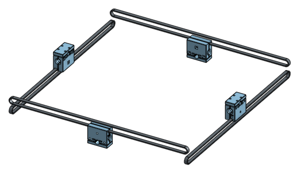
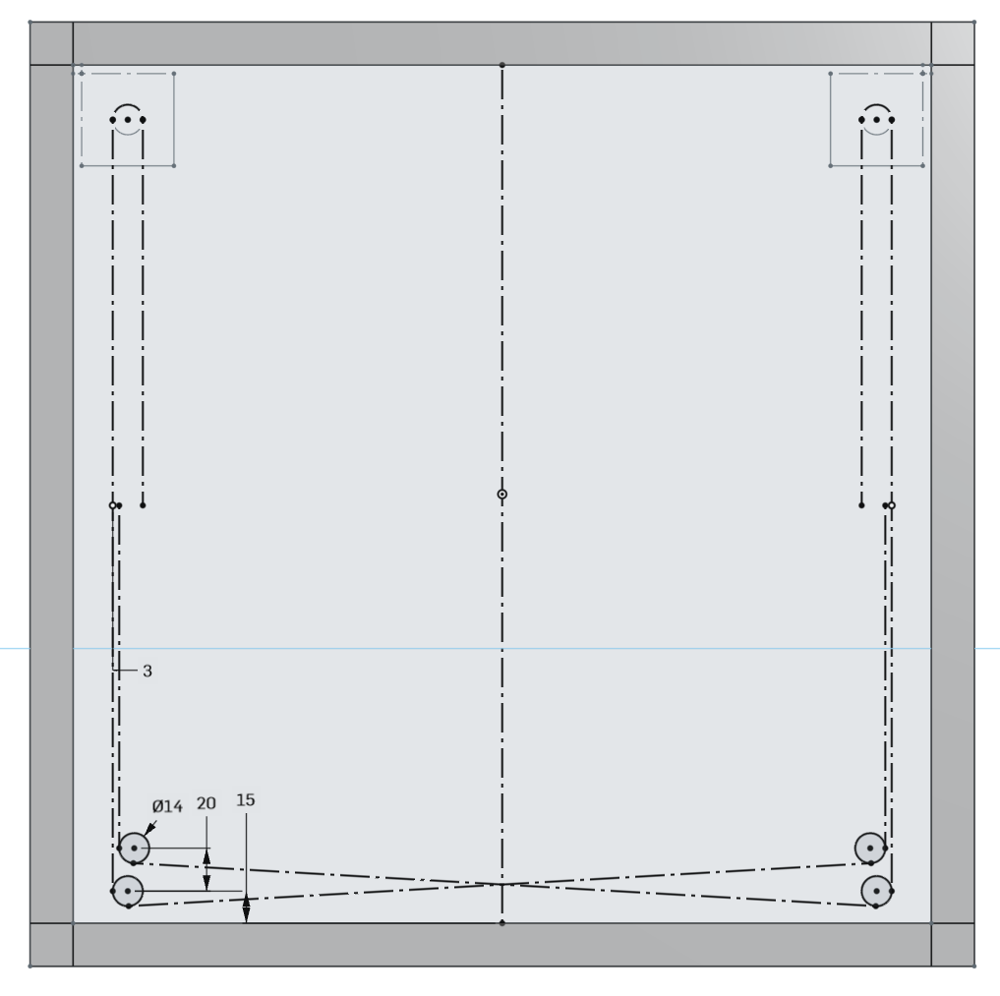
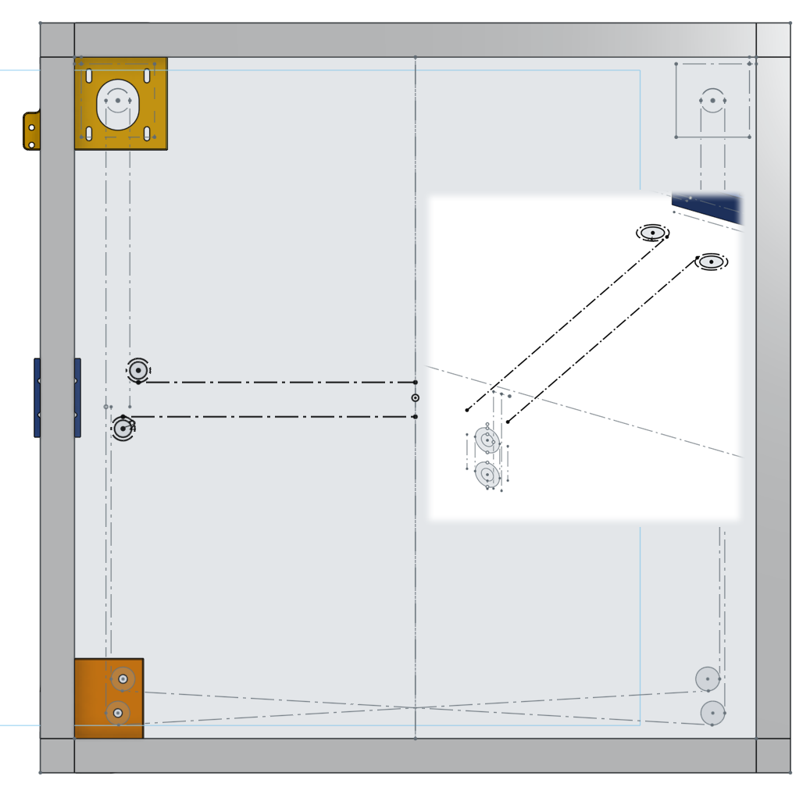
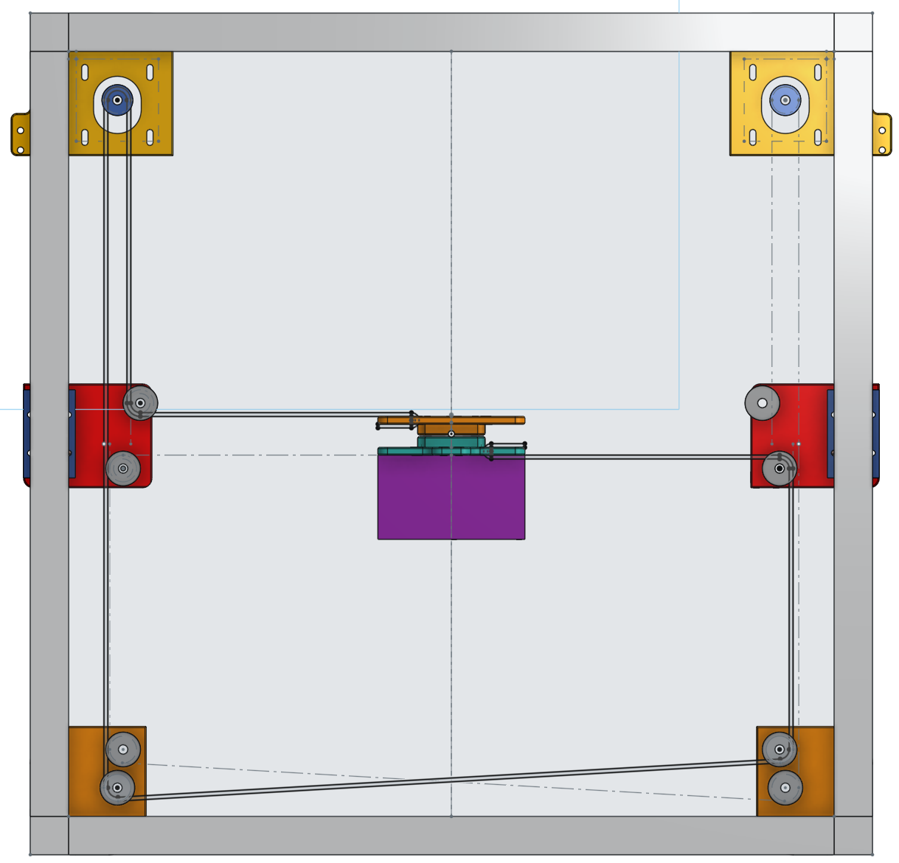
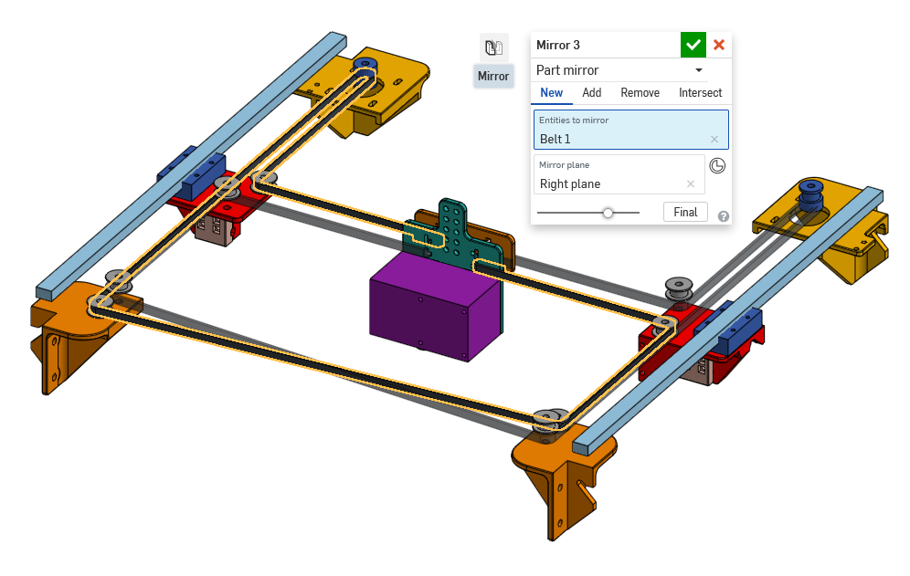

# CoreXY Experimental Design

I've also designed this printer with a CoreXY motion system for the upper gantry.

Top view:

[Link to Model](https://cad.onshape.com/documents/359baba3de4f085c967fb5a9/w/62a7ef2a4414462a5d8bf3e1/e/c66889334e6ec6a43058badc)

## What is CoreXY

CoreXY is derived from a system known as [**H-Bot**](https://www.youtube.com/watch?v=ei4lPk_aM9Y), which looks like a **H**.

[Click here to visit the CoreXY home page](http://www.corexy.com/theory.html)

## CoreXY Advantages

Although the CoreXY system is a bit harder to understand, the design complexity is **actually simpler** once you planned out the belts. The carriage only needs to handle one axis of motion instead of two, so mounting bearings is simpler. This is one of the reasons why it's easier to implement something like an automatic tool-changer with a CoreXY style printer. The system is meant for more than just 3D printers, it can be adapted to any cartesian CNC machine, such as a laser cutter.

A 400mm wide desktop 3D printer isn't that big, but once you build something bigger, the rods will start to droop. If you tried to spin a bent rod, you will start getting wobbling. The CoreXY system allows **linear rails** to be used so that drooping is less of a problem.

The gantry of a CoreXY is supposed to be more **lightweight**. The reasoning is that there's no **heavy bed being moved** (such as the Prusa-style printers), and also, **no motors being moved** (such as the FlashForge printers). The Ultimaker-like design we originally used also **does not have any motors or the bed being moved**.

## CoreXY Disadvantages

The **2** belts on a CoreXY system are **super long**, with only **4** attachment points to the print head. This means as the print head moves around, there's **more belt stretching**.

In comparison, the Ultimaker-like system that our original design used, has **8** belt attachment points, and also **4** relatively **short** belts. This is almost like **doubling the belt's width**. The belt stretch of a Ultimaker-like system will be much less than a CoreXY system, because the belts are shorter and virtually wider.

This disadvantage of CoreXY is why I do not prefer it, as it would either cause **worse print quality**, or force the print **speed to be reduced**.

This is why CoreXY 3D printers typically use a lightweight Bowden style extruder, to avoid carrying around an extruder motor, which would cause more belt stretch. Bowden extruders are far less capable of high speed printing, much easier to jam, and doesn't handle flexible filaments well.

## Still Want It?

This 3D model only has the upper gantry portion. The bed's sizing and positioning is different but still uses the same parts from the original Ultimaker-like design. The electronics is all the same, the wiring needs to be done slightly differently. The firmware will need to be completely reconfigured. The shopping list is also very different, as you'll need a lot more idler pulleys for the belts.

As I have not built a CoreXY style printer myself, I cannot offer as much support if you choose to build this version. It'll be a nice experiment for a second 3D printer.

## Belt Planning in CAD

It might seem daunting to design something like this at first, but it's quite simple. It's just a bunch of pulleys, the belts go around them, and most of the belts need to be parallel.

First start with where the stepper motor will be, and the diameters of the pulleys. You can draw a plan for the Y axis. There's a bunch of tangent constraints used here.

For the X axis, I first planned out where the linear rods and linear ball bearings will go. Then I planned on how thick I wanted the 3D printed carriage to be. This told me where the belts should end up resting against, which means I know where to put the pulleys for the X axis.

In the end, I could follow these two planning sketches to make a third sketch of exactly where the entire belt will go.

And finally we can use the mirror tool to duplicate the belt for the other side.

## Back to Main Page

[Click Here](../) to go to our main page
