# Designing an External MOSFET Circuit

We have discusssed electrical safety around 3D printers and one of the topics was external MOSFET circuits. These are typically used to allow a small control circuit board to control a heated bed that's much more powerful than what the control circuit is rated for. You can buy this circuit from anywhere that sells 3D printer parts.

However, for that previous lesson, I left you some homework, to design one of these circuits. If you have no clue about how to do it... this is the right lesson for you.

#### Before we begin...

For my previous robotics class, I wrote a [circuit-basics class](http://eleccelerator.com/ssfpl_robotics_class_2018/circuitbasics.htm), check it out. It will explain some things here that I didn't dive into.

## What is a MOSFET? ELI5

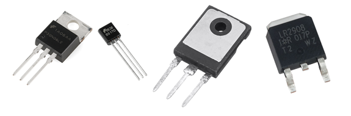

A MOSFET is a type of transistor. Transistors are semiconductor devices that we can use to act as a switch, a switch that is switched by giving it an electrical signal. We can use it to switch a big signal by giving it a small signal.

MOSFETs come in two main flavors: **N**-channel and **P**-channel

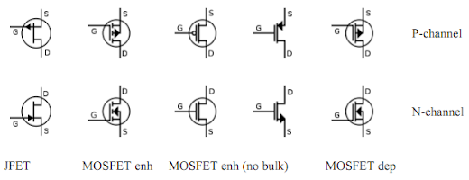

For now, only worry about N and P, and notice that the easiest way to tell is where the arrow points.

A MOSFET has 3 pins: **S**ource, **D**rain, **G**ate

Conventionally, we say that current flows from drain to source, which doesn't make sense...

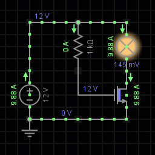

That's why I said conventionally... because **electrons actually flow from source to drain**. Conventional current is actually the exact opposite of electron movement. But since conventional current is easier for everybody, we will continue to say that **current flows from drain to source**. (and what the simulation animations will show)

## Where should we put this switch?

Conventionally, we say electricity flows from positive to negative. If we pretend our power supply is a battery and our bed heater is a lightbulb, the following circuit will always be ON, with no way to switch it off:

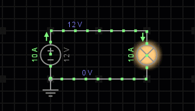

We want to add a switch to it, to be able to turn it on or off. We could either put the switch near the positive terminal of the power source, or the negative terminal.

The circuit configuration on the left is known as **high-side switching**, and the right side is known as **low-side switching**.

What's the difference? Functionally, there's no difference. Electrons don't care where the switch is, they still move at the same speed with the same force, no matter where you put the switch. You can see this in the simulation, both circuits have 10A flowing through.

However... it matters in the type of MOSFET you can use. For high-side switching, you need to use a P-channel MOSFET. For low-side switching, you need to use a N-channel MOSFET. (this isn't exactly always true, but for now, we'll keep things simple)

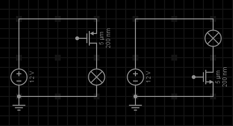

You'll see low-side switching used in the real world a lot more. To control a low-side switch MOSFET, you need a low voltage input, like maybe 3 volts. For a high-side switch, if you wanted to use 12 volts, then you need 9 volts (12 minus 3) at the input to control it. Microcontrollers can't output that much voltage. So it's much easier to use low-side switching. We want to design our circuit with a N-channel MOSFET.

## MOSFET Control

The gate is essentially the control input of the MOSFET. If we give the gate some voltage, then current can flow between the drain and source, for simplicity's sake, we will say that the MOSFET is ON. Without any voltage at the gate, the MOSFET will stay OFF.

Also, the gate of a MOSFET doesn't like being connected to nothing. If you leave it disconnected, then the MOSFET could randomly turn ON and OFF, due to either static electricity, or some form of interference. This is a massive safety hazard! To solve this problem, we can use a resistor to make a connection to the gate, but a weak one.

If this resistor is between the gate and a positive voltage, then the gate will stay ON by default, until something turns it off. This resistor is called a **pull-up** resistor.

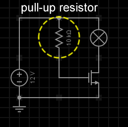

And vice versa, if the resistor is between the gate and zero voltage, then the MOSFET will stay OFF until something turns it on. This resistor is called a **pull-down** resistor.

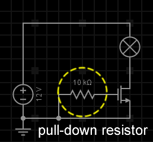

We know we need a big beefy N-channel MOSFET as our main switch. But we want it to stay OFF unless something turns it ON. So we want a pull-down resistor on the beefy MOSFET. For safety, we want to be safe when anything fails, hence the term fail-safe. So it's a good rule to make sure the beefy MOSFET is OFF when something fails.

## Our input signal

Remember how low-side switching is used in the real world a lot more? Well... your control circuit motherboard also uses low-side switching. This adds a bit of complication to our design. There are two wires coming out of the heater connector, one is the positive +12V, and the other one is labeled as negative, but it is actually connected to the MOSFET of the control circuit. We can actually double-check the schematic of the SKR Mini E3 to see this:

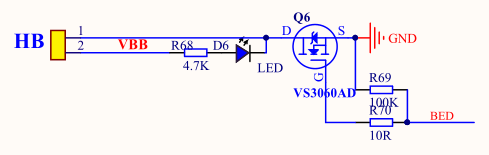

You see the HB (**H**eated **B**ed) connector. VBB means the 12 volt power, they got lazy when drawing this and just labeled the wire. Q6 is the MOSFET. BED is the control signal coming from the microcontroller. R69 is the pull-down resistor. R70 is there to protect the microcontroller. We can draw a simplified version of that circuit in our simulator.

If we take away the fake lightbulb to pretend there's a connector...

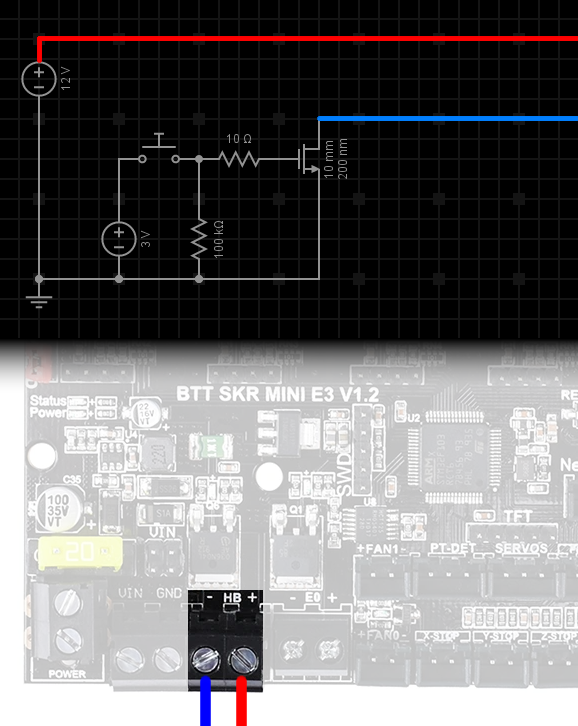

Which wire do you connect to your external MOSFET's gate?

If you connected the +12V signal to the gate, then the external MOSFET will be always ON, you will never be able to turn it OFF. So that won't work.

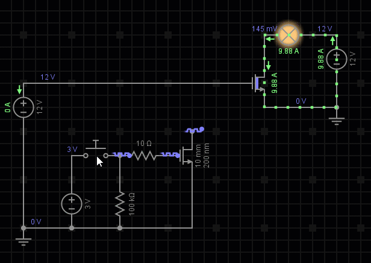

If you connected the negative signal to the gate, then when the control circuit turns ON its own MOSFET, your external MOSFET's gate will get 0V, and stay OFF.

We don't want that. Let's make it worse...

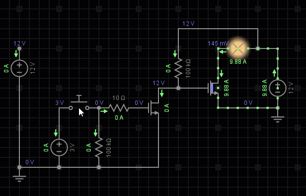

We definitely don't want that, when the control circuit tries to turn OFF the heated bed, it will turn ON! That's exactly the opposite of what we want it to do!

But you just learned something: This is what an **inverter** does. The most basic inverter you can build is just a N-channel MOSFET with a pull-up resistor.

Then... why not invert the inverter? Why not add another MOSFET to solve this problem? That's exactly what we are going to do!

## P-channel MOSFET

P-channel MOSFETs are not useless, and a small one can be used to help us.

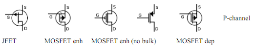

Because we are using a pull-down resistor on the beefy MOSFET's gate, then we can't use another N-channel MOSFET at that gate, because it'll do the same thing as the resistor, and the beefy MOSFET will never turn ON.

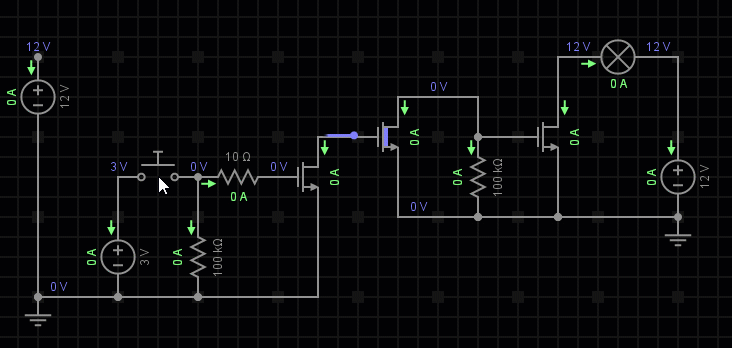

So this is the time when we use a tiny P-channel MOSFET. P-channel MOSFETs, require the gate to be at a low voltage in order to turn ON, and a high voltage in order to turn OFF. We want it OFF by default, for safety, so we give it a pull-up resistor at the gate. (note: for P-channel MOSFETs, the logic for pull-up and pull-down is the opposite of N-channel MOSFETs)

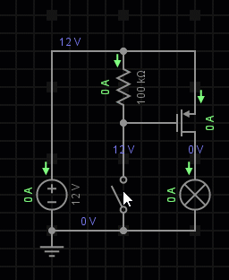

## Completed Working Circuit

Knowing how to use a P-channel MOSFET, we will put it into our circuit

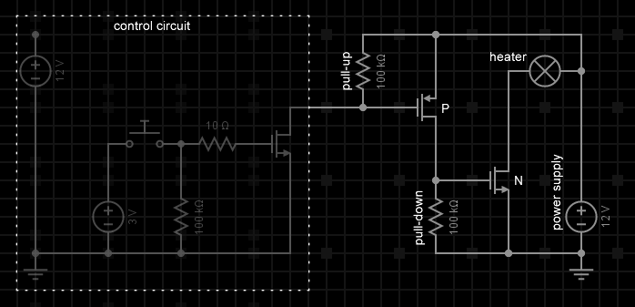

We are done!

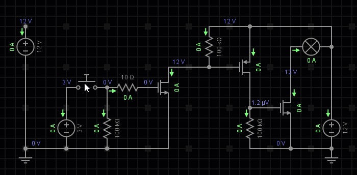

It works in the simulator! But... is it safe?

## Gate Voltage Limits

The gate of a MOSFET is physically very thin. It can only handle so many volts before failing. The gate of a MOSFET is actually very easy to fry. We want some protections against unexpected voltage spikes and also static electricity.

First, we can add some resistors, these will both lower the voltage and current going into the gates of our MOSFETs. I also adjusted the 100k&Omega; resistors to 10k&Omega;, which is safer because it makes the signals less suseptible to noise.

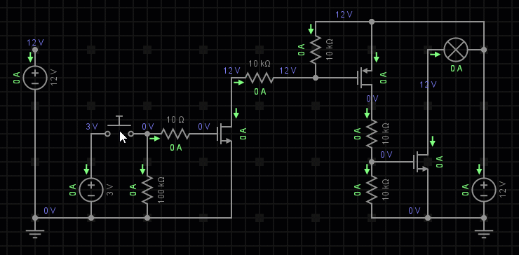

Now you see that the gates are operating at about 6V instead of 12V, this is because the resistors are forming a voltage divider. 6V is plenty enough to operate the gate of our MOSFETs.

People who buy these external MOSFET circuits might want to use a even more powerful power supply, that means more voltage too. If you used a 30 volt power supply, then the gate voltage will be 15 volts. That might be too high. In the following simulation, watch the voltages at the gates of the MOSFETs as the voltage of the power supply is increased.

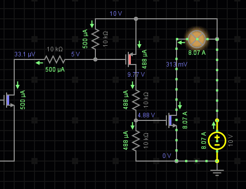

What should we do?

A diode is a semiconductor device that allows current to flow only in one direction. Zener diodes are a special type of diode that does the same thing, except when the backward voltage is too much, then it allows current to flow the other way. A common usage for a zener diode is to set a voltage limit. We can limit the gate voltage to 8V by using a 8V zener diode. This will keep the beefy MOSFET safe from a power supply that's outputting more voltage. Watch the following animation where the voltage is increased, and watch the gate voltages, see how they are limited by the zener diodes.

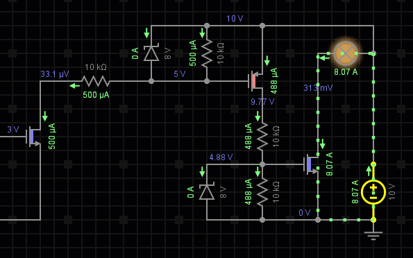

But static electricity is hundreds or thousands of volts, and it could be positive or negative. It's a good idea to also add some diodes that are made specifically to handle static electricity, such as bi-directional TVS diodes.

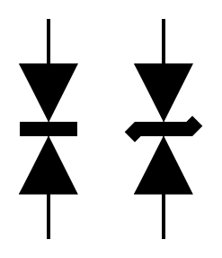

They are kind of just two regular diodes or two zener diodes butted up against one another in opposite directions, rated to handle much higher voltages.

In circuit design, you want to put TVS diodes near any sort of connector or button, **things that a person will touch**. It's really hard to draw it into our simulated circuit here because this component doesn't exist in the simulator. I would put them here like this:

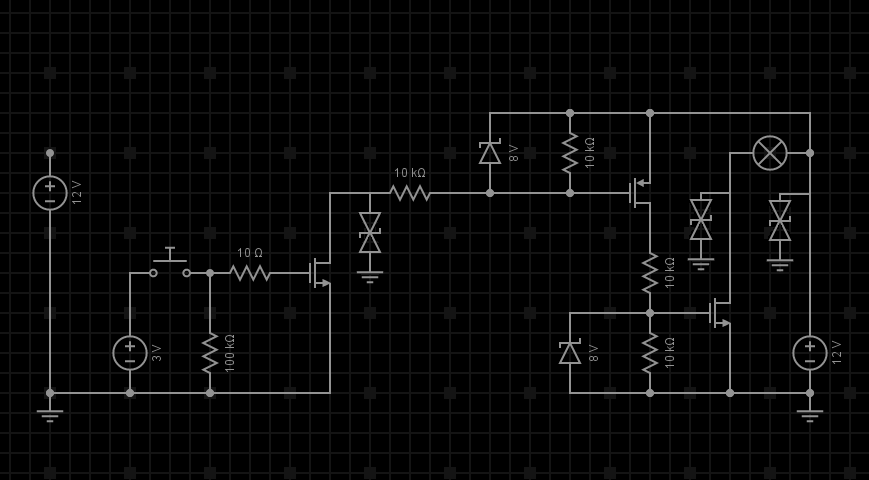

Voila! Our external MOSFET circuit is now a lot safer!

## Heat Dissipation

Have we discovered room temperature super conductors yet? No? Then remember, everything has a resistance, and passing current through any resistance will generate heat. Even the most powerful MOSFETs will have a few milliohms (m&Omega;) of resistance. Pretend our MOSFET has 50m&Omega; of resistance and we are passing 10A of current through. The equation is

50m&Omega; x 10A2 = 5W

5W is a lot. Remember that even a 20W heater can be used to 3D print, meaning reach hundreds of degrees to melt plastic. 10A isn't even a lot of current, considering a Tesla Model S can use 1500A in ludicrous mode. That's why big MOSFETs have surfaces where you can attach heatsinks to. Heatsinks conduct the heat away from the MOSFET, and heatsinks use fins to increase the amount of air that touches it, air can carry the heat away. Moving that air with a fan makes the heat go away faster.

MOSFET datasheets will tell you some information about its thermal resistance. Heat travels through material just like how electrons travel through conductors. Just like with electricity, everything is a conductor for heat, and everything is a resistor for heat. Look at this bit of information from a MOSFET datasheet:

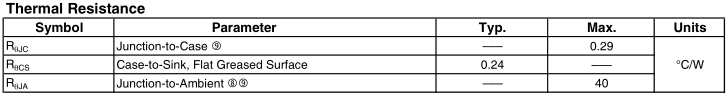

The MOSFET is pieces of silicon encased in plastic, the silicon pieces have junctions where different pieces meet. Junction-to-Ambient means, without a heatsink, how much thermal resistance is there between the junction to the air.

It says 40&deg;C/W in that table, oh boy, it means if our MOSFET is dissipating 5W of heat, the temperature inside would rise 200&deg;C (200 above ambient room temperature, so more like 220&deg;C). It's toast. (the datasheet says the maximum temperature rating of the junction is 175&deg;C)

Let's add a heatsink.

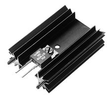

The MOSFET specifies that junction-to-case is 0.29&deg;C/W and case-to-heatsink is 0.24&deg;C/W, so 0.53&deg;C/W in total. The heatsink has some specifications:

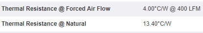

It means if we don't use a cooling fan, then the total thermal resistance to air is 13.4&deg;C/W plus 0.53&deg;C/W, 13.93&deg;C/W in total. 5W of heat would mean 69.65&deg;C more than ambient air temperature, so it'll be something like 90&deg;C on the inside of the MOSFET. That's... better... I wouldn't want my computer's CPU running that hot all the time though.

Let's use a fan, so now it's 4.54&deg;C/W, multiplied by 5W, giving us 22.7&deg;C more than ambient air temperature. That means something like 42&deg;C, a hot summer day.

The takeaway here is that when somebody sells you a 30A MOSFET... that doesn't mean anything until you know you can cool it, because a crappy MOSFET can have something like 200m&Omega; of resistance and running 30A through it would mean **180W** being dissipated as heat. If that heat isn't removed, it doesn't matter that you are technically not using more than 30A, it **will melt**.

## Opto-Isolation

If you've shopped around for an external MOSFET online, you might've noticed they often mention optoisolation or optocouplers.

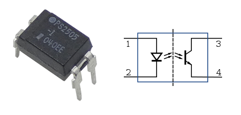

These devices are literally a LED with a transistor next to the LED. Did you know that all diodes and transistors are also kind of microscopic solar panels? When photons hits the silicon juntions of a diode or transistor, there's some electrons that gets ejected from the silicon atoms. So if you light up a LED beside this microscopic transistor, you get a transistor that's activated by light instead of electricity.

Optocouplers are used for isolation between circuits that are at different voltages, they don't even need to share the same ground reference. Electricity can't travel between the LED and the transistor inside, only light can cross that gap. This allows one side to be operating at a much different voltage without affecting the other side, even when components starts to fail. For the external MOSFETs that 3D printers use, it allows people to use vastly higher voltages, like maybe a 48 volt power supply just for the heated bed, while still running the stepper motors with 12 volts.

Another thing is that the signal to the LED needs to be strong, and that actually means it's almost completely immune to noise.

If we wanted to add one to our circuit, it would look like this:

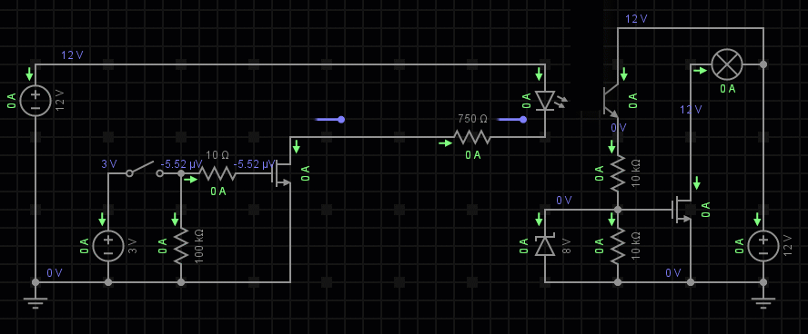

Notice how we are using both of the wires from the control circuit. Optocouplers are also used when people don't really know what kind of input signal you are going to get, but as long as you know that it can drive a LED, then it will work.

## AC Power?

MOSFETs cannot be used with **A**lternating **C**urrent most of the time. The way that MOSFETs are constructed means that if you try to reverse the current, it cannot be stopped, even if the MOSFET is OFF. This is because the way the silicon must be arranged inside a MOSFET also forms a diode, this is called a **body diode** and cannot be avoided.

There's also a whole bunch of other reasons that makes it a bad idea. I can't think of a way to hook up AC power to a MOSFET without blowing up the gate.

Big 3D printer builders might want to use AC because the AC is usually 120V or 220V, much higher, so it can drive a much more powerful heated bed. To switch AC on or off, you want to use a relay. But a typical relay is not a good idea, they don't like switching high voltages very often. This is because high voltages will spark, and sparking will slowly damage the relay contacts. To get around this, there's a device called a SSR, **S**olid **S**tate **R**elay.

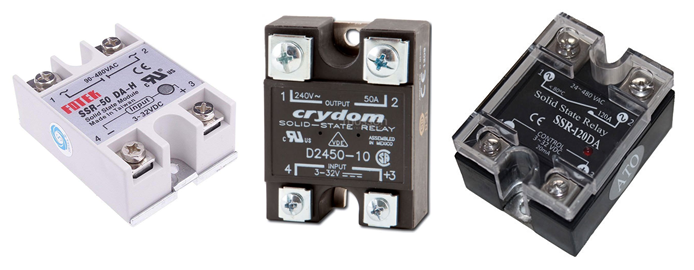

SSRs are typically built with a optocouplers controlling a TRIAC (**tri**ode for **a**lternating **c**urrent). TRIACs are semiconductor switches designed specifically for AC. The scary part is that once a TRIAC is turned ON, it cannot be turned off until the AC voltage hits zero volts. But the good news is that... by definition, AC must hit zero volts once in a while, otherwise it wouldn't be alternating... you can't go from being positive to being negative without being zero somewhere in the middle.

I don't recommend you try playing with AC powered heated beds, you definitely don't need it. Cheap SSRs, or improperly cooled SSRs (they get HOT, they must have a heatsink, maybe even a cooling fan), could fail and cause an unstoppable thermal runaway, leading to a fire or a burn.

## Things I missed

Some people might be really angry at me right now to dumbing down MOSFETs so much, I did not mention anything about what the gate voltage is referenced to. I didn't even show a ground wire in my simulations and didn't explain the symbol. All done intentionally for the sake of keeping the lesson within reasonable limits.