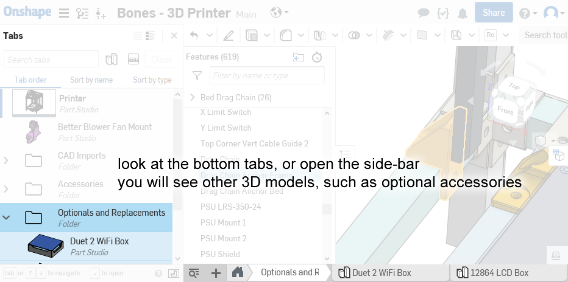
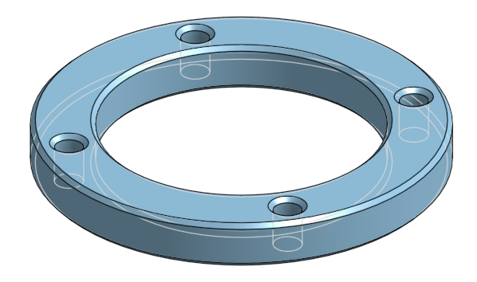
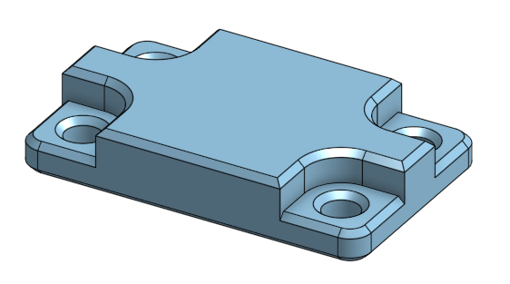
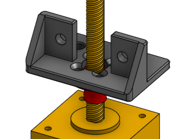
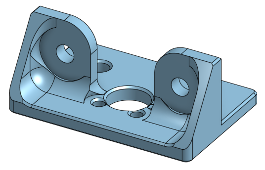
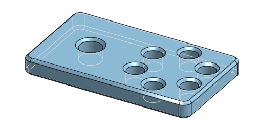
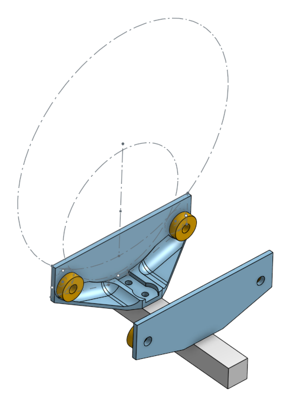
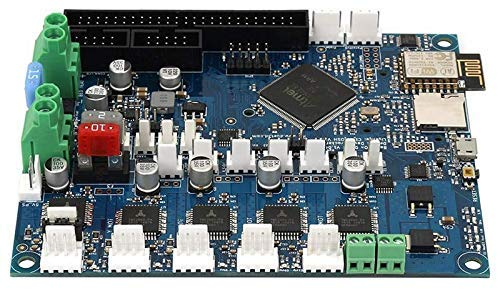
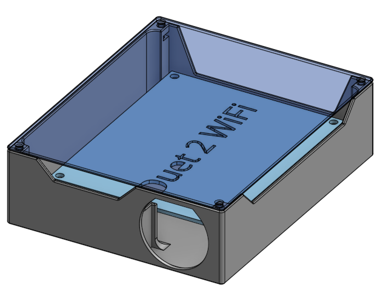

# Optional 3D Printed Parts

The link to the Onshape model: [https://cad.onshape.com/documents/359ba....150f](https://cad.onshape.com/documents/359baba3de4f085c967fb5a9/w/62a7ef2a4414462a5d8bf3e1/e/208ce2426916e4fde5ad150f)

## Money Saving Parts

### Z Stepper Spacer

The Z axis stepper motor has a mount that is 4mm thick. This means it should be using a 8mm long M3 screw. But it's the only place in the design where such a screw is needed. This means you'd be buying a pack of 100 screws but using only 4 of them, so buying them could be wasteful.

But we already need more than twenty 14mm long M3 screws. So if we design a spacer that's 6mm tall, then we can use the 14mm long screws to mount the Z axis stepper motor.

[Link to Model](https://cad.onshape.com/documents/359baba3de4f085c967fb5a9/w/62a7ef2a4414462a5d8bf3e1/e/d639a4eba6b7893faf065275)

### Thicker Backstop Plate

The plate part behind the glass bed that acts as a backstop was originally designed to use very long countersink screws. But we only need 8 of them and they are sold by the hundreds, so buying them could be wasteful.

But we already need more than twenty 20mm long M3 screws. So if we design the plate to use a counterbore instead of countersink, then we can use 20mm button head screws instead. This means the plate needs to be thicker as well.

Original Design:

Replacement Design:

[Link to Model](https://cad.onshape.com/documents/359baba3de4f085c967fb5a9/w/62a7ef2a4414462a5d8bf3e1/e/8911b402051f506c826f07ff)

### Cheaper Lead-Nut Mount

The mount for the lead-nut required four short countersink screws, because the screws needed to sit underneath an aluminum beam. But we only need 8 of them and they are sold by the hundreds, so buying them could be wasteful.

But we already need more than twenty 14mm long M3 screws, and the lead-nut only needs one or two of them to be mounted. So a different design was created with only two holes for M3 button head screws.

Original Design

Replacement Design:

[Link to Model](https://cad.onshape.com/documents/359baba3de4f085c967fb5a9/w/62a7ef2a4414462a5d8bf3e1/e/7b49229f1095a7f50965be98)

## Useful Accessories

### Simple Cable Tie Point

These have holes for you to zip-tie wires against, and it can be screwed onto the frame's T-slotted aluminum beams using M5 screws and T-nuts. This is useful for situations when you can't just zip-tie around the aluminum beam.

[Link to Model](https://cad.onshape.com/documents/359baba3de4f085c967fb5a9/w/62a7ef2a4414462a5d8bf3e1/e/6fec5bcb797834af2d18ee43)

### Spool Holder

This is a spool holder that can be adapted to any size of 3D printer filament spools. It bolts against your printer's frame via screws and T-nuts, into the T-slots. It uses four F608ZZ rotary ball bearings for smooth rotation. It's width can be adjusted by loosening the mounting and sliding it along the T-slot. This design is almost guaranteed to never tangle because there's no way for the plastic filament to "escape" it.

The rotary ball bearings should be F608ZZ just like the ones used for the 3D printer's gantry, but ordinary 608 ball bearings should also work. They need to be secured with 5/8" diameter screws and nuts, or use M5 diameter screws and nuts.

[Link to Model](https://cad.onshape.com/documents/359baba3de4f085c967fb5a9/w/62a7ef2a4414462a5d8bf3e1/e/e6f8eff31be62feb446cee75)

## Upgrades

### Duet 2 WiFi Box

If you decide to upgrade the electronics to use the [Duet 2 WiFi](https://www.duet3d.com/DuetWifi) (it's awesome!), then I've designed a box for it already. It's similar to the one designed for the SKR Mini E3, and it has active fan cooling as well.

[Link to Model](https://cad.onshape.com/documents/359baba3de4f085c967fb5a9/w/62a7ef2a4414462a5d8bf3e1/e/35f45c13ed91fded48469511)
