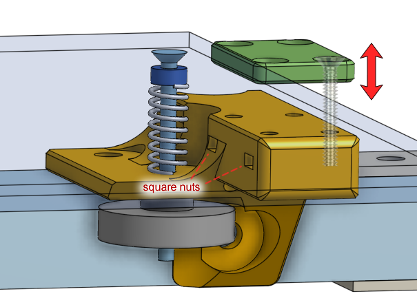

# Optional 3D Printed Parts

The link to the Onshape model: [https://cad.onshape.com/documents/359ba....150f](https://cad.onshape.com/documents/359baba3de4f085c967fb5a9/w/62a7ef2a4414462a5d8bf3e1/e/208ce2426916e4fde5ad150f)

## Money Saving Parts

### Thicker Backstop Plate

The plate part behind the glass bed that acts as a backstop was originally designed to use very long countersink screws. But we only need 8 of them and they are sold by the hundreds, so buying them could be wasteful.

But we already need more than twenty 20mm long M3 screws. So if we design the plate to use a counterbore instead of countersink, then we can use 20mm button head screws instead. This means the plate needs to be thicker as well.

Original Design:

Replacement Design:

[Link to Model](https://cad.onshape.com/documents/359baba3de4f085c967fb5a9/w/62a7ef2a4414462a5d8bf3e1/e/8911b402051f506c826f07ff)

### Cheaper Lead-Nut Mount

The mount for the lead-nut required four short countersink screws, because the screws needed to sit underneath an aluminum beam. But we only need 8 of them and they are sold by the hundreds, so buying them could be wasteful.

But we already need more than twenty 14mm long M3 screws, and the lead-nut only needs one or two of them to be mounted. So a different design was created with only two holes for M3 button head screws.

Original Design

Replacement Design:

[Link to Model](https://cad.onshape.com/documents/359baba3de4f085c967fb5a9/w/62a7ef2a4414462a5d8bf3e1/e/7b49229f1095a7f50965be98)

### Tube Guide Anchor

The design has a drag chain that guides the wires between the printer's frame and the printer's bed, as it moves up and down. It prevents the wires from sagging or getting caught on something. This drag chain would cost about $8 and also would make replacing the heated bed more difficult.

An alternative solution is to use a teflon tube to prop up the wires instead. This requires a slightly redesigned 3D printed part that have holes meant for zip-tying the tube.

[Link to Model](https://cad.onshape.com/documents/359baba3de4f085c967fb5a9/w/62a7ef2a4414462a5d8bf3e1/e/879e7d80929449cf28acd3bf)

## Useful Accessories

### Simple Cable Tie Point

These have holes for you to zip-tie wires against, and it can be screwed onto the frame's T-slotted aluminum beams using M5 screws and T-slot-nuts. This is useful for situations when you can't just zip-tie around the aluminum beam.

[Link to Model](https://cad.onshape.com/documents/359baba3de4f085c967fb5a9/w/62a7ef2a4414462a5d8bf3e1/e/6fec5bcb797834af2d18ee43)

### Spool Holder

This is a spool holder that can be adapted to any size of 3D printer filament spools. It bolts against your printer's frame via screws and T-slot-nuts, into the T-slots. It uses four F608ZZ rotary ball bearings for smooth rotation. It's width can be adjusted by loosening the mounting and sliding it along the T-slot. This design is almost guaranteed to never tangle because there's no way for the plastic filament to "escape" it.

The rotary ball bearings should be F608ZZ just like the ones used for the 3D printer's gantry, but ordinary 608 ball bearings should also work. They need to be secured with 5/8" diameter screws and nuts, or use M5 diameter screws and nuts.

[Link to Model](https://cad.onshape.com/documents/359baba3de4f085c967fb5a9/w/62a7ef2a4414462a5d8bf3e1/e/e6f8eff31be62feb446cee75)

### 2020 Feet

Recall in [lesson 3](lesson3) we talked about what happens if a leg of the printer is too long or too short? We can use some sort of adjustable feet to make the printer level. I've designed something that goes around a 2020 profile aluminum extrusion beam, and is secured to it via a M5 screw and a T-slot nut.

[Link to Model](https://cad.onshape.com/documents/359baba3de4f085c967fb5a9/w/62a7ef2a4414462a5d8bf3e1/e/ffe99086e5938267dbd1d906)

[Link to Model version 2](https://cad.onshape.com/documents/359baba3de4f085c967fb5a9/w/62a7ef2a4414462a5d8bf3e1/e/9fff88d5d5309237cd05f5d7)

### Split Loom Guide

The 3D printed wire guide up on top of the printer was originally meant to have a teflon tube tied to it. Another possible solution is to use a split loom instead of the teflon tube, which would look neater. I have designed another 3D printed guide that allows you to zip-tie a split loom into it.

[Link to Model](https://cad.onshape.com/documents/359baba3de4f085c967fb5a9/w/62a7ef2a4414462a5d8bf3e1/e/ba03d3cc5587af0ce1e760af)

### Leadscrew Upper Guard

This 3D printed part is placed on the tip of the leadscrew and it prevents you from accidentally bending the leadscrew. It does not use a rotary ball bearing, the hole it has is simply much larger than the leadscrew's diameter.

Most 3D printers with this style of bed lifting does not use a ball bearing up on the tip of the leadscrew.

Even [my Hephaestus 3D printer](https://eleccelerator.com/hephaestus-my-own-3d-printer/) doesn't have something to secure its leadscrews up on top. But I think it's a good idea to have something there. This is just to prevent the leadscrew from becoming damaged during transportation, in the back of a truck, where something could knock into the leadscrew.

This part is included in the main 3D model.

### Alternative Electronics Arrangment

You can also mount the electronics like this:

But watch out that the stepper motors and limit switches are all on the left side of the design. So the wires to those components need to be longer. However, it'll be easy to just put the stepper motors on the right side.

This design gives you more room to put junk on to the front of the printer frame.

## Upgrades

### Angled TFT24 Box

This is another box for the TFT24 LCD screen. It's angled upwards, and it has openings both sides so both USB drives and SD cards can be used.

[Link to Model](https://cad.onshape.com/documents/359baba3de4f085c967fb5a9/w/62a7ef2a4414462a5d8bf3e1/e/cdc93c4504e058bfb7a438bf)

### Duet 2 WiFi Box

If you decide to upgrade the electronics to use the [Duet 2 WiFi](https://www.duet3d.com/DuetWifi) (it's awesome!), then I've designed a box for it already. It's similar to the one designed for the SKR Mini E3, and it has active fan cooling as well.

[Link to Model](https://cad.onshape.com/documents/359baba3de4f085c967fb5a9/w/62a7ef2a4414462a5d8bf3e1/e/35f45c13ed91fded48469511)
